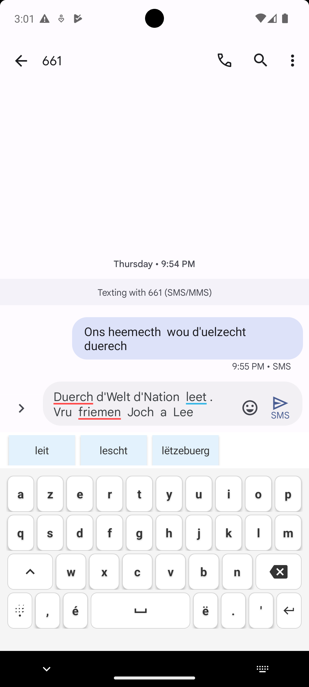

# 🇱🇺 Clavier Lëtzebuergesch : Clavier intelligent pour la saisie en **luxembourgeois** avec suggestions de mots.

**Clavier Lëtzebuergesch** est un clavier Android intelligent conçu pour répondre à un besoin fondamental : permettre aux Luxembourgeois d'écrire facilement en **luxembourgeois** sur leur smartphone, avec fluidité, authenticité et fierté.


- 🛠️ Si ton luxembourgeois est très rouillé...
- 😤 Que tu galères à écrire en lëtzebuergesch parce que ton téléphone refuse tous les mots
- 🤔 Que tu doutes de l'orthographe à chaque message ...
- ➡️ Clavier Lëtzebuergesch est fait pour toi !


🧠 Le dictionnaire est en **évolution permanente**, enrichi régulièrement grâce aux **suggestions de la communauté luxembourgeoise**. Chaque contribution aide à affiner les prédictions et à refléter les usages réels du luxembourgeois contemporain.

⚡ Grâce à ces suggestions basées sur les plus grands textes en luxembourgeois, les utilisateurs peuvent **écrire très rapidement dans un luxembourgeois fluide, riche et parfaitement maîtrisé**, sans effort ni approximation.

📱 Compatible Android 5.0+, il s'installe facilement et fonctionne avec toutes les applications de messagerie, réseaux sociaux ou saisie web.

---

**Clavier Lëtzebuergesch**, c'est plus qu'un outil :  
C'est un acte de transmission, un hommage à la langue, une technologie au service de l'identité luxembourgeoise.


## 📱 Aperçu

<div align="center">
   
</div>

*Suggestions luxembourgeoises en cours de frappe — ici les premiers vers de « Ons Heemecht »*

<!-- Capture antérieure à la 10.9.2 : la rangée du bas n'y montre pas encore la
     touche « ä » ni la touche emoji. À refaire sur émulateur. -->


## 🌟 Fonctionnalités

### 🎯 **Suggestions Intelligentes**
- Suggestions contextuelles en temps réel, sur un dictionnaire de **6 342 mots**
- **N-grammes** : après un espace, le clavier propose la suite probable de la phrase d'après les deux mots précédents
- **Tolérance aux fautes de frappe** : une lettre oubliée, en trop ou tapée à côté n'empêche pas la suggestion d'arriver
- **Tolérance aux diacritiques** : taper « letzebuergesch » propose « lëtzebuergesch »
- La casse est respectée, et les mots que vous employez souvent remontent d'eux-mêmes

### ⌨️ **Écrire en lëtzebuergesch**
- **é, ä et ë** ont chacune leur touche dédiée — les trois diacritiques les plus fréquentes de la langue
- Les plus rares (ü, ö, à, â…) sont en appui long, avec un aperçu dans le coin de la touche
- Panneau **emoji** complet, tons de peau compris
- **Correcteur orthographique système** : vos mots luxembourgeois ne sont plus soulignés en rouge dans Messages ou Notes

### 🏆 **Progression et jeux**
- Huit niveaux, d'**Ufänker** à **Sproochenmeeschter**, selon la part du dictionnaire que vous avez employée
- Carte de niveau partageable
- Trois jeux de vocabulaire : **Wuertsich** (mots mêlés), **Wuertmix** (mots mélangés) et **Wuertriet** (devinez le mot en six essais)

### 🔒 **Vie privée**
Le clavier fonctionne **entièrement hors ligne** : il n'a aucun accès à Internet. Seuls les mots déjà présents dans le dictionnaire sont comptés pour la progression — mots de passe et termes personnels ne sont jamais enregistrés, et rien ne quitte l'appareil.

#### 📚 **Corpus des suggestions**
Le dictionnaire et les n-grammes sont générés à partir d'un corpus de luxembourgeois contemporain : les transcriptions des conférences de presse du gouvernement luxembourgeois, publiées comme jeu de données ouvert. Le pipeline est relancé à chaque build, ce qui fait évoluer les suggestions avec l'usage réel de la langue.

### ⚖️ **Face à Gboard et au clavier Apple**
Gboard gère le luxembourgeois parmi 900 autres langues, et Apple ne l'ajoutera qu'avec iOS 27 : voir le **[comparatif détaillé](COMPARATIF.md)** — disposition, dictionnaire, vie privée, ce que les autres font mieux.

## 📦 Téléchargements

### 🚀 **Dernière Version Stable**

[](https://github.com/famibelle/LuxKeyb/releases/latest)
[](https://github.com/famibelle/LuxKeyb/releases)

### 🧪 **Test fermé sur Google Play**

L'application est en test fermé sur le Play Store. Y participer, c'est la recevoir comme n'importe quelle autre application : installation en un geste, mises à jour automatiques, sans autoriser les « sources inconnues ».

1. Depuis votre téléphone, ouvrez la [page d'inscription au test](https://play.google.com/apps/testing/com.potomitan.luxkeyboard) avec le compte Google que vous utilisez sur le Play Store
2. Appuyez sur **Devenir testeur**, puis suivez le lien vers Google Play
3. Le test est réservé à une liste de comptes : si le vôtre n'y est pas encore, ouvrez une [issue](https://github.com/famibelle/LuxKeyb/issues) ou passez par le [formulaire de retours](https://famibelle.github.io/LuxKeyb/feedbacks_form.html)

<div align="center">
  <a href="https://play.google.com/apps/testing/com.potomitan.luxkeyboard"></a>
  <br><em>Scannez : la page d'inscription s'ouvre</em>
</div>

Google demande au moins douze testeurs pendant quatorze jours avant d'autoriser une publication ouverte : chaque inscription rapproche le clavier du Play Store public. Détails sur la [page d'accueil du site](https://famibelle.github.io/LuxKeyb/#devenir-testeur).

L'APK ci-dessous reste disponible et contient exactement le même code.

### 📱 **Installation Rapide**

1. **Téléchargez l'APK** depuis la [dernière release](https://github.com/famibelle/LuxKeyb/releases/latest)
2. **Autorisez les sources inconnues** dans les paramètres Android
3. **Installez l'APK** en touchant le fichier
4. **Activez le clavier** dans Paramètres → Système → Langues et saisie

### 📦 **Types d'APK Disponibles**

| Type | Description | Taille | Usage |
|------|-------------|--------|-------|
| **Release APK** | Optimisée production | ~5 MB | ✅ Recommandé |
| **Debug APK** | Avec logs verbeux | ~7 MB | 🔧 Dev |

### 🔄 **Mises à Jour Automatiques**

Les nouvelles versions sont automatiquement construites et publiées grâce à **GitHub Actions** :
- ✅ **Build automatique** à chaque push sur `main`
- ✅ **APK signés** prêts pour l'installation
- ✅ **Releases automatiques** sur [GitHub Releases](https://github.com/famibelle/LuxKeyb/releases) à chaque tag `v*.*.*`

### 🔧 Compilation (sources)
```bash
git clone https://github.com/famibelle/LuxKeyb.git
cd LuxKeyb/android_keyboard
./gradlew assembleRelease
```

## ⚙️ Installation depuis les sources

### Prérequis
- **Android 5.0** (API 21) ou supérieur
- **JDK 17** et le SDK Android 36 pour compiler
- **20 MB** d'espace libre

### Installation depuis les sources

1. **Cloner le repository** :
```bash
git clone https://github.com/famibelle/LuxKeyb.git
cd LuxKeyb/android_keyboard
```

2. **Compiler l'APK** :
```bash
./gradlew assembleDebug
```

3. **Installer sur device** :
```bash
./gradlew installDebug
```

4. **Activer le clavier** :
   - Aller dans **Paramètres** → **Système** → **Langues et saisie**
   - Sélectionner **Claviers virtuels**
   - Activer **Clavier Luxembourgeois**
   - Définir comme clavier par défaut

## 🚀 Utilisation

### Activation
1. Ouvrir n'importe quelle application de saisie
2. Appuyer longuement sur l'icône clavier (barre de navigation)
3. Sélectionner **Clavier Luxembourgeois**

### Accents
Appui long sur une lettre : affiche un popup (a → ä à â, e → é ë è ê, u → ü û ù, o → ô ö). Glissez le doigt vers l'accent voulu, puis relâchez.

Les trois diacritiques les plus fréquentes — **é**, **ä** et **ë** — ont leur propre touche en bas du clavier, sans appui long.

### Suggestions de Mots
- Commencer à taper un mot luxembourgeois
- Les suggestions apparaissent automatiquement
- Toucher une suggestion pour l'insérer

## 🏗️ Architecture


Le service `KreyolInputMethodServiceRefactored` coordonne quatre composants par
interfaces de rappel : `KeyboardLayoutManager` (construction des touches),
`SuggestionEngine` (dictionnaire, n-grammes, Levenshtein), `AccentHandler`
(appui long) et `InputProcessor` (traitement des touches). Le détail est dans
[CLAUDE.md](CLAUDE.md).

> Les noms de classes et le package `com.example.kreyolkeyboard` viennent du
> clavier créole dont ce projet est issu et avec lequel il partage sa base de
> code. Ce sont des alias historiques, pas une trace de créole dans le produit.

### Technologies Utilisées
- **Kotlin** — langage principal, compilé nativement par AGP 9
- **Android InputMethodService** — framework IME
- **JSON** — format du dictionnaire et des n-grammes
- **Gradle 9.6** / **AGP 9.3** — build system
- **JUnit 4** — 120 tests unitaires exécutés en CI
- **Python / Hugging Face** — pipeline de génération du corpus
- **GitHub Actions** — CI/CD automatisé
