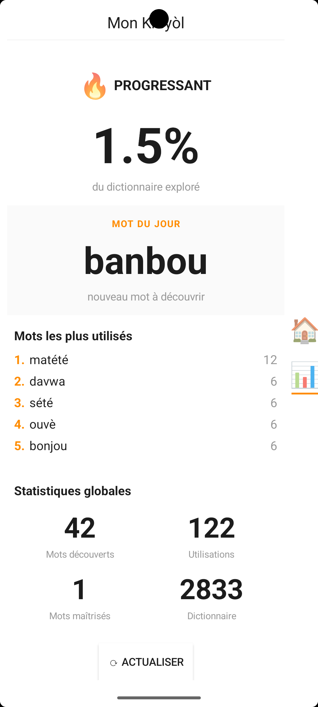

# Klavyé Kréyòl Karukera • Potomitan™

**📱Klavyé Kréyòl Karukera** est un clavier Android intelligent conçu pour répondre à un besoin fondamental : permettre aux Guadeloupéens d’écrire facilement en **Kréyòl Guadeloupéen** sur leur smartphone, avec fluidité, authenticité et fierté.

- 🛠️ Si ton créole est très rouillé...
- 😤 Que tu galères à écrire en kréyòl parce que ton téléphone refuse tous les mots
- 🤔 Que tu doutes de l’orthographe à chaque message ...
- ➡️ Klavyé Kréyòl Karukera est fait pour toi !

## 📱 Aperçu

   
   

### 📥 [Télécharger directement](https://github.com/famibelle/KreyolKeyb/releases)

   

**Google Play Store :** [Bientôt disponible]

### 📧 Contact

**Développeur :** Médhi Famibelle  
**Email :** medhi@potomitan.io  
**Organisation :** Potomitan