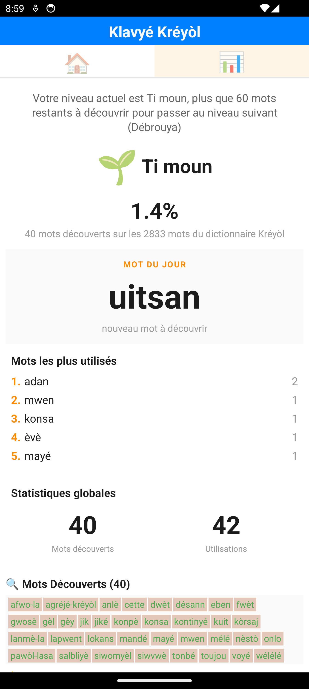
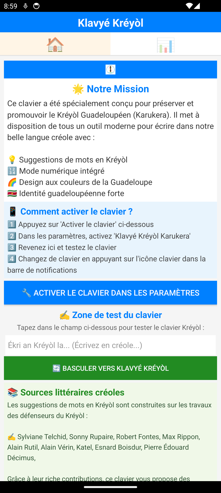

**📱Klaviatur Lëtzebuergesch** est un clavier Android intelligent conçu pour répondre à un besoin fondamental : permettre aux Luxembourgeois d'écrire facilement en **Lëtzebuergesch** sur leur smartphone, avec fluidité, authenticité et fierté.

- 🛠️ Si votre luxembourgeois est très rouillé...
- 😤 Que vous galériez à écrire en lëtzebuergesch parce que votre téléphone refuse tous les mots
- 🤔 Que vous doutez de l'orthographe à chaque message...
- ➡️ Klaviatur Lëtzebuergesch est fait pour vous !

## 📱 Aperçu

  
  
  

## 🎮 Système de progression et de gamification

**Klaviatur Lëtzebuergesch** ne se contente pas de fluidifier l'écriture du Lëtzebuergesch : il **suit votre progression** et vous accompagne dans votre maîtrise du luxembourgeois !

### 📊 Suivez vos progrès en temps réel

À chaque mot que vous écrivez en lëtzebuergesch, l'application :
- ✅ **Compte les mots découverts** - Votre vocabulaire s'enrichit automatiquement
- 📈 **Calcule votre niveau** - Du débutant "Klengen 🌱" au maître "Sproochenmeeschter 👑"
- 🎯 **Vous motive** - Visualisez combien de mots il vous reste pour atteindre le niveau suivant

### 🏆 7 niveaux de maîtrise du luxembourgeois

Progressez à travers 7 niveaux qui suivent une distribution gaussienne (la plupart des utilisateurs se situent dans les niveaux intermédiaires) :

| Niveau | Badge | Nom | Signification |
|--------|-------|-----|---------------|
| 1 | 🌍 | **Ufänker** | Débutant absolu - Premiers pas |
| 2 | 🌱 | **Klengen** | Débutant - Vous commencez votre apprentissage |
| 3 | 🔥 | **Fléisseg** | Vous vous débrouillez bien ! |
| 4 | 💎 | **Mëttel** | Vous êtes au milieu du chemin |
| 5 | 🐇 | **Geschéit** | Vous avez de bonnes connaissances |
| 6 | 🐘 | **Sproochenkënner** | Vous maîtrisez le luxembourgeois ! |
| 7 | 👑 | **Sproochenmeeschter** | Expert - Vous êtes un maître du luxembourgeois ! |

### 💡 Visualisez votre apprentissage

Dans l'onglet **"Mäin Lëtzebuergesch"** 📊, vous pouvez :
- 🔍 **Voir tous les mots découverts** - Avec leur orthographe correcte en vert
- 🌟 **Découvrir les mots à apprendre** - Les mots du dictionnaire que vous n'avez pas encore utilisés
- 📈 **Suivre votre progression** - Un message vous indique combien de mots il reste pour passer au niveau suivant
- 🎯 **Vous motiver** - "Votre niveau actuel est Fléisseg, plus que 125 mots restants à découvrir pour passer au niveau suivant (Mëttel)"

### 🔄 Actualisation en temps réel

Tirez simplement l'écran vers le bas (**Pull-to-Refresh**) dans l'onglet Statistiques pour mettre à jour vos progrès instantanément !

## Télécharger

### 🚀 **Dernière Version Stable**

### 📱 **Installation Rapide**

📥[Télécharger directement](https://github.com/famibelle/LuxKeyb/releases)

> ⚠️ **Note :** Ce lien de téléchargement direct vous permet d'accéder aux toutes dernières fonctionnalités développées, avant même leur publication officielle sur le Google Play Store.

  

## 📲 Comment installer l'application

### Étape 1️⃣ : Télécharger l'application

1. **Cliquez sur le lien** [Télécharger directement](https://github.com/famibelle/LuxKeyb/releases) ou scannez le QR code
2. **Choisissez la dernière version** (la première dans la liste)
3. **Téléchargez le fichier APK** (son nom ressemble à `Luxembourgish_Keyboard_vX.X.X_release.apk`)
4. Le fichier se télécharge automatiquement dans votre dossier **"Téléchargements"**

> 💡 **Astuce :** Vous verrez peut-être un message "Ce type de fichier peut endommager votre appareil". C'est normal ! Cliquez sur **"Télécharger quand même"** ou **"OK"**.

### Étape 2️⃣ : Autoriser l'installation

Avant d'installer l'application, votre téléphone doit vous autoriser à installer des applications venant de l'extérieur du Play Store.

#### 🔓 **Activer "Sources inconnues"**

1. Une fois le fichier téléchargé, **appuyez dessus** pour l'ouvrir
2. Un message apparaît : *"Pour des raisons de sécurité, votre téléphone n'est pas autorisé à installer des applications inconnues provenant de cette source"*
3. **Appuyez sur "Paramètres"** (ou "Réglages")
4. **Activez le bouton** "Autoriser cette source" ou "Installer des applications inconnues"
5. **Revenez en arrière** et appuyez à nouveau sur le fichier APK

> 📱 **Selon votre téléphone Android :**  
> - **Samsung :** Paramètres → Biométrie et sécurité → Installer des applis inconnues → (Votre navigateur) → Activer  
> - **Xiaomi / Redmi :** Paramètres → Confidentialité → Autorisations spéciales → Installer des applications inconnues  
> - **Huawei :** Paramètres → Sécurité → Plus de paramètres → Installer des applications à partir de sources externes  
> - **OnePlus / Oppo :** Paramètres → Sécurité → Installation d'applis → Autoriser l'installation d'applis  
> - **Google Pixel / Android standard :** Le téléphone vous guidera automatiquement lors de l'installation  
> - **Autres marques :** Cherchez dans Paramètres → Sécurité ou Confidentialité → Sources inconnues ou Installation d'applis

### Étape 3️⃣ : Installer et activer le clavier

#### 📦 **Installer l'application**

1. **Appuyez sur "Installer"**
2. Attendez quelques secondes (une barre de progression apparaît)
3. Quand c'est terminé, appuyez sur **"Ouvrir"**

#### ⚙️ **Activer le clavier Luxembourgeois**

L'application s'ouvre automatiquement et vous guide :

1. **Appuyez sur le bouton** *"🔧 Activer le clavier dans les paramètres"*
2. Une nouvelle page s'ouvre avec la liste des claviers
3. **Trouvez "Klaviatur Lëtzebuergesch"** dans la liste
4. **Activez le bouton** à côté (il devient bleu ou vert)
5. Un message de sécurité apparaît → Lisez-le et appuyez sur **"OK"**

#### 🎯 **Utiliser le clavier**

1. Ouvrez n'importe quelle application de messagerie (WhatsApp, SMS, Facebook...)
2. **Appuyez dans la zone de texte** pour faire apparaître le clavier
3. En bas du clavier, vous verrez une **icône de globe 🌐** ou **d'engrenage ⚙️**
4. **Appuyez longuement** sur cette icône
5. **Choisissez "Klavyé Kréyòl Karukera"** dans la liste
6. C'est parti ! Vous pouvez maintenant écrire en kréyòl ! 🎉

> 💡 **Astuce :** Pour revenir à votre ancien clavier, appuyez à nouveau longuement sur l'icône 🌐 et choisissez votre autre clavier.

## 🔒 Déclaration de confidentialité

Consultez notre [Déclaration de confidentialité](https://famibelle.github.io/KreyolKeyb/privacy/) pour en savoir plus sur la manière dont vos données sont traitées.

TL;DR zero data collectée

## 📧 Contact

**Développeur :** Médhi Famibelle  
**Email :** medhi@potomitan.io  
**Organisation :** Potomitan™