<!-- English version of index.md. Same order, same figures, same images:
     when the French homepage changes, this page and de.md follow. Pages
     linked from here that exist only in French say so. -->

<nav class="site">
  <strong>🏠 Home</strong> ·
  <a href="#install">📲 Install</a> ·
  <a href="simulateur.html">⌨️ Try it online</a> ·
  <a href="index.html" hreflang="fr" lang="fr">FR</a> ·
  <strong>EN</strong> ·
  <a href="de.html" hreflang="de" lang="de">DE</a> ·
  <a href="pt.html" hreflang="pt" lang="pt">PT</a> ·
  <button type="button" class="theme-toggle" aria-label="Switch to dark mode">🌙</button>
</nav>

# Dare to write Lëtzebuergesch!

<strong>You are not bad at writing Luxembourgish: your keyboard
just doesn't know it.</strong> Lëtzebuergesch Clavier suggests words as you type,
puts in the accents and capitals for you, and writes down what you say to it.
Your Luxembourgish words finally stop being underlined in red in your
messages.

Free · no ads · nothing you type ever leaves your phone

<a href="simulateur.html">Try it in your browser
first</a>, without installing anything. To use it in your messages, then install
the Android app.

<a href="#install"
   class="btn-installer">📲 Install on my phone</a>

## The keyboard in action

  <figure style="margin:0;max-width:420px;text-align:center;">
    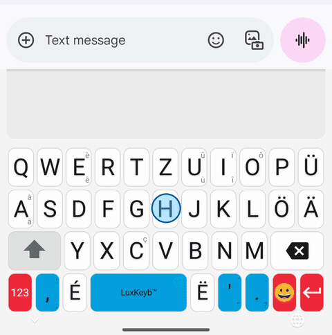
    <figcaption>
      “Ech hunn op der Schueberfouer Gromperekichelcher giess”
      (I ate potato fritters at the Schueberfouer): the bar suggests what comes
      next after “op der”, then completes the long words in one tap.
    </figcaption>
  </figure>

  <figure style="margin:0;flex:1 1 220px;max-width:300px;text-align:center;">
    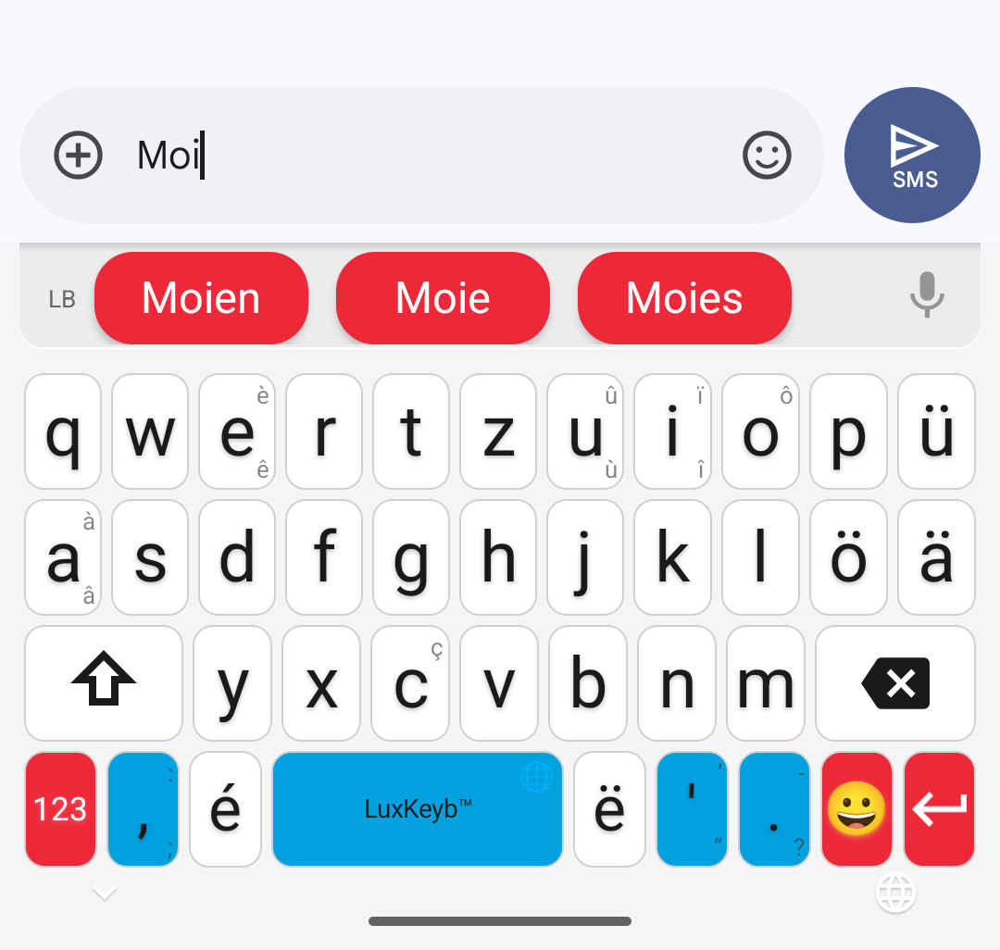
    <figcaption>Suggestions in Luxembourgish</figcaption>
  </figure>
  <figure style="margin:0;flex:1 1 220px;max-width:300px;text-align:center;">
    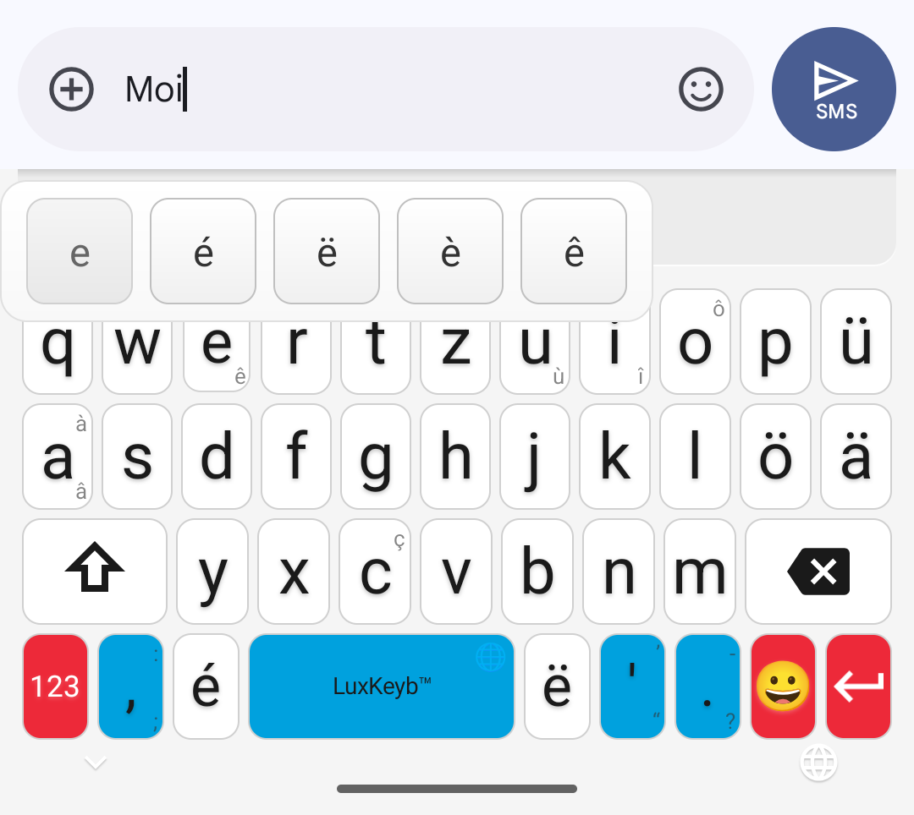
    <figcaption>Accents with a long press</figcaption>
  </figure>
  <figure style="margin:0;flex:1 1 220px;max-width:300px;text-align:center;">
    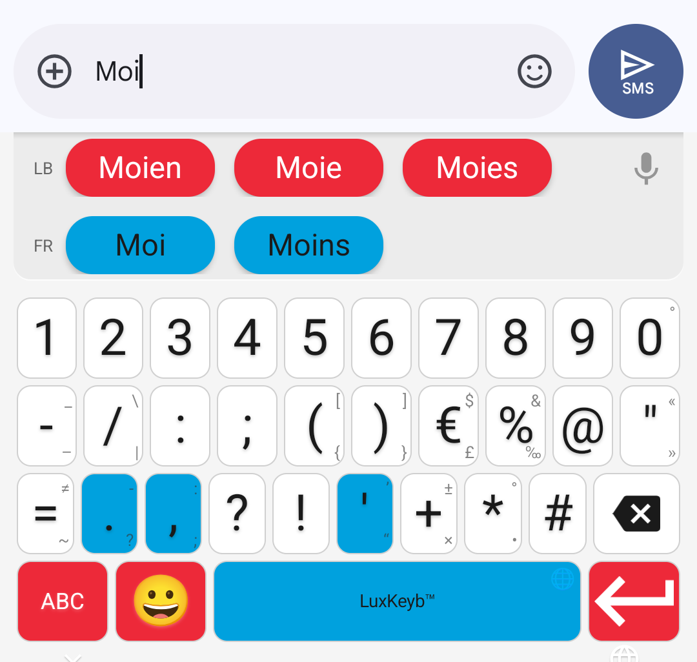
    <figcaption>Numbers and symbols</figcaption>
  </figure>

The keyboard wears the three colours of the flag: white for the letters, red for
what acts (Enter, mode switch) and sky blue for the space bar and punctuation.

## Voice typing 🎙️

Tap the microphone, to the right of the suggestion bar, and speak: the text
appears as you talk, with punctuation and capital letters. The microphone closes
by itself when you stop.

  <figure style="margin:0;max-width:420px;text-align:center;">
    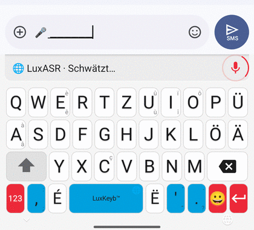
    <figcaption>
      “Op der Kiermes iessen ech ëmmer Gromperekichelcher mat Äppelkompott”
      (at the fair I always eat potato fritters with apple sauce): the text is
      written as you speak.
    </figcaption>
  </figure>

Recognition is provided by **[LuxASR](https://luxasr.uni.lu)**, the speech
recognition service of the **University of Luxembourg**. So it needs an internet
connection:

- your voice is only sent **while you dictate**, after you tap the microphone,
  and never from a password field;
- it goes straight to the University, in Luxembourg, which turns it into text
  without keeping it or using it to train its models;
- with no network, the microphone is shown crossed out; on a network that is too
  slow, the keyboard tells you instead of letting you talk into the void.

It is not infallible: read it over before sending. The details are in the
[privacy policy](privacy/privacy-policy.html#dictee-vocale) (in French).

## What held you back, and what has changed

<table class="objections">
  <tr>
    <td>🤔 <strong>“My phone corrects my Luxembourgish into German”</strong></td>
    <td>Not any more. This keyboard never replaces one word with another: your
    letters stay yours. And its spell checker, once switched on, stops
    underlining your words in red in Messages, in your notes and in your
    messaging apps.</td>
  </tr>
  <tr>
    <td>😬 <strong>“I'm never sure of the spelling”</strong></td>
    <td>The keyboard suggests the forms of the <em>Lëtzebuerger Online
    Dictionnaire</em>, the language's official dictionary: 123,297 words
    recognised. You don't make anything up, you choose.</td>
  </tr>
  <tr>
    <td>😤 <strong>“The ë is hidden in a menu”</strong></td>
    <td>Not here. The three diacritics the language rests on, <strong>é</strong>,
    <strong>ä</strong> and <strong>ë</strong>, each have their own key, and so
    does the apostrophe of elision (<em>d'Land</em>, <em>s'Kanner</em>). Just
    type “letzebuergesch”: the keyboard offers “Lëtzebuergesch”.</td>
  </tr>
  <tr>
    <td>🤷 <strong>“It isn't a written language anyway”</strong></td>
    <td>It is: national language since 1984, spelling set by the Zenter fir
    d'Lëtzebuerger Sprooch, a state dictionary online. This keyboard is built on
    186,204 sentences actually written in Luxembourgish, and
    <a href="corpus.html">says which ones</a> (in French).</td>
  </tr>
</table>

The letters follow the **QWERTZ** layout, the one used on physical keyboards in
Luxembourg. The keyboard is **free, open source and ad-free**, and typing works
entirely offline: it runs in the browser to try it, and installs on Android for
everyday use.

## What it can do

### It suggests the words

The keyboard recognises **123,297 forms** and **27,746 prediction contexts**.
After a space, it suggests how your sentence probably goes on, based on the two
words you just wrote, not only the last one.

Luxembourgish suggestions come first. To slip French words into your sentences,
turn on “French suggestions” in the keyboard settings: a second row, in blue,
offers them from the third letter, and “ech hunn eng réunion muer” is written
without switching keyboards. The option is off by default, and the French side
deliberately sticks to the most common words: it is there for borrowings, not
for writing in French.

### It forgives typos

A missing letter, an extra letter, a neighbouring key: the suggestions still
come. And you can write without diacritics: type “letzebuergesch”, the keyboard
offers “Lëtzebuergesch”.

Capitalisation is respected, and the words you use often move up on their own.

### It corrects everywhere, not only in the keyboard

A system spell checker comes with it: once switched on, your Luxembourgish words
stop being underlined in red in Messages, Notes or your messaging apps.

### It helps you progress

**The games are not a gimmick next to the keyboard: they give you a reason to
keep writing Luxembourgish.** Each round brings you a word you would not have
looked for, and each word you win goes into a collection that reviews itself.

Every word you use raises your level, from **Ufänker** to
**Sproochenmeeschter**, according to how much of the dictionary you have already
used. Seven games complete the journey: **Wuertsich** (word search),
**Wuertmix** (scrambled words), **Wuertriet**, where you guess a five-letter
word in six tries, **Wuertlück**, a real Luxembourgish sentence with one word
missing, **Zuelwuert**, where you write out the result of a multiplication in
full, **Kräizwuert**, a crossword with clues in your language, and
**Wuertplaz**, an empty grid and a list of words to fit into it.

  <figure style="margin:0;flex:1 1 160px;max-width:220px;text-align:center;">
    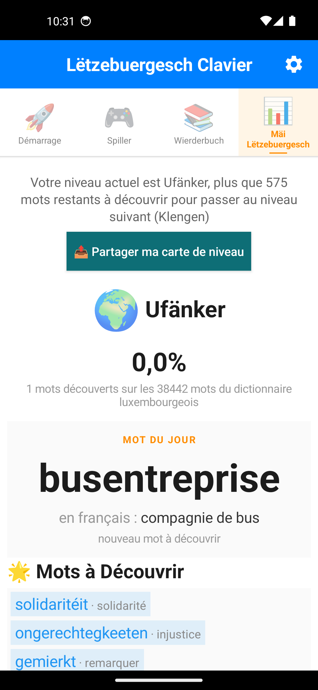
    <figcaption>Progress and word of the day</figcaption>
  </figure>
  <figure style="margin:0;flex:1 1 160px;max-width:220px;text-align:center;">
    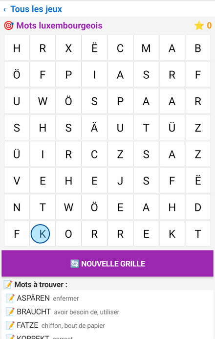
    <figcaption>Wuertsich · word search</figcaption>
  </figure>
  <figure style="margin:0;flex:1 1 160px;max-width:220px;text-align:center;">
    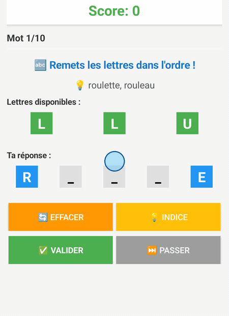
    <figcaption>Wuertmix · scrambled words</figcaption>
  </figure>
  <figure style="margin:0;flex:1 1 160px;max-width:220px;text-align:center;">
    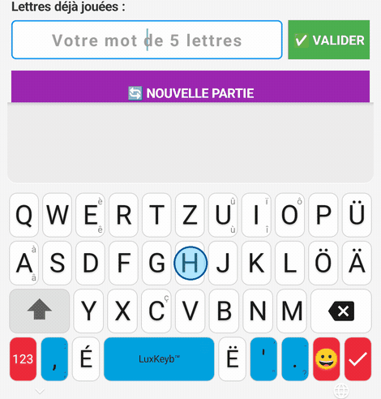
    <figcaption>Wuertriet · a word in six tries</figcaption>
  </figure>

### The words you win stay with you

A word found in one of the seven games does not vanish with the round: it
becomes a **card** in **Mäi Carnet**. Each card carries the meaning of the word
in your language, an example sentence from the official dictionary, with its
translation when the State has published one, the other forms of the same
family, and its rarity, that is its real rank in the corpus. The collection only
ever grows.

  <figure style="margin:0;max-width:520px;text-align:center;">
    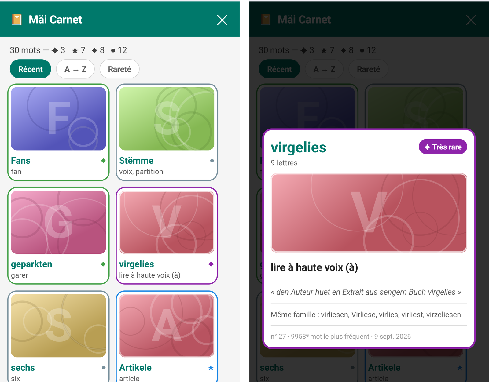
    <figcaption>Thirty words won, and the card “virgelies” open (app in French)</figcaption>
  </figure>

The cards then come back on their own, through **Widderhuelen**: six boxes, one
day, three days, a week, two weeks, a month, three months, then the word is
learnt and leaves the queue. You flip the card, grade yourself, and it moves up
or back down a box.

  <figure style="margin:0;flex:1 1 300px;max-width:420px;text-align:center;">
    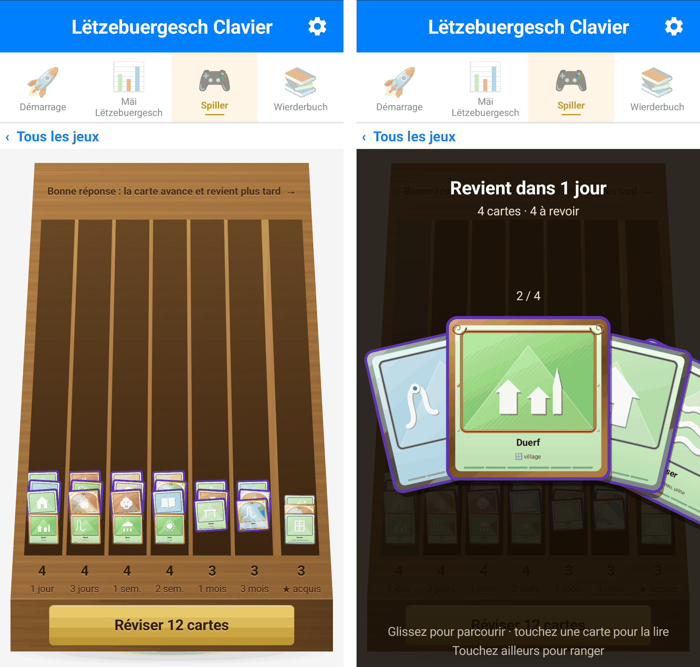
    <figcaption>The box, compartment by compartment</figcaption>
  </figure>
  <figure style="margin:0;flex:0 0 auto;max-width:190px;text-align:center;">
    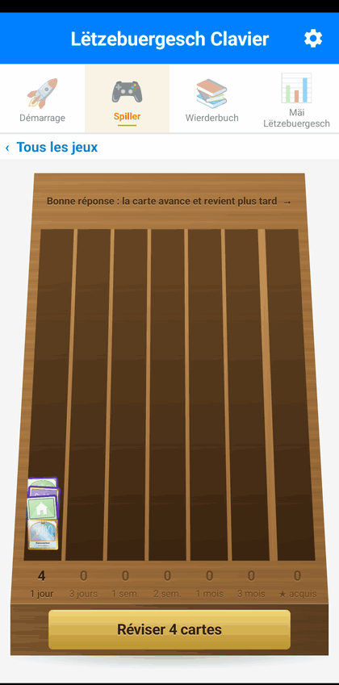
    <figcaption>A card you knew</figcaption>
  </figure>

**And the keyboard is the exam.** If you have written the word again in your
messages since the last review, the card moves up a box without you being asked
anything: language actually written counts for more than language recited. That
count stays on the phone, in a file that not even Android backup takes away.

### It knows nothing about you

🔒 **What you type does not leave your phone.** No account, no server of ours:
typing, suggestions, the spell checker and the games all work without a network.
There is a single exception, and you can see it: **voice typing**. When you tap
the microphone, your voice goes to the University of Luxembourg, which turns it
into text without keeping it; without that tap, nothing is sent. Android backup
itself only uploads your settings, vibration, sound and theme, neither your
words nor your progress. The code is public and can be checked, and the
[privacy policy](privacy/privacy-policy.html) (in French) says so in plain
words.

Only words already in the dictionary count towards your progress: a password, a
name or a number is not in it, so it is never recorded. The keyboard switches
itself off in password fields.

## Check it right now, without installing anything

Type a word in this practice keyboard: it is the app's real dictionary and real
suggestions, loaded in your browser. Start with “lëtz”, or with “op der”
followed by a space to see the rest of the sentence arrive.

  <iframe src="simulateur.html?embed=1" width="380" height="620" loading="lazy"
          title="Lëtzebuergesch Clavier practice keyboard"
          style="border:0;max-width:100%;"></iframe>

The practice keyboard has its own
<a href="simulateur.html">full page</a> (in French), with the automatic demo and
the counter of keystrokes saved.

## Install

  

    <a href="https://play.google.com/store/apps/details?id=com.potomitan.luxkeyboard&hl=en&referrer=utm_source%3Dsite%26utm_medium%3Daccueil-en%26utm_campaign%3Dinstaller"
       class="btn-installer">📲 Install on my phone</a>
    

      The app installs from Google&nbsp;Play, like any other: in one tap, with
      automatic updates.
    

    

      Android will show a warning when you switch the keyboard on. It appears
      for <strong>every</strong> keyboard, without exception, and this one sends
      nothing of what you type.
    

  

  <figure style="margin:0;text-align:center;">
    
    <figcaption>
      Or scan this code with your phone
    </figcaption>
  </figure>

  <link rel="stylesheet" href="assets/fredoka-embed.css">
  <link rel="stylesheet" href="assets/countdown.css">

  
Google Play · public release

  
🎉 Open to everyone since 28 September 2026

  

    The keyboard installs from Google Play like any other app, with no testing
    programme to join.
  

  <ol class="sortie__etapes" aria-label="Publication on Google Play, completed">
    <li class="fait">Choice of countries and regions</li>
    <li class="fait">Release created</li>
    <li class="fait">Release previewed and confirmed</li>
    <li class="fait">Release sent to Google for review</li>
    <li class="fait">
      Published on Google Play
      

        Done:
        <a href="https://play.google.com/store/apps/details?id=com.potomitan.luxkeyboard&amp;hl=en&amp;referrer=utm_source%3Dsite%26utm_medium%3Daccueil-en%26utm_campaign%3Dsortie">open the Google Play page</a>.
      

    </li>
  </ol>

  
Install without Google Play

  
It is possible, by installing the file by hand:
  <a href="#install-without-google-play">see how</a>.
  Android 7.0 or later · about 7 MB · typing never leaves the phone.

### Once installed, what happens?

1. **The app opens** and welcomes you.
2. **It guides you step by step** to switch the keyboard on, then choose it as
   your phone's keyboard. Each step is ticked when it is done.
3. **You try it on the spot**, in a field made for that, before using it in
   your messages.

The app speaks English, French, German, Portuguese or Luxembourgish: pick yours
at the bottom of the Keyboard settings, even if your phone is set to another
language.

  <figure style="margin:0;max-width:260px;text-align:center;">
    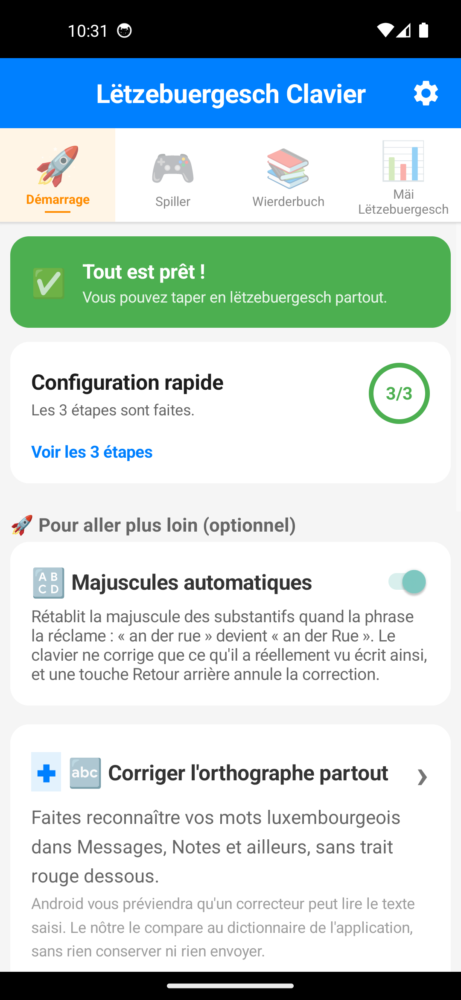
    <figcaption>The three guided steps, in the app (in French)</figcaption>
  </figure>

## Compared with other keyboards

Luxembourgish is missing from none of the big keyboards: Gboard, SwiftKey and
the Samsung keyboard all offer it, checked in the apps themselves. But none is
**built** for it: at Samsung, `lb` is one of the 691 languages in the
catalogue, served by the generic QWERTZ and with no published dictionary. And
the open source keyboards that accept a Luxembourgish dictionary rely on a word
list frozen since 2013, with no next-word prediction.

| | **Lëtzebuergesch Clavier** | Gboard | Samsung Keyboard | SwiftKey | HeliBoard | AnySoftKeyboard |
|---|---|---|---|---|---|---|
| Luxembourgish available | **Yes** | Yes, checked in the app | Yes, checked on the S24 Ultra | Yes, official Microsoft list | Yes, dictionary to add | Yes, separate pack |
| Designed for Luxembourgish | **Yes**, it is its only reason to exist | One language among 100+ | One language among 691 | One language among 700+ | Dictionary to add | Separate pack to install |
| Layout made for the language | **Yes**, QWERTZ with `é` `ä` `ë` as full keys | Yes, `é` `ä` `ë` as full keys | No, generic QWERTZ | — | — | — |
| Luxembourgish dictionary | **123,297 forms**, 2026 corpus + LOD | Not disclosed | Not disclosed | Not disclosed | 71,255 words, frozen in 2013 | Not disclosed |
| Next-word prediction | **Yes**, 27,746 contexts | Yes | Yes | Yes | No, in Luxembourgish | Basic |
| Prediction measured on a Galaxy A21s | 20.2% of words right in the top 3 | 13.4% | 17.7% | — | — | — |
| Two languages with no setup | **Yes**, two rows `LB` and `FR` at once | Up to 3 languages, to enable | Several languages, to enable | Up to 5 languages, to enable | 1 secondary language, to enable | — |
| Forgives typos | **Yes** | Yes | Yes | Yes | Yes | Yes |
| Writing without diacritics | **Yes** | — | — | — | — | — |
| System spell checker (lb) | **Yes** | Yes | In the keyboard | — | No | No |
| Internet access | **For dictation only**, typing stays on the phone | Yes | Yes | Yes | No | No |
| Open source | **Yes**, MIT | No | No | No | Yes | Yes |
| Games and progress | **Yes**, 7 games, 8 levels | No | No | No | No | No |
| Swipe typing | No | Yes | Yes | Yes | Library to add | Gestures |
| Luxembourgish voice typing | **Yes**, by LuxASR (University of Luxembourg), with a connection | No | No | No | No | No |
| Dark theme | **Yes** | Yes | Yes | Yes | Yes | Yes |

“—”: not checked. Figures collected in August 2026; Samsung
column collected in September 2026 from the language catalogue of the Samsung
Keyboard shipped on the Galaxy S24 Ultra (One UI 7, build
<code>S928BXXS4BYEC</code>); the Luxembourgish dictionary of the open source
keyboards comes from the
<a href="https://codeberg.org/Helium314/aosp-dictionaries">AOSP dictionaries repository</a>.
The “prediction measured” row comes from typing benchmarks on a Galaxy A21s
(our keyboard and Samsung on 8 September 2026, Gboard 18.2.4 on the 20th): 322
word boundaries in sentences from the ZLS corpus, where the next word must
appear among the three suggestions shown before a single one of its letters has
been typed. The gap with the Samsung Keyboard is not statistically significant:
on pure prediction the two are level, and Gboard does worse than both. Method,
raw data and limits in
<a href="comparatif.html#les-trois-claviers-mesurés-sur-le-même-galaxy">the comparison</a> (in French).

Apple's keyboard is not in this table because it does not offer Luxembourgish
yet: see the [detailed comparison with Gboard and Apple](comparatif.html) (in
French).

**What it does not do yet.** No swipe typing, no dictation without a
connection, and no German dictionary alongside the French one. These gaps are
real and known; they are at the top of the to-do list.

## Where the suggestions come from

The dictionary and the n-grams are generated from two open datasets:
[LuxAlign](https://huggingface.co/datasets/fredxlpy/LuxAlign), 180,342 press
sentences that bring the vocabulary, and
[LETZ](https://huggingface.co/datasets/fredxlpy/LETZ), the example sentences of
the *Lëtzebuerger Online Dictionnaire*, the only source of the everyday
register.

The pipeline runs again with every release, so the suggestions follow how the
language is really used rather than a frozen list. Details of the corpora,
measurements and citations are on the [corpus page](corpus.html) (in French).

## Install without Google Play

If you would rather not go through Google Play, the installation file (the
“APK”) can be installed by hand.

  <a href="https://github.com/famibelle/LuxKeyb/releases/latest/download/LetzebuergeschClavier-latest.apk"
     class="btn">📲 Download the latest APK</a>
  <figure style="margin:0;text-align:center;">
    
    <figcaption>
      Scan: the download starts
    </figcaption>
  </figure>

1. Download the file with the button or the QR code above: either way the
   download starts straight away. Every version stays listed on the
   [releases page](https://github.com/famibelle/LuxKeyb/releases).
2. Allow installation from this source, if Android asks.
3. Open the app: it guides you as described above.

Here too, Android shows a generic warning, displayed for **every** keyboard,
about possibly capturing what you type. It is normal, and the app's guide, at
the bottom of the Haut tab, explains why this one cannot send anything
anywhere.

## Contribute

The code is on [GitHub](https://github.com/famibelle/LuxKeyb) under the MIT
licence.

A word missing, a suggestion off the mark, a key in the way? Open an
[issue](https://github.com/famibelle/LuxKeyb/issues) or use the
[feedback form](feedbacks_form.html). The dictionary improves above all thanks
to these reports.

---

## Further reading

  <a href="labs.html?lang=en">🔬 Labs</a> ·
  <a href="ambassadeurs.html">📣 Ambassadors</a> (FR) ·
  <a href="supports-communication.html">🖨️ Posters and flyers</a> (FR) ·
  <a href="privacy/privacy-policy.html">🔒 Privacy</a> (FR) ·
  <a href="feedbacks_form.html">💬 Write to us</a> ·
  <a href="https://github.com/famibelle/LuxKeyb">💻 GitHub</a>

---

Android and Google Play are trademarks of Google
LLC; this app is neither published nor endorsed by Google.

Mir wëlle bleiwe wat mir sinn.

“We want to remain what we are.” 
That is what you join by installing it.

<em>Made in Luxembourg with ❤️</em>

