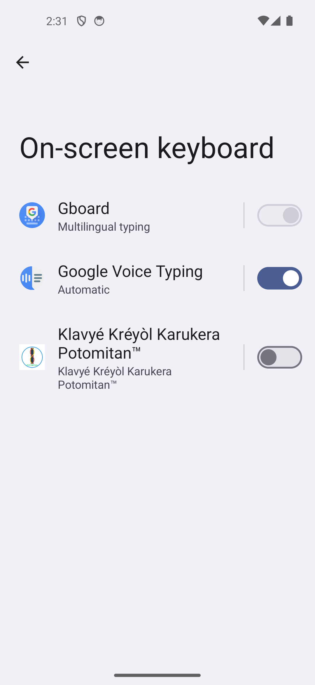
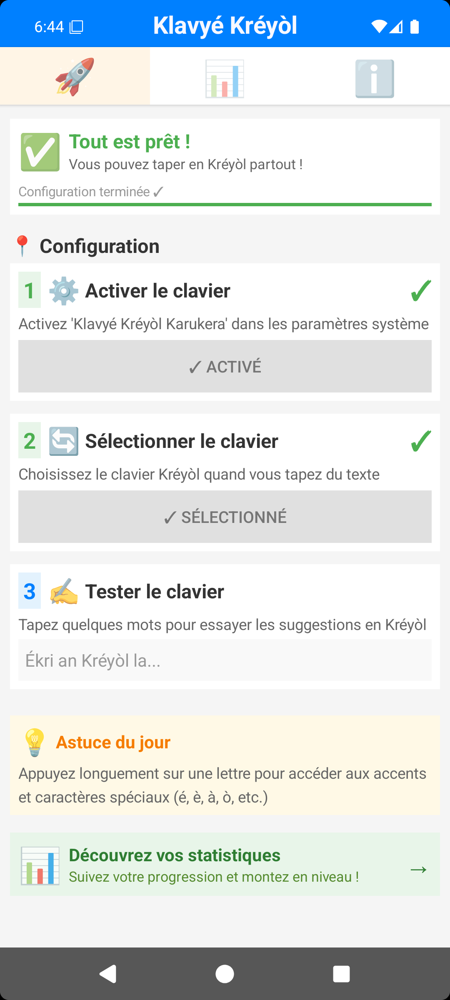
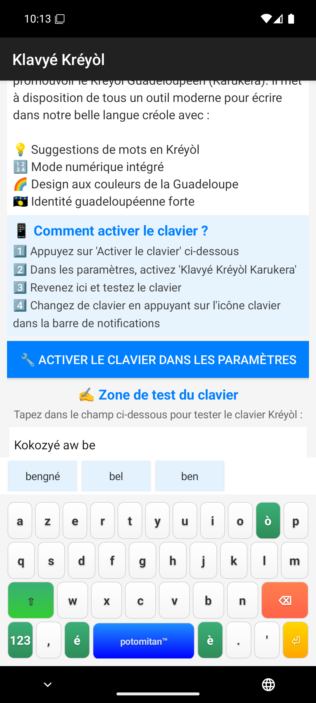
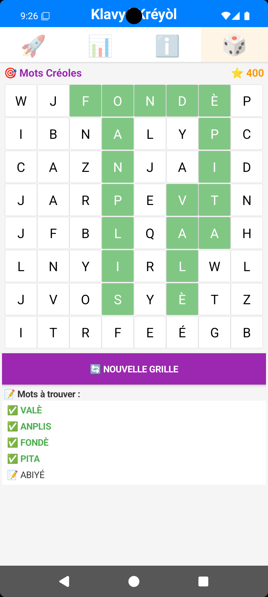
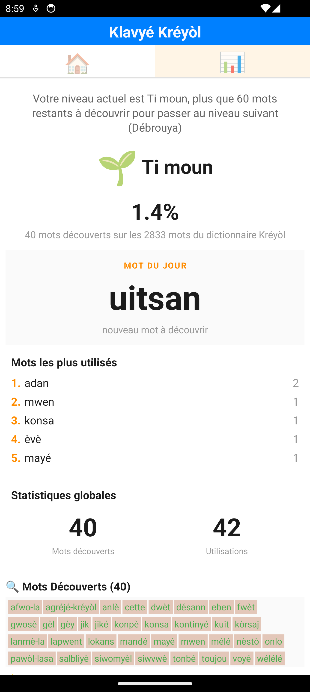

<!-- nav:start -->
<nav class="site">
  <a class="nav-brand" href="./">⌨️ Klavyé Kréyòl</a>
  <a href="simulateur.html">🧪 Essayer</a>
  <a href="nouveautes.html">🎁 Nouveautés</a>
  

    
ℹ️ Le projet

    

      <a href="corpus.html">Le corpus en chiffres</a>
      <a href="presskit.html">Dossier de presse</a>
      <a href="notes_techniques.html">Notes techniques</a>
      <a href="https://github.com/famibelle/KreyolKeyb">Code source</a>
      <a href="privacy/privacy-policy.html">Confidentialité</a>
    

  

  <a class="nav-cta" href="https://play.google.com/store/apps/details?id=com.potomitan.kreyolkeyboard&amp;referrer=utm_source%3Dlanding%26utm_campaign%3Dlaunch10k%26utm_content%3Dnav">📲 Installer, c'est gratuit</a>
  

    
Déjà installé ?

    

      <a href="guide.html" aria-current="page">Guide d'installation</a>
      <a href="feedbacks_form.html">Donner son avis</a>
      <a href="beta_onboarding.html">Devenir bêta-testeur</a>
      <strong class="menu-label">Faire connaître</strong>
      <a href="ambassade.html">Vin Anbasadè</a>
      <a href="charte-ambassadeur.html">Charte de l'ambassadeur</a>
      <a href="tract.html">Tract à imprimer</a>
      <a href="affiche.html">Affiche à imprimer</a>
      <a href="triptyque.html">Triptyque à imprimer</a>
      <a href="publicites.html">Visuels publicitaires</a>
    

  

  <button type="button" class="theme-toggle" aria-label="Changer de thème">🌙</button>
</nav>
<!-- Sur mobile, le bouton de la barre est masqué et remplacé par celle-ci,
     fixée en bas dans la zone du pouce, donc atteignable à toute profondeur
     de défilement. -->

  <a class="install-bar-cta" href="https://play.google.com/store/apps/details?id=com.potomitan.kreyolkeyboard&amp;referrer=utm_source%3Dlanding%26utm_campaign%3Dlaunch10k%26utm_content%3Dbarre-mobile">📲 Installer, c'est gratuit</a>
  <a class="install-bar-alt" href="simulateur.html">Essayer d'abord dans le navigateur</a>

<!-- nav:end -->

# Guide d'installation et d'utilisation

*Tout ce qu'il faut savoir pour activer Klavyé Kréyòl Karukera et en tirer le
meilleur, en 5 minutes.*

## Installation en 3 étapes

Une fois l'application installée depuis Google Play, elle doit être activée
comme clavier système avant de pouvoir l'utiliser dans vos applications.

### Étape 1 : Activer le clavier

Ouvrez l'application Klavyé Kréyòl Karukera et touchez **« Activer le
clavier »**. Vous arrivez dans les paramètres Android, section « Clavier
virtuel » (ou « Langues et saisie » selon les téléphones). Activez
l'interrupteur en face de **« Klavyé Kréyòl Karukera »**.

  

Android affiche un avertissement standard rappelant qu'un clavier peut lire
le texte saisi : c'est le même message pour tous les claviers, y compris
Gboard. Klavyé Kréyòl Karukera fonctionne **100 % hors ligne** et ne
collecte aucune donnée (voir notre [politique de confidentialité](privacy/privacy-policy.html)).

### Étape 2 : Sélectionner le clavier

Activer le clavier ne suffit pas : il faut ensuite le **choisir** comme
clavier actif. Revenez dans une application où vous pouvez écrire (Messages,
Notes...), touchez un champ de texte, puis :

- soit appuyez longuement sur la barre d'espace de votre clavier actuel et
  choisissez « Klavyé Kréyòl Karukera » dans la liste ;
- soit touchez l'icône clavier dans la barre de notifications, si elle est
  affichée.

### Étape 3 : Essayer le clavier

Écrivez « Bonjou tout moun » dans un champ de texte et observez les
suggestions apparaître au-dessus du clavier. Si des mots créoles vous sont
proposés, tout fonctionne.

  

### Étape 4 (optionnelle) : le correcteur orthographique

Pour que vos mots créoles ne soient plus soulignés en rouge **dans toutes
les applications** (pas seulement au clavier), activez aussi le correcteur
orthographique Kréyòl : Paramètres Android → Système → Langues et saisie →
Correction orthographique, puis activez « Klavyé Kréyòl Karukera ».

## Utilisation au quotidien

  

### Écrire en kréyòl

Le clavier démarre en mode alphabétique classique. La première lettre de
chaque message prend automatiquement une majuscule, comme sur n'importe quel
clavier.

### Accents et caractères spéciaux

Appuyez **longuement** sur une lettre pour faire apparaître ses variantes
accentuées (é, è, à, ò...) et les caractères spéciaux du kréyòl. Glissez le
doigt vers l'accent voulu puis relâchez pour le sélectionner.

### Suggestions et autocomplétion

Une barre de suggestions apparaît dès que vous commencez à taper. Les mots
en kréyòl sont prioritaires ; le français prend le relais à partir de 3
lettres si aucun mot créole ne correspond. Touchez un mot suggéré pour le
compléter instantanément, espace inclus.

### Chiffres et symboles

Le bouton **« 123 »** en bas à gauche du clavier bascule vers les chiffres
et symboles usuels. La ponctuation de base (virgule, point, apostrophe)
reste accessible directement sur le clavier alphabétique.

### Changer de clavier à tout moment

Un appui long sur la barre d'espace permet de repasser à un autre clavier
(Gboard, etc.) ponctuellement, sans avoir à tout reconfigurer.

## Jeux de vocabulaire et progression

En dehors du clavier, l'application propose deux jeux pour enrichir son
vocabulaire créole à partir du dictionnaire intégré : **Mots Mêlés**
(retrouver des mots cachés dans une grille de lettres) et **Mots Mélangés**
(reconstituer un mot à partir de lettres dans le désordre).

  
  

Chaque mot tapé au clavier ou découvert dans les jeux fait progresser votre
maîtrise du kréyòl, visible dans l'onglet des statistiques. **7 niveaux
culturels** jalonnent le parcours, de « Pipirit » à « Potomitan ».

## Questions fréquentes

**Le clavier créole n'apparaît pas quand je tape ?**
Vérifiez qu'il est bien *sélectionné* (pas seulement activé) : reprenez
l'étape 2, ou faites un appui long sur la barre d'espace pour changer de
clavier à tout moment.

**Comment revenir à un autre clavier ponctuellement ?**
Appui long sur la barre d'espace, puis choisissez un autre clavier dans la
liste.

**Mes données sont-elles envoyées quelque part ?**
Non. Le clavier fonctionne entièrement en local, sans connexion internet.
Voir la [politique de confidentialité](privacy/privacy-policy.html) complète.

**Le clavier ne propose pas un mot créole que je connais ?**
Le dictionnaire s'enrichit au fil du temps à partir d'un corpus littéraire
créole. Vous pouvez signaler un mot manquant via le
[formulaire de retours](feedbacks_form.html).

**Le clavier est-il gratuit ?**
Oui, entièrement gratuit, sans publicité et open source
([code source sur GitHub](https://github.com/famibelle/KreyolKeyb)).

## Besoin d'aide ?

Une question qui n'est pas couverte ici ? Écrivez à
**[contact@potomitan.io](mailto:contact@potomitan.io)** ou passez par le
[formulaire de retours](feedbacks_form.html).

  

<!-- footer:start -->
<footer class="site">
  

    
Maké an bèl Kréyòl asi téléfòn a-w.

    <a class="btn primary" href="https://play.google.com/store/apps/details?id=com.potomitan.kreyolkeyboard&amp;referrer=utm_source%3Dlanding%26utm_campaign%3Dlaunch10k%26utm_content%3Dpied">📲 Installer, c'est gratuit</a>
  

  

    

      <strong>Le clavier</strong>
      <a href="./">Accueil</a>
      <a href="simulateur.html">Essayer en ligne</a>
      <a href="guide.html" aria-current="page">Guide d'installation</a>
      <a href="nouveautes.html">Nouveautés</a>
    

    

      <strong>Le projet</strong>
      <a href="corpus.html">Le corpus en chiffres</a>
      <a href="presskit.html">Dossier de presse</a>
      <a href="notes_techniques.html">Notes techniques</a>
      <a href="https://github.com/famibelle/KreyolKeyb">Code source</a>
    

    

      <strong>Faire connaître</strong>
      <a href="ambassade.html">Vin Anbasadè</a>
      <a href="charte-ambassadeur.html">Charte de l'ambassadeur</a>
      <a href="tract.html">Tract</a>
      <a href="affiche.html">Affiche</a>
      <a href="triptyque.html">Triptyque</a>
      <a href="publicites.html">Visuels publicitaires</a>
    

    

      <strong>Participer</strong>
      <a href="beta_onboarding.html">Devenir bêta-testeur</a>
      <a href="feedbacks_form.html">Donner son avis</a>
      <a href="jauge.html">La jauge des 10 000</a>
      <a href="mailto:contact@potomitan.io">contact@potomitan.io</a>
    

  

  

    Potomitan™, Teknoloji pou tout moun.
    <a href="privacy/privacy-policy.html">Politique de confidentialité</a>
    Gratuit, open source (MIT), zéro pub, 100&nbsp;% hors ligne.
  

</footer>
<!-- footer:end -->
