<!-- nav:start -->
<nav class="site">
  <a class="nav-brand" href="./">⌨️ Klavyé Kréyòl</a>
  <a href="simulateur.html">🧪 Essayer</a>
  <a href="nouveautes.html">🎁 Nouveautés</a>
  

    
ℹ️ Le projet

    

      <a href="corpus.html">Le corpus en chiffres</a>
      <a href="presskit.html">Dossier de presse</a>
      <a href="partenaires.html">Partenariats institutionnels</a>
      <a href="notes_techniques.html">Notes techniques</a>
      <a href="https://github.com/famibelle/KreyolKeyb">Code source</a>
      <a href="privacy/privacy-policy.html">Confidentialité</a>
    

  

  <a class="nav-cta" href="https://play.google.com/store/apps/details?id=com.potomitan.kreyolkeyboard&amp;referrer=utm_source%3Dlanding%26utm_campaign%3Dlaunch10k%26utm_content%3Dnav">📲 Installer, c'est gratuit</a>
  

    
Déjà installé ?

    

      <a href="guide.html" aria-current="page">Guide d'installation</a>
      <a href="feedbacks_form.html">Donner son avis</a>
      <a href="beta_onboarding.html">Devenir bêta-testeur</a>
    

  

  

    
📣 Ambassadeurs

    

      <a href="ambassadeurs.html">Espace ambassadeurs</a>
      <a href="ambassade.html">Vin Anbasadè</a>
      <a href="charte-ambassadeur.html">Charte de l'ambassadeur</a>
      <a href="tract.html">Tract à imprimer</a>
      <a href="affiche.html">Affiche à imprimer</a>
      <a href="triptyque.html">Triptyque à imprimer</a>
      <a href="publicites.html">Visuels publicitaires</a>
      <a href="charte-graphique.html">Charte graphique</a>
    

  

  <button type="button" class="theme-toggle" aria-label="Changer de thème">🌙</button>
</nav>
<!-- Sur mobile, le bouton de la barre est masqué et remplacé par celle-ci,
     fixée en bas dans la zone du pouce, donc atteignable à toute profondeur
     de défilement. -->

  <a class="install-bar-cta" href="https://play.google.com/store/apps/details?id=com.potomitan.kreyolkeyboard&amp;referrer=utm_source%3Dlanding%26utm_campaign%3Dlaunch10k%26utm_content%3Dbarre-mobile">📲 Installer, c'est gratuit</a>
  <a class="install-bar-alt" href="simulateur.html">Essayer d'abord dans le navigateur</a>

<!-- nav:end -->

# Guide d'installation et d'utilisation

*Tout ce qu'il faut savoir pour activer Klavyé Kréyòl Karukera et en tirer le
meilleur, en 5 minutes.*

## Installation en 3 étapes

Une fois l'application installée depuis Google Play, elle doit être activée
comme clavier système avant de pouvoir l'utiliser dans vos applications.

### Étape 1 : Activer le clavier

Ouvrez l'application Klavyé Kréyòl Karukera et touchez **« Activer le
clavier »**. Vous arrivez dans les paramètres Android, section « Clavier
virtuel » (ou « Langues et saisie » selon les téléphones). Activez
l'interrupteur en face de **« Klavyé Kréyòl Karukera »**.

  

Android affiche un avertissement standard rappelant qu'un clavier peut lire
le texte saisi : c'est le même message pour tous les claviers, y compris
Gboard. Klavyé Kréyòl Karukera fonctionne **100 % hors ligne** et ne
collecte aucune donnée (voir notre [politique de confidentialité](privacy/privacy-policy.html)).

### Étape 2 : Sélectionner le clavier

Activer le clavier ne suffit pas : il faut ensuite le **choisir** comme
clavier actif. Revenez dans une application où vous pouvez écrire (Messages,
Notes...), touchez un champ de texte, puis :

- soit appuyez longuement sur la barre d'espace de votre clavier actuel et
  choisissez « Klavyé Kréyòl Karukera » dans la liste ;
- soit touchez l'icône clavier dans la barre de notifications, si elle est
  affichée.

### Étape 3 : Essayer le clavier

Écrivez « Bonjou tout moun » dans un champ de texte et observez les
suggestions apparaître au-dessus du clavier. Si des mots créoles vous sont
proposés, tout fonctionne.

  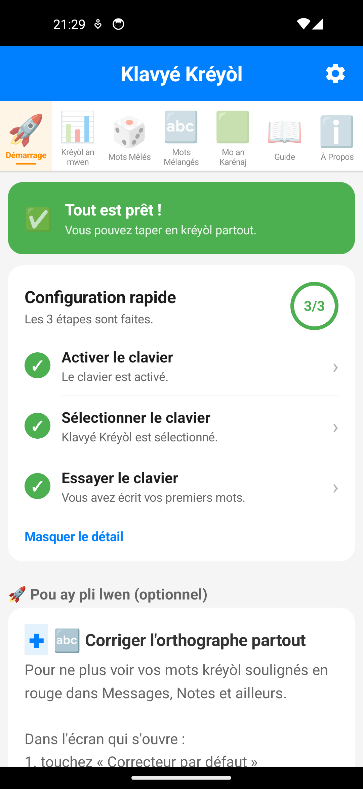

### Étape 4 (optionnelle) : le correcteur orthographique

Pour que vos mots créoles ne soient plus soulignés en rouge **dans toutes
les applications** (pas seulement au clavier), activez aussi le correcteur
orthographique Kréyòl : Paramètres Android → Système → Langues et saisie →
Correction orthographique, puis activez « Klavyé Kréyòl Karukera ».

## Utilisation au quotidien

  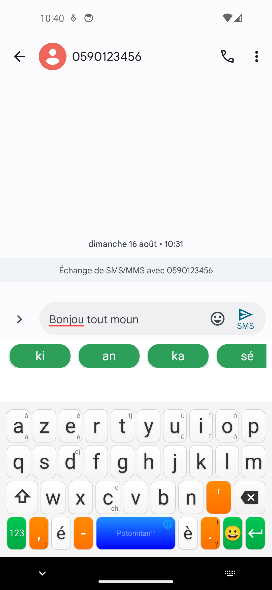

### Écrire en kréyòl

Le clavier démarre en mode alphabétique classique. La première lettre de
chaque message prend automatiquement une majuscule, comme sur n'importe quel
clavier.

### Accents et caractères spéciaux

Appuyez **longuement** (une seconde) sur une lettre pour faire apparaître ses
variantes accentuées (é, è, à, ò...) et les caractères spéciaux du kréyòl. Le
choix reste affiché quand vous relâchez : touchez ensuite l'accent voulu, il
s'insère à la place de la lettre. Les petits accents imprimés dans le coin
d'une touche annoncent ce qu'elle cache.

  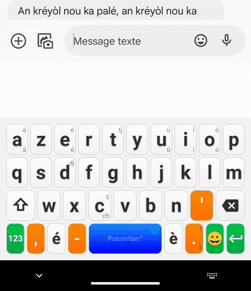

### Suggestions et autocomplétion

Une barre de suggestions apparaît dès que vous commencez à taper. Les mots
en kréyòl sont prioritaires (étiquette **KR**) ; le français prend le relais à
partir de 3 lettres si aucun mot créole ne correspond (étiquette **FR**).
Touchez un mot suggéré pour le compléter instantanément, espace inclus. Une
fois le mot validé, la barre propose les **mots qui suivent habituellement**,
d'après le corpus littéraire créole.

  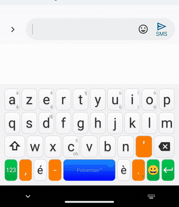

### Chiffres et symboles

Le bouton **« 123 »** en bas à gauche du clavier bascule vers les chiffres
et symboles usuels. La ponctuation de base (virgule, point, apostrophe)
reste accessible directement sur le clavier alphabétique.

### Dans une conversation

Rien de particulier à faire : une fois le clavier sélectionné, il s'ouvre dans
Messages, WhatsApp, les mails ou n'importe quel champ de texte, avec ses
suggestions kréyòl.

  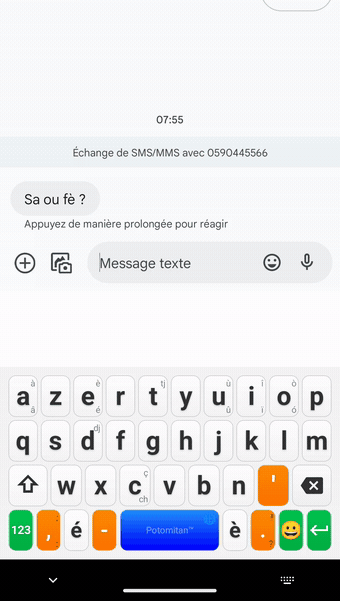

## Passer d'un clavier à l'autre

Klavyé Kréyòl Karukera ne remplace pas vos autres claviers : il s'ajoute à
la liste, et vous basculez de l'un à l'autre en deux secondes, aussi souvent
que vous voulez. Aucun réglage à refaire, aucune donnée perdue.

### Quitter Klavyé Kréyòl pour un autre clavier

Pendant que le clavier créole est affiché, **appuyez une seconde sur la
barre d'espace**. Le petit 🌐 dans son coin est là pour vous le rappeler :

  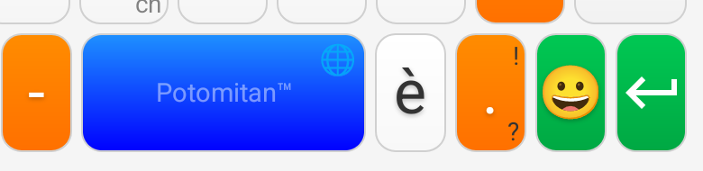

Le sélecteur de claviers d'Android s'ouvre et liste tous vos claviers
installés. Touchez « Gboard », « Samsung Keyboard » ou celui que vous
voulez : il prend la main immédiatement, dans le champ où vous étiez.

  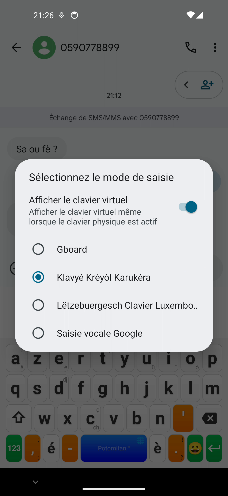
  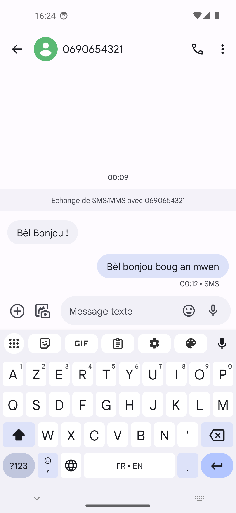

Le clavier créole vous propose toujours la liste plutôt que de basculer tout
seul vers le clavier suivant : c'est vous qui choisissez sur quoi vous
atterrissez.

### Revenir à Klavyé Kréyòl Karukera

Attention, le geste n'est pas symétrique : sur la plupart des autres
claviers, l'appui long sur la barre d'espace ou la touche 🌐 change
seulement **leur** langue interne (Gboard propose ainsi français, anglais...)
et ne ramène pas au clavier créole.

Le chemin qui marche partout est l'**icône de clavier en bas de l'écran**,
dans la barre de navigation, affichée tant qu'un clavier est ouvert.
Touchez-la : le sélecteur Android réapparaît, et « Klavyé Kréyòl Karukera »
y attend.

  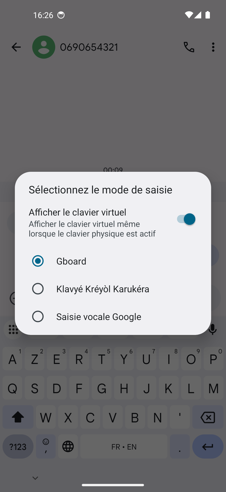
  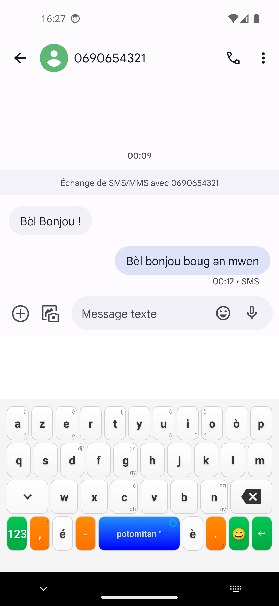

Le trajet complet, aller et retour :

  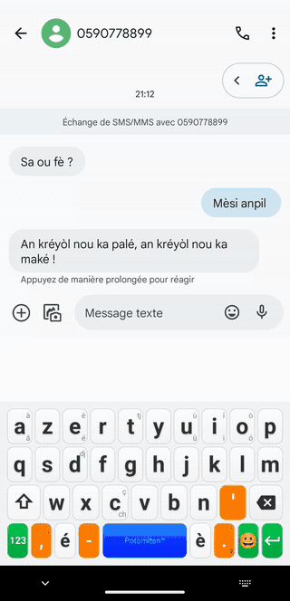

Si votre téléphone n'affiche pas cette icône, ouvrez l'**application Klavyé
Kréyòl Karukera** et touchez le bouton de l'étape 2, « Sélectionner le
clavier » : il ouvre exactement le même sélecteur.

L'application rappelle ces deux gestes dans son onglet **Démarrage**, une fois
le clavier activé et sélectionné, avec un bouton qui ouvre le sélecteur
directement.

  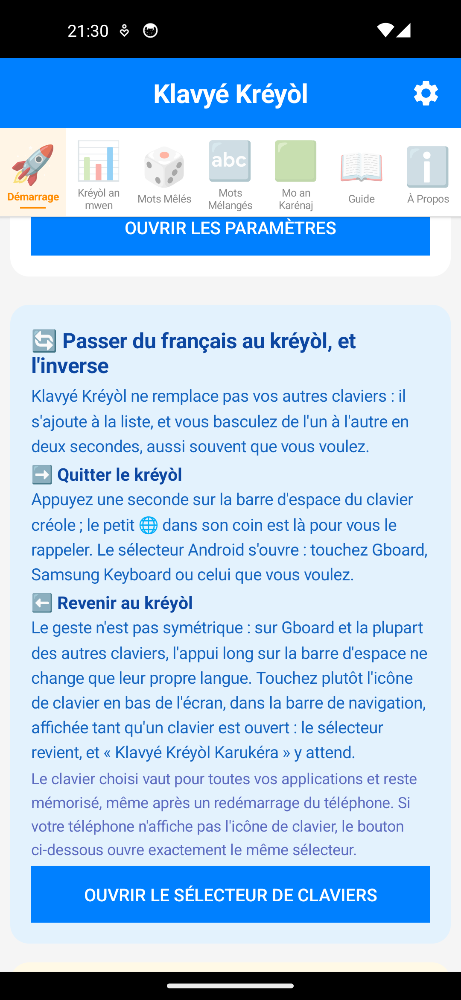

### Ce qu'il faut savoir

- Le choix est **global**, pas par application : le clavier sélectionné vaut
  pour Messages, WhatsApp, le navigateur et tout le reste, jusqu'à ce que
  vous en changiez.
- Le choix est **mémorisé** : le téléphone rouvre le dernier clavier choisi,
  même après un redémarrage.
- Un clavier n'apparaît dans le sélecteur que s'il a été **activé** au
  préalable dans les paramètres Android (étape 1). Si Klavyé Kréyòl Karukera
  manque à l'appel, c'est presque toujours cela.
- Écrire en français avec le clavier créole reste possible : les suggestions
  françaises prennent le relais à partir de 3 lettres. Changer de clavier
  n'est utile que si vous avez besoin d'une autre langue ou d'une
  disposition particulière.

## Les écrans de l'application

L'application qui accompagne le clavier sert d'abord à l'installer, puis à
suivre sa progression et à jouer. Sa **barre d'onglets n'apparaît qu'une fois
le clavier activé et sélectionné** : tant que la configuration n'est pas
terminée, l'écran de démarrage reste seul, pour ne pas disperser.

### 🚀 Démarrage

Le point d'entrée, et le seul onglet visible tant que le clavier n'est pas en
place. Les trois étapes (activer, sélectionner, essayer dans un champ de test)
tiennent dans une carte **« Configuration rapide »** : tant qu'il reste
quelque chose à faire elle est dépliée, une fois tout coché elle se replie sur
un simple **3/3**, que « Voir les 3 étapes » rouvre au besoin. En dessous
viennent l'étape facultative du correcteur orthographique, le rappel des
gestes pour changer de clavier, l'astuce de la semaine et un raccourci vers
les statistiques.

  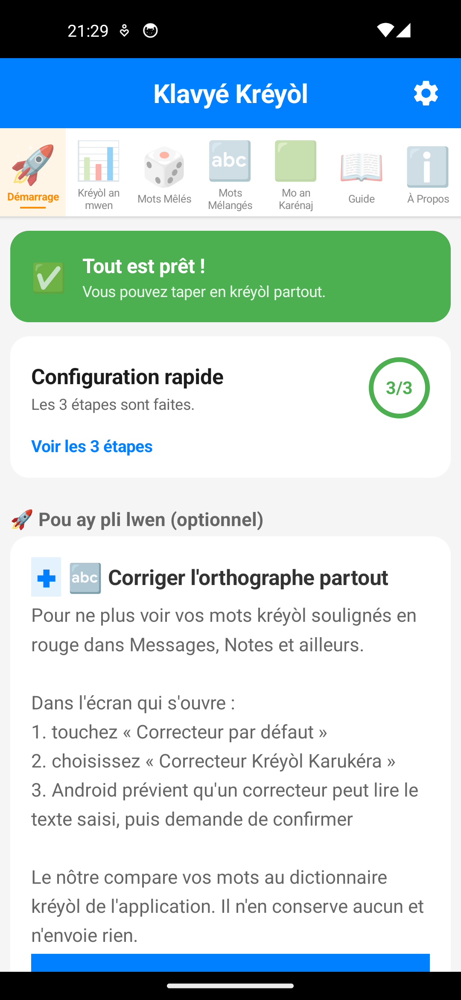

### 📊 Kréyòl an mwen

Votre progression. Le niveau atteint, la part du dictionnaire déjà employée,
le **mot du jour** et une liste de mots à découvrir, tirés du dictionnaire.
Chaque mot tapé au clavier ou trouvé dans un jeu compte. **7 niveaux
culturels** jalonnent le parcours : Pipirit, Ti moun, Débrouya, An mitan,
Kompè Lapen, Kompè Zamba, Potomitan. Un bouton permet de partager sa carte de
niveau.

  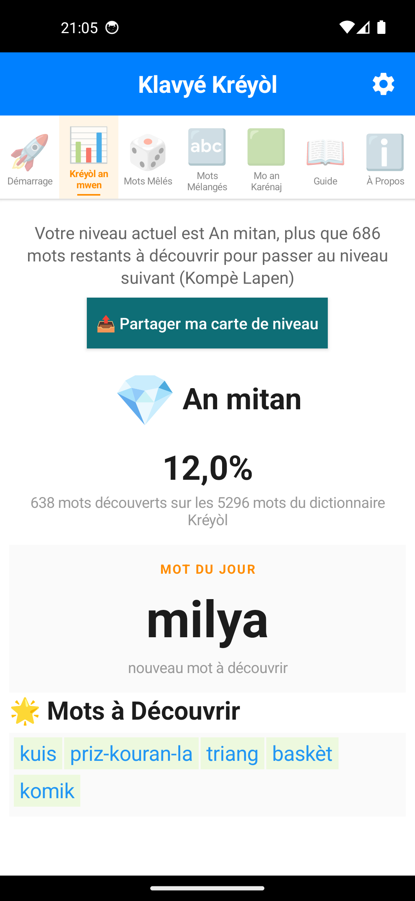

La carte de niveau part comme une image, avec un texte tout prêt : de quoi
lancer un défi à ses proches.

  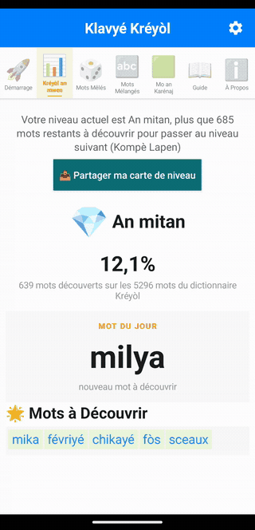

### 🎲 Mots Mêlés

Une grille de lettres où se cachent des mots créoles, listés sous la grille.
Glissez le doigt de la première à la dernière lettre d'un mot pour le
valider : il passe au vert. « Nouvelle grille » tire une autre grille du
dictionnaire.

  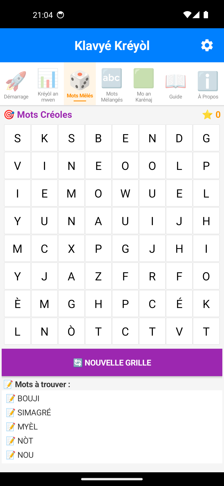

### 🔤 Mots Mélangés

Dix mots par partie, à reconstituer à partir de leurs lettres dans le
désordre. La première et la dernière lettre sont données. « Indice » place une
lettre de plus mais coûte 20 points, « Passer » enchaîne sur le mot suivant.

  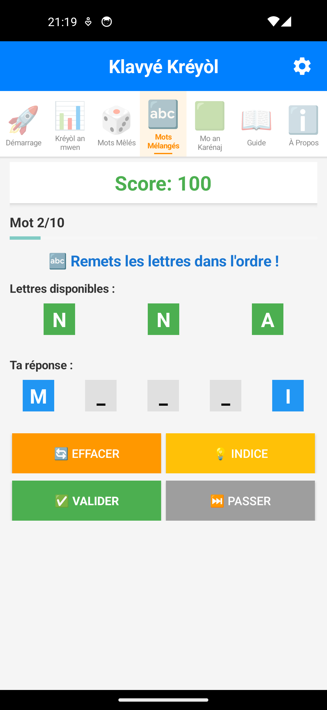

  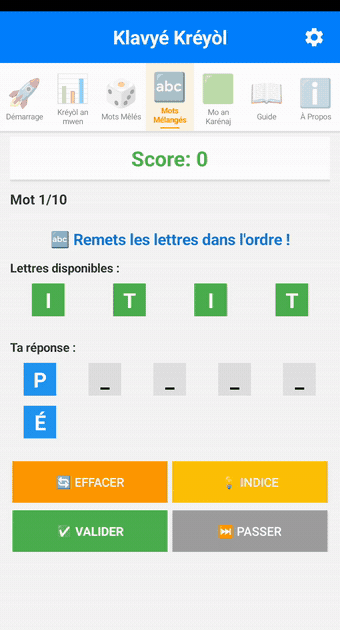

### 🟩 Mo an Karénaj

Un mot kréyòl de 5 lettres à deviner en 6 essais. Après chaque proposition,
les cases se colorent : vert pour une lettre bien placée, orange pour une
lettre présente mais ailleurs, gris pour une lettre absente. Le mot proposé
doit exister dans le dictionnaire kréyòl.

  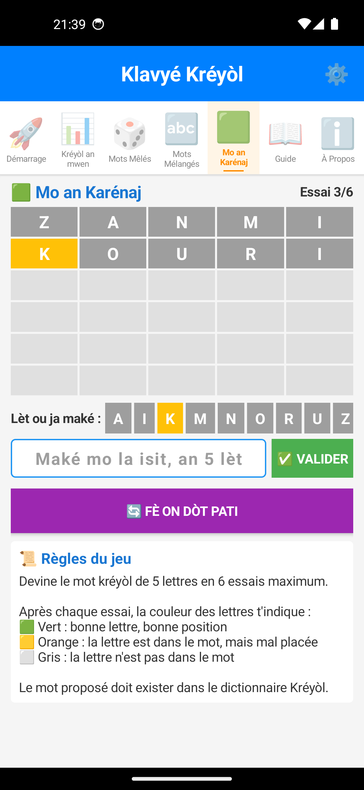

Le mot se tape avec le clavier kréyòl, accents compris :

  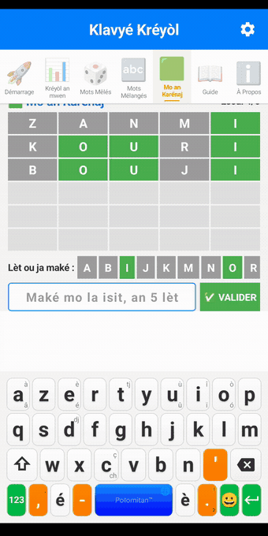

### 📖 Guide

Le même mode d'emploi que cette page, embarqué dans l'application et illustré
de captures : installation, accents, suggestions, correcteur, chiffres,
jeux, progression, questions fréquentes. Utile hors connexion, ou pour
accompagner quelqu'un à qui vous faites installer le clavier.

  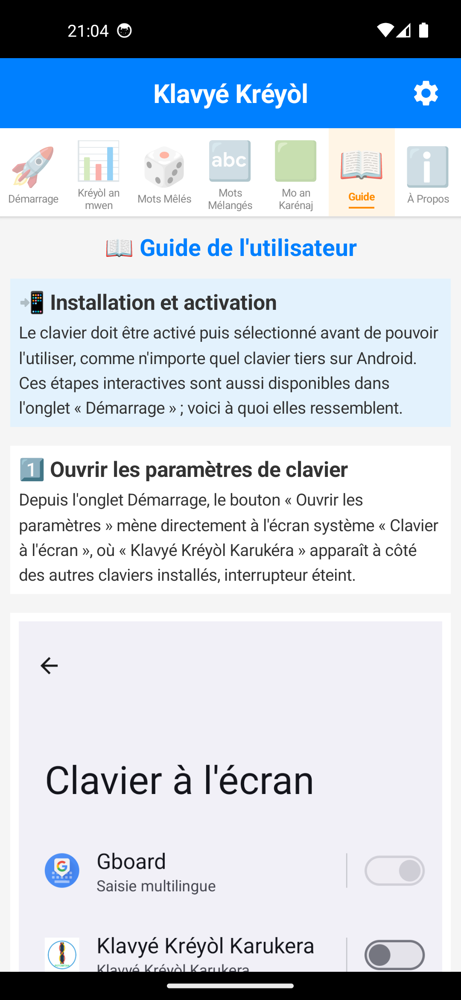

### ℹ️ À Propos

La raison d'être du projet, les boutons pour partager l'application et la
noter sur le Play Store, et les **sources littéraires** dont sont tirés les
mots du dictionnaire.

  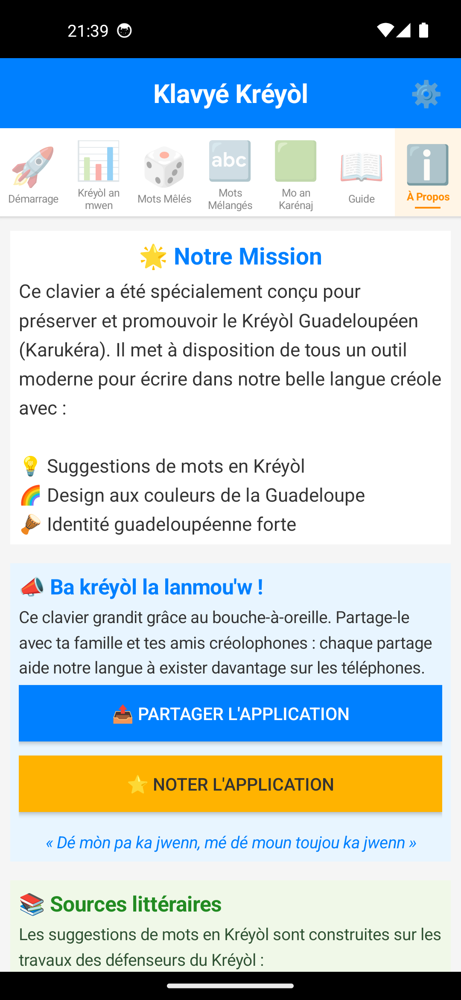

« Partager l'application » prépare un message en kréyòl et laisse choisir par
où il part :

  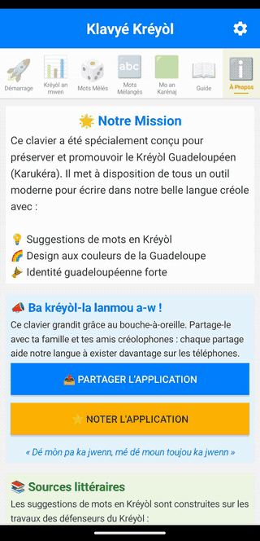

### ⚙️ Réglages du clavier

Derrière l'engrenage, en haut à droite de la barre bleue, et non dans les
onglets. Deux blocs :

- **Apparence** : « Comme le téléphone », « Toujours clair » ou « Toujours
  sombre ». Seul le blanc des touches de lettres passe en anthracite ; le
  vert, l'orange et le bleu du clavier ne bougent pas. Les deux positions
  fixes existent parce que sur plusieurs surcouches constructeur le mode
  sombre du téléphone ne descend pas jusqu'aux claviers tiers.
- **Retour de frappe** : la **vibration** et le **son** à chaque appui.

Ces réglages vivent dans l'application plutôt que dans les paramètres du
téléphone, parce que sur beaucoup d'appareils le réglage système de vibration
au toucher ne gouverne que le clavier du constructeur. Le choix s'applique dès
le retour dans un champ de saisie.

  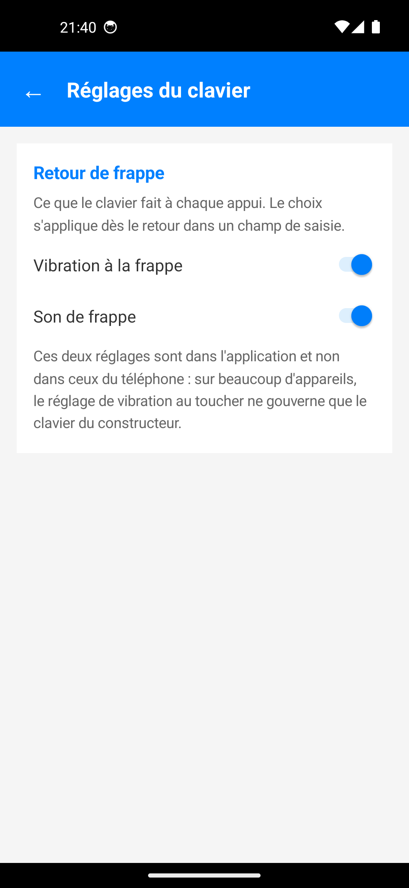

## Questions fréquentes

**Le clavier créole n'apparaît pas quand je tape ?**
Vérifiez qu'il est bien *sélectionné* (pas seulement activé) : reprenez
l'étape 2, ou touchez l'icône de clavier en bas de l'écran pendant que vous
écrivez pour rouvrir le sélecteur.

**Comment revenir à un autre clavier ponctuellement ?**
Appui long d'une seconde sur la barre d'espace du clavier créole, puis
choisissez un autre clavier dans la liste. Pour revenir au créole ensuite,
le geste est différent : voir
[Passer d'un clavier à l'autre](#passer-dun-clavier-à-lautre).

**Installer Klavyé Kréyòl va-t-il supprimer mon clavier habituel ?**
Non. Il s'ajoute à la liste des claviers du téléphone, sans toucher aux
autres, et vous basculez entre eux quand vous voulez.

**Mes données sont-elles envoyées quelque part ?**
Non. Le clavier fonctionne entièrement en local, sans connexion internet.
Voir la [politique de confidentialité](privacy/privacy-policy.html) complète.

**Le clavier ne propose pas un mot créole que je connais ?**
Le dictionnaire s'enrichit au fil du temps à partir d'un corpus littéraire
créole. Vous pouvez signaler un mot manquant via le
[formulaire de retours](feedbacks_form.html).

**Le clavier est-il gratuit ?**
Oui, entièrement gratuit, sans publicité et open source
([code source sur GitHub](https://github.com/famibelle/KreyolKeyb)).

## Besoin d'aide ?

Une question qui n'est pas couverte ici ? Écrivez à
**[contact@potomitan.io](mailto:contact@potomitan.io)** ou passez par le
[formulaire de retours](feedbacks_form.html).

  

<!-- footer:start -->
<footer class="site">
  

    
Maké on bèl Kréyòl asi téléfòn a-w.

    <a class="btn primary" href="https://play.google.com/store/apps/details?id=com.potomitan.kreyolkeyboard&amp;referrer=utm_source%3Dlanding%26utm_campaign%3Dlaunch10k%26utm_content%3Dpied">📲 Installer, c'est gratuit</a>
  

  

    

      <strong>Le clavier</strong>
      <a href="./">Accueil</a>
      <a href="simulateur.html">Essayer en ligne</a>
      <a href="guide.html" aria-current="page">Guide d'installation</a>
      <a href="nouveautes.html">Nouveautés</a>
    

    

      <strong>Le projet</strong>
      <a href="corpus.html">Le corpus en chiffres</a>
      <a href="presskit.html">Dossier de presse</a>
      <a href="partenaires.html">Partenariats institutionnels</a>
      <a href="notes_techniques.html">Notes techniques</a>
      <a href="ergotherapie.html">Fiche ergothérapie</a>
      <a href="comparatif-gboard.html">Comparatif avec Gboard</a>
      <a href="https://github.com/famibelle/KreyolKeyb">Code source</a>
    

    

      <strong>Faire connaître</strong>
      <a href="ambassadeurs.html">Espace ambassadeurs</a>
      <a href="ambassade.html">Vin Anbasadè</a>
      <a href="charte-ambassadeur.html">Charte de l'ambassadeur</a>
      <a href="tract.html">Tract</a>
      <a href="affiche.html">Affiche</a>
      <a href="triptyque.html">Triptyque</a>
      <a href="publicites.html">Visuels publicitaires</a>
      <a href="charte-graphique.html">Charte graphique</a>
    

    

      <strong>Participer</strong>
      <a href="beta_onboarding.html">Devenir bêta-testeur</a>
      <a href="feedbacks_form.html">Donner son avis</a>
      <a href="jauge.html">La jauge des 10 000</a>
      <a href="mailto:contact@potomitan.io">contact@potomitan.io</a>
    

  

  

    Potomitan™, Teknoloji pou tout moun.
    <a href="privacy/privacy-policy.html">Politique de confidentialité</a>
    Gratuit, open source (MIT), zéro pub, 100&nbsp;% hors ligne.
  

</footer>
<!-- footer:end -->
