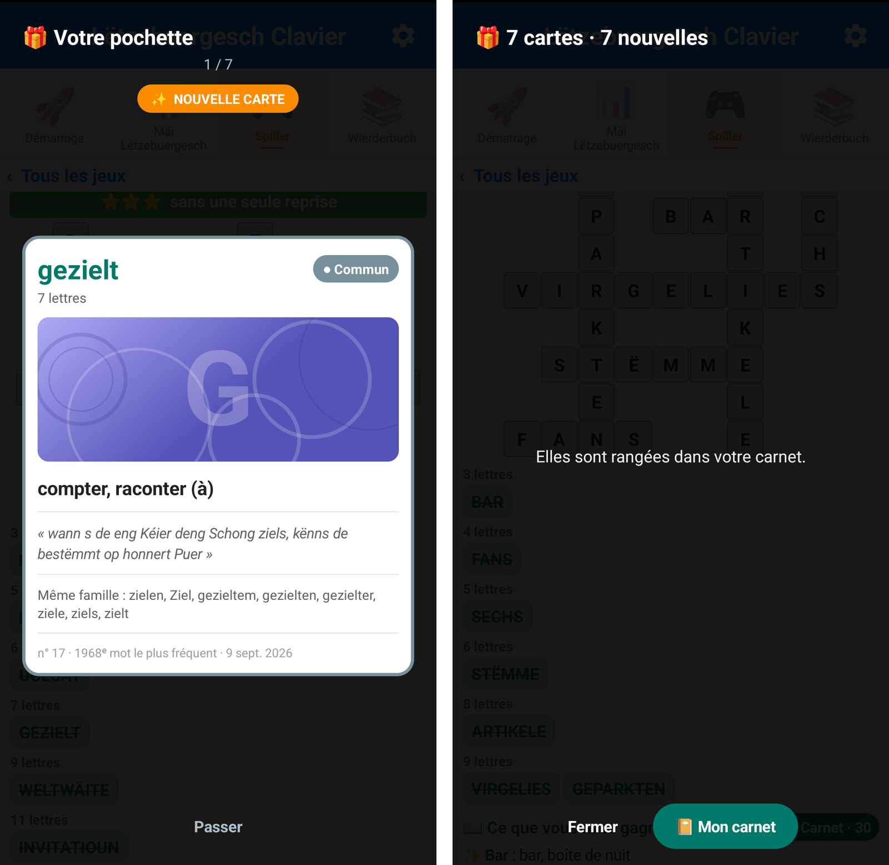
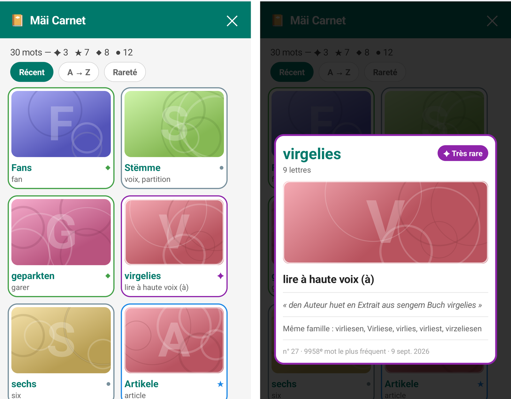

<nav class="site">
  <a href="index.html">🏠 Accueil</a> ·
  <a href="index.html#installer">📲 Installer</a> ·
  <a href="simulateur.html">⌨️ Essayer en ligne</a> ·
  <strong>📘 Guide</strong> ·
  <a href="faq.html">❓ Aide</a> ·
  <button type="button" class="theme-toggle" aria-label="Passer en mode sombre">🌙</button>
</nav>

# Guide d'installation et d'utilisation

*Tout ce qu'il faut savoir pour activer le Lëtzebuergesch Clavier et en tirer le
meilleur, en cinq minutes.*

## Installation en 3 étapes

Installez d'abord l'application. Le plus simple est de passer par
[Google Play](https://play.google.com/apps/testing/com.potomitan.luxkeyboard) :
elle s'y installe et s'y met à jour comme n'importe quelle autre. Si vous
préférez le fichier d'installation, il est sur la
[page d'accueil](index.html#installer-sans-passer-par-google-play), et Android
vous demandera alors une autorisation pour cette source.

Une fois installée, l'application doit être activée comme clavier système avant
de pouvoir servir dans vos autres applications. Elle vous guide, et coche les
étapes au fur et à mesure.

### Étape 1 : activer le clavier

Ouvrez l'application et touchez **« Activer le clavier »**. Vous arrivez dans
les paramètres Android, section « Clavier à l'écran » (ou « Langues et saisie »
selon les téléphones). Activez l'interrupteur en face de
**« Lëtzebuergesch Clavier »**.

  

Android affiche alors un avertissement standard, rappelant qu'un clavier peut
lire le texte saisi. C'est le **même message pour tous les claviers**, Gboard
compris. Celui-ci fonctionne entièrement hors ligne et n'a aucun accès réseau —
voir la [politique de confidentialité](privacy/privacy-policy.html).

Un second message prévient qu'après un redémarrage, le clavier ne sera
disponible qu'une fois le téléphone déverrouillé. C'est également normal.

### Étape 2 : sélectionner le clavier

Activer ne suffit pas : il faut ensuite le **choisir** comme clavier actif.
Depuis l'application, touchez **« Ouvrir le sélecteur »** et choisissez
« Lëtzebuergesch Clavier » dans la liste.

À tout moment ensuite, un appui long d'une seconde sur la barre d'espace ouvre
ce même sélecteur — le petit 🌐 affiché sur la barre le rappelle.

### Étape 3 : essayer

Écrivez « Moien alleguer » dans le champ d'essai et regardez les suggestions
apparaître. Si des mots luxembourgeois vous sont proposés, tout fonctionne.

  

### Étape 4 (facultative) : le correcteur orthographique

Pour que vos mots luxembourgeois cessent d'être soulignés en rouge **dans
toutes les applications**, et pas seulement au clavier, activez aussi le
correcteur fourni : Paramètres Android → Système → **Clavier** → Correcteur
orthographique, puis choisissez « Correcteur Lëtzebuergesch ».

Attention : ce réglage se trouve sous **Clavier**, et non sous « Langues ». Un
interrupteur général « Utiliser le correcteur orthographique » le surplombe ;
s'il est éteint, rien n'est vérifié et le correcteur choisi n'est jamais appelé.

## Utilisation au quotidien

### La disposition des touches

Les lettres sont en **QWERTZ**, la disposition des claviers physiques au
Luxembourg, celle que le luxembourgeois partage avec l'allemand : le `z` est en
haut, à côté du `t`, et le `y` en bas à gauche.

L'apostrophe, structurelle en luxembourgeois — *d'Land*, *s'Kanner* —, a sa
propre touche à droite de la barre d'espace. Elle porte l'apostrophe droite
`'`, sûre dans une adresse ou un mot de passe ; un appui long donne
l'apostrophe typographique `’` et les guillemets `“ ” "`.

### Les diacritiques du luxembourgeois

Les trois plus fréquentes ont chacune leur touche, sans aucun appui long :
**é** ferme la rangée du milieu, juste à droite du `l` ; **ä** et **ë**
encadrent la barre d'espace, sur la rangée du bas.

Les plus rares s'obtiennent en appuyant **longuement** sur la lettre de base :
`ü` et `û` sous le `u`, `ö` et `ô` sous le `o`, `à` et `â` sous le `a`, `è` et
`ê` sous le `e`. Glissez le doigt vers celle que vous voulez, puis relâchez.

  

Les petits caractères affichés dans le coin d'une touche annoncent ce que cache
son appui long : inutile de deviner.

### Suggestions

La barre de suggestions apparaît dès les premières lettres. Les mots
luxembourgeois passent en premier, en rouge ; le français prend le relais à
partir de trois lettres, en bleu, si aucun mot luxembourgeois ne correspond.
Touchez une suggestion pour la compléter d'un coup, espace inclus.

Vous pouvez taper sans diacritiques : « letzebuergesch » propose bien
« lëtzebuergesch ». Une lettre oubliée, en trop ou tapée à côté n'empêche pas
non plus les suggestions d'arriver.

Après un espace, le clavier propose la suite probable de votre phrase d'après
les **deux** mots précédents, pas seulement le dernier.

### Chiffres, symboles et emojis

Le bouton **« 123 »** bascule vers les chiffres et symboles, euro compris ; le
bouton **« ABC »** ramène aux lettres. La touche emoji, en bas à droite, ouvre
un panneau de près de 1 900 emojis classés par catégories — appui long sur un
personnage pour choisir sa couleur de peau.

Le panneau s'ouvre sur l'onglet **« Récents »**, qui retient les trente derniers
emojis employés, soit exactement la page visible : le même envoi ne recommence
donc pas par la même descente dans la grille. Cette liste ne quitte pas le
téléphone, et se vide depuis les réglages du clavier.

  

### Les majuscules des noms se mettent toutes seules

En luxembourgeois, tous les noms prennent une majuscule — la
*Groussschreiwung*. Le clavier s'en charge : quand vous appuyez sur la barre
d'espace, il remet la majuscule au mot que vous venez d'écrire si la phrase la
demande. Vous tapez « an der stad », vous obtenez « an der Stad ».

Trois choses à savoir, et elles suffisent :

- **Il ne le fait que s'il en est sûr.** La décision se prend d'après le mot
  précédent : le clavier ne capitalise que ce qu'il a vu capitalisé après ce
  mot-là. Dans le doute, il ne touche à rien.
- **Ce que vous écrivez vous appartient.** Si vous avez mis une majuscule
  vous-même, où que ce soit dans le mot, le clavier n'y revient pas.
- **Un retour arrière annule.** Si la majuscule ne vous convient pas, appuyez
  une fois sur ⌫ juste après : le mot reprend sa minuscule, sans perdre
  l'espace. Un second retour arrière efface normalement.

### Majuscules et effacement

La touche majuscule a trois états : un appui pour une seule majuscule, deux pour
le verrouillage, trois pour revenir au normal. Un appui long sur le retour
arrière efface le mot entier plutôt que lettre à lettre.

### Déplacer le curseur en glissant sur la barre d'espace

Poser le curseur entre deux lettres est le geste le plus raté de la saisie
mobile : la cible fait deux millimètres et le doigt en couvre dix. Posez le
doigt sur la **barre d'espace** et faites-le glisser : le curseur suit, une
lettre à la fois, avec une courte vibration à chaque caractère franchi. Le geste
ne s'arrête pas au bord de la touche, il court sur toute la largeur de l'écran —
de quoi traverser une phrase sans lever le doigt.

Les autres gestes de la barre d'espace sont intacts : l'appui simple insère une
espace, l'appui long d'une seconde ouvre le sélecteur de claviers.

### Les réglages du clavier

L'**engrenage**, en haut de l'application, ouvre les réglages propres au
clavier :

- **Apparence** — clair, sombre, ou « comme le téléphone ». Le rouge et le bleu
  du drapeau ne changent pas ; seul le blanc des lettres passe en anthracite.
  Les deux positions fixes existent parce que sur plusieurs surcouches le mode
  sombre du système ne descend pas jusqu'aux claviers tiers.
- **Vibration à la frappe** et **son de frappe**. Ils sont ici et non dans les
  réglages du téléphone : sur beaucoup d'appareils, le réglage de vibration au
  toucher ne gouverne que le clavier du constructeur.
- **Vider les emojis récents.**

## L'application, en quatre onglets

Au-delà du clavier lui-même, l'application tient en quatre destinations :

| Onglet | Ce qu'on y trouve |
|---|---|
| 🚀 **Démarrage** | Les étapes d'installation, le champ d'essai, et — tout en bas — ce guide et la page « À propos » |
| 📊 **Mäi Lëtzebuergesch** | Votre niveau, le mot du jour, vos mots les plus employés et ceux qu'il vous reste à découvrir |
| 🎮 **Spiller** | Le carnet de cartes, puis les sept jeux |
| 📖 **Wierderbuch** | Le dictionnaire luxembourgeois–français |

## Progression et jeux

Chaque mot que vous employez fait progresser votre maîtrise du lëtzebuergesch,
visible dans l'onglet **« Mäi Lëtzebuergesch »**. Huit niveaux jalonnent le
parcours, d'**Ufänker** à **Sproochenmeeschter**, selon la part du dictionnaire
que vous avez déjà utilisée. Vous pouvez partager votre carte de niveau.

Sept jeux sont réunis derrière l'onglet **« Spiller »** :

| Jeu | Ce qu'on y fait |
|---|---|
| 🎲 **Wuertsich** | Des mots mêlés : tracer les mots au doigt dans une grille de lettres |
| 🔤 **Wuertmix** | Remettre des lettres dans l'ordre, contre la montre |
| 🟩 **Wuertriet** | Deviner un mot de cinq lettres en six essais |
| 📝 **Wuertlück** | Retrouver le mot qui manque à une phrase luxembourgeoise authentique |
| 🔢 **Zuelwuert** | Écrire en toutes lettres le résultat d'une multiplication — « sechsafofzeg » pour 56 |
| 🧩 **Kräizwuert** | Des mots croisés : la définition est en français, la case à remplir en luxembourgeois |
| 🔡 **Wuertplaz** | Une grille vide, une liste de mots, et leur place à trouver |

Tous puisent dans le même dictionnaire que le clavier, sauf **Zuelwuert**, qui
ne puise nulle part : il fabrique ses multiplications et n'a besoin que des
noms de nombres.

Les deux derniers sont les seuls où l'on **écrit** le luxembourgeois au lieu de
le reconnaître. **Kräizwuert** donne le sens et demande le mot : ses lettres
accentuées Ä, Ë, É, Ö et Ü sont sur son propre pavé, dans la disposition du
clavier, si bien que le jeu ne dépend pas du clavier actif de l'appareil.
**Wuertplaz** fait l'inverse, et c'est le seul **jouable sans connaître un mot
de luxembourgeois** : la grille est vide, tous les mots vous sont donnés, et la
déduction porte sur les longueurs et les croisements, pas sur le sens. La
traduction n'y apparaît qu'au moment où un mot se verrouille — elle est la
récompense, pas la question.

Chacun affiche la **traduction française** du mot cherché, au moment où elle ne
donne pas la réponse : dans la liste pour Wuertsich, sous les lettres pour
Wuertmix, à la fin de la partie pour Wuertriet. On y apprend donc du
vocabulaire, pas seulement des suites de lettres.

## Le carnet de cartes

Une partie finie ne laissait rien : la grille s'efface, et les mots avec elle.
Le **carnet** est ce qui reste. Chaque mot trouvé dans l'un des sept jeux — un
mot tracé dans Wuertsich, remis dans l'ordre dans Wuertmix, deviné dans
Wuertriet, retrouvé dans Wuertlück, bien orthographié dans Zuelwuert, écrit dans
Kräizwuert ou casé dans Wuertplaz — devient une **carte**, et la collection ne
repart jamais de zéro.

Il est en tête de l'onglet **« Spiller »**, pleine largeur, au-dessus des sept
jeux : il n'y a aucune partie à finir pour découvrir qu'il existe. Sa bannière
porte le total, les emojis des jeux qui ont déjà donné une carte, et le nombre
de cartes à revoir aujourd'hui. Chaque jeu porte en plus sa pastille
**« 📔 Carnet »** dans son en-tête, et l'ouvre d'une touche.

### La pochette de fin de partie

À la fin de chaque partie — fin de manche, grille complète, mot trouvé — une
**pochette** s'ouvre aux couleurs du jeu que vous quittez : les cartes gagnées
s'y retournent une à une, celles que le carnet n'avait jamais vues portant une
étiquette « Nouvelle carte ». Elle rend **toutes** les cartes de la partie, pas
seulement les inédites : n'ouvrir que les nouveautés viderait la récompense dès
que vous commencez à connaître le vocabulaire, c'est-à-dire précisément quand
vous progressez. « Passer » est offert dès la première carte — c'est un cadeau,
pas un passage obligé. Une grille dont on a demandé la solution n'en verse
aucune, puisqu'elle ne rapporte rien.

  

### Ce que porte une carte

Le mot, sa nature quand la majuscule la donne, une illustration, le sens
français, une phrase d'exemple du dictionnaire officiel, les autres formes de sa
famille, son rang dans la collection — et l'emoji du jeu dont elle vient. Un mot
gagné dans deux jeux reste **une seule carte** et porte les deux emojis : ce sont
les mêmes mots, en faire deux cartes doublerait la collection sans rien lui
apprendre.

La **rareté** n'est pas inventée : c'est le rang du mot dans le dictionnaire de
fréquences, en quatre paliers — Commun ●, Peu commun ◆, Rare ★, Très rare ✦.
Poser des « points de vie » sur une vraie langue aurait appris quelque chose de
faux. Les illustrations, elles, sont dessinées à partir des lettres du mot :
aucune image n'est embarquée dans l'application, et la même forme donne toujours
la même carte.

Le carnet se trie (Récent, A → Z, Rareté) et **se filtre par jeu**. Les filtres
n'apparaissent qu'à mesure que les jeux donnent des cartes.

  

## Widderhuelen : les cartes reviennent vous voir

Une collection qu'on ne rouvre jamais est une étagère à trophées. Le carnet est
donc aussi une **méthode de révision** — *Widderhuelen*, « répéter ».

Chaque carte occupe une **boîte**, de 1 à 6. Une bonne réponse la fait monter
d'une boîte, une mauvaise la ramène au départ, et le délai avant sa prochaine
visite s'allonge à chaque montée :

| Boîte | La carte revient dans |
|---:|---|
| 1 | 1 jour |
| 2 | 3 jours |
| 3 | 7 jours |
| 4 | 16 jours |
| 5 | 35 jours |
| 6 | 90 jours |

Au sortir de la sixième, la carte est **acquise** et ne revient plus : 152 jours
séparent la première rencontre de l'acquisition. Une barre de six segments sous
chaque vignette dit où en est sa révision — une barre et non une couleur, la
couleur du cadre appartenant déjà à la rareté.

Ces intervalles sont des valeurs d'usage, pas des valeurs mesurées, et
l'application ne prétend pas le contraire : aucune donnée de rétention ne sort
du téléphone, donc rien ici ne pouvait les mesurer.

### C'est la boîte qui décide de la question

Vous ne choisissez pas la difficulté, elle suit la mémoire :

- **Boîtes 1 et 2 — reconnaître.** La carte se retourne et vous vous notez
  vous-même, « Je savais » ou « Pas su ». Reconnaître suffit à ce stade.
- **À partir de la boîte 3 — produire.** Il faut **écrire l'orthographe** :
  dans la phrase du dictionnaire officiel dont le mot a été retiré (« Quel mot
  manque ? »), ou à défaut depuis le sens français (« Comment l'écrit-on ? »).
  Le mot se tape sur un pavé dans la disposition du clavier, avec une touche
  majuscule à la place exacte qu'elle y occupe : la majuscule du substantif fait
  partie de la question.

**Juste à un accent ou à une majuscule près compte comme réussi.** La différence
vous est montrée — « vous avez écrit *greng*, le mot s'écrit *gréng* » — et la
carte **reste dans sa boîte** : ni punie, puisque le mot était su, ni promue,
puisque l'orthographe ne l'était pas. C'est le seul endroit de l'application où
l'accent et la majuscule sont la question, et non un détail d'affichage.

Une réponse juste que le jeu n'attendait pas est acceptée : sur une question
posée depuis le sens français, toute carte de votre paquet portant ce sens vaut
réponse. Répondre *Akkord* là où la carte disait *Accord* n'est pas une erreur.

### Le clavier est l'examen

Une carte dont le compteur d'usage a monté depuis la dernière session **monte
d'une boîte sans que la question soit posée** : avoir écrit le mot dans un vrai
message est une preuve de mémoire plus forte qu'une carte retournée. Le bilan de
fin de session le dit en clair — « vous avez écrit vous-même *…* depuis la
dernière fois : ces cartes n'avaient rien à prouver. »

### Une session tient en douze cartes

Le bouton **« 🔁 Réviser N cartes »**, en tête du carnet, ouvre la session. Elle
est plafonnée à **douze cartes**, les plus anciennement dues d'abord, puis les
boîtes les plus basses ; une carte ratée repasse une fois en fin de session,
pour ne pas quitter sur un mot qu'on n'a pas retrouvé.

La bannière annonce ce que la prochaine session contient, jamais l'arriéré :
promettre « 213 cartes à revoir » est la façon de n'en faire réviser aucune. De
même, un carnet déjà rempli au moment de la mise à jour n'est pas rendu
entièrement dû le jour même : les cartes sans échéance sont étalées par paquets
de douze sur les jours suivants, dans leur ordre de capture. La collection
revient au rythme où elle a été faite.

## Le dictionnaire « Wierderbuch »

Le quatrième onglet est un dictionnaire luxembourgeois–français de
**88 883 formes traduites**, regroupées par famille, qui ne demande jamais dans
quel sens vous cherchez : tapez
« Haus », vous obtenez « maison » ; tapez « maison », vous obtenez « Haus ». Le
clavier luxembourgeois s'ouvre dans le champ de recherche, accents compris.

**Touchez un résultat** et sa fiche s'ouvre. Elle contient :

- **le sens**, ou les sens quand le mot en a plusieurs ;
- **des phrases d'exemple** qui emploient le mot, écrites par le
  *Lëtzebuerger Online Dictionnaire*, le dictionnaire officiel de la langue —
  parce que « Haus = maison » ne vous apprend pas à vous en servir dans une
  phrase ;
- **les autres formes du même mot** : *Haus* et *Haiser* sont une seule entrée,
  pas deux résultats. Chercher un pluriel ou un verbe conjugué retrouve donc le
  mot en entier ;
- un bouton pour **copier le mot**, et un autre pour l'ouvrir sur **lod.lu**, le
  site du dictionnaire officiel.

Un **appui long** sur un résultat le copie directement, sans ouvrir la fiche.

## Questions fréquentes

*Les plus courantes sont ci-dessous ; la [FAQ complète](faq.html) en couvre une
trentaine, de la place occupée aux majuscules des noms.*

**Le clavier n'apparaît pas quand je tape.**
Vérifiez qu'il est bien *sélectionné*, et pas seulement activé : reprenez
l'étape 2, ou faites un appui long sur la barre d'espace.

**Comment revenir ponctuellement à un autre clavier ?**
Appui long d'une seconde sur la barre d'espace, puis choisissez-en un autre dans
la liste.

**Mes données partent-elles quelque part ?**
Non. Le clavier n'a aucun accès à Internet. Seuls les mots déjà présents dans le
dictionnaire sont comptés pour la progression : un mot de passe ou un nom propre
n'y figure pas et n'est donc jamais enregistré. Le clavier se désactive de
lui-même dans les champs de mot de passe. Voir la
[politique de confidentialité](privacy/privacy-policy.html).

**Le correcteur reste muet après une mise à jour.**
Android garde parfois l'ancienne liaison jusqu'au redémarrage du téléphone.
Cela vient du système, pas du clavier.

**Un mot que je connais n'est pas proposé.**
Le clavier reconnaît **123 265 formes** : celles d'un corpus de luxembourgeois
contemporain, reconstruit à chaque publication, complétées par celles du
dictionnaire officiel — ce sont ces dernières qui ont apporté les mots du
quotidien que la presse n'écrit jamais, comme *Läffelen* ou *schaffesch*. Il
reste des manques, la langue composant ses mots sans limite. Signalez le mot
manquant via le
[formulaire de retours](feedbacks_form.html) ou une
[issue GitHub](https://github.com/famibelle/LuxKeyb/issues).

**Faut-il réviser tous les jours ?**
Non. Une carte due qui n'est pas revue reste due, elle ne se perd pas et rien ne
vous est reproché. Et comme une session est plafonnée à douze cartes, une
semaine d'absence ne fabrique jamais un mur de deux cents cartes à l'ouverture.

**Mon carnet suit-il si je change de téléphone ?**
Oui : le carnet est rangé avec les réglages du clavier, donc sauvegardé et
transféré comme eux. Ce sont des mots de dictionnaire. Les compteurs de frappe,
eux, ne quittent jamais l'appareil : le carnet ne reçoit d'eux qu'une date
d'échéance, et une échéance repoussée parce que vous avez écrit le mot est
indiscernable d'une échéance repoussée par une carte réussie.

**Le clavier est-il gratuit ?**
Oui, entièrement, sans publicité et open source
([code source sur GitHub](https://github.com/famibelle/LuxKeyb)).

## Besoin d'aide ?

Une question qui n'est pas couverte ici ? Passez par le
[formulaire de retours](feedbacks_form.html) ou ouvrez une
[issue](https://github.com/famibelle/LuxKeyb/issues).

  <a href="https://play.google.com/apps/testing/com.potomitan.luxkeyboard"
     class="btn-installer">📲 Installer sur mon téléphone</a>

## Pour aller plus loin

  <a href="nouveautes.html">🎁 Nouveautés</a> ·
  <a href="corpus.html">📚 D'où viennent les mots</a> ·
  <a href="comparatif.html">⚖️ Comparatif détaillé</a> ·
  <a href="labs.html">🔬 Labs</a> ·
  <a href="ambassadeurs.html">📣 Ambassadeurs</a> ·
  <a href="privacy/privacy-policy.html">🔒 Confidentialité</a> ·
  <a href="feedbacks_form.html">💬 Nous écrire</a> ·
  <a href="https://github.com/famibelle/LuxKeyb">💻 GitHub</a>

