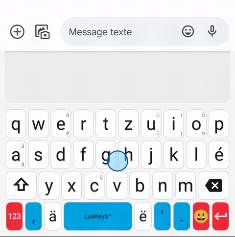
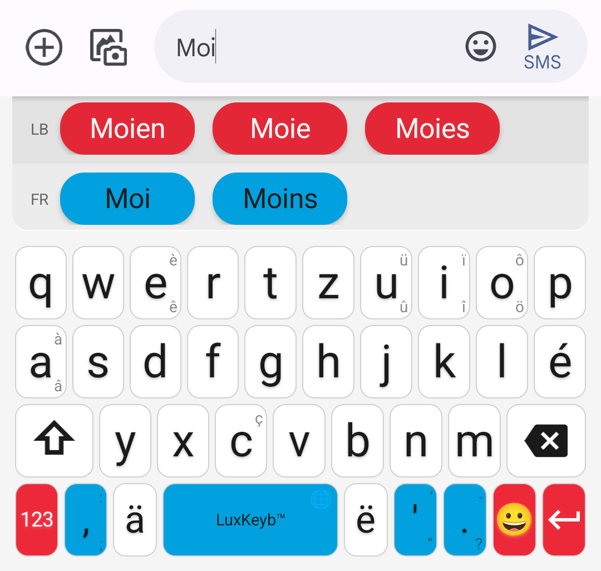
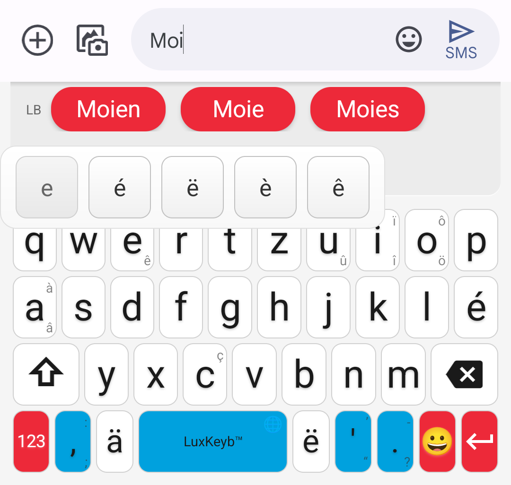
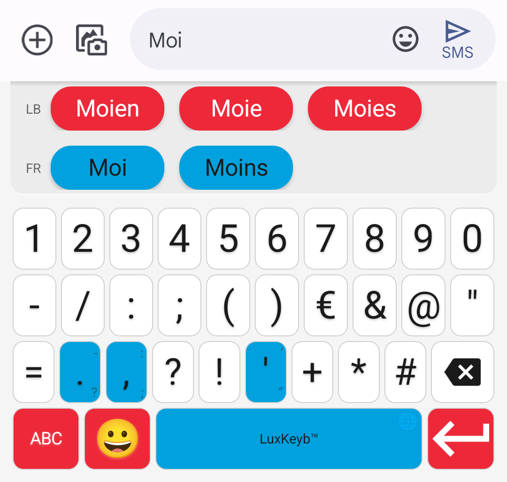
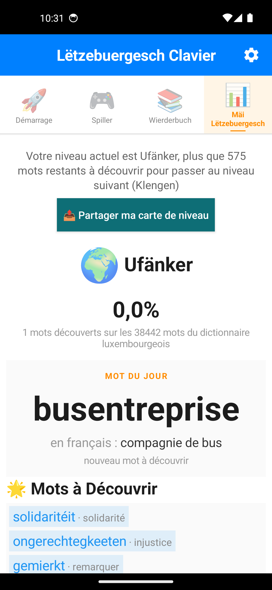
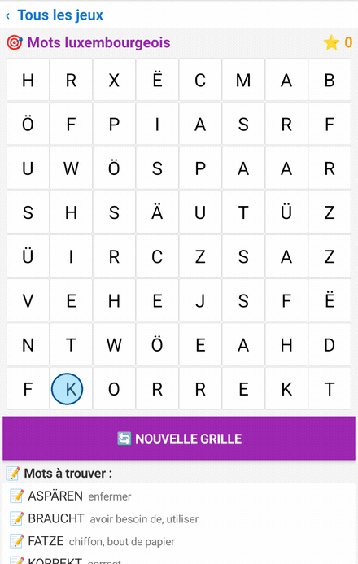
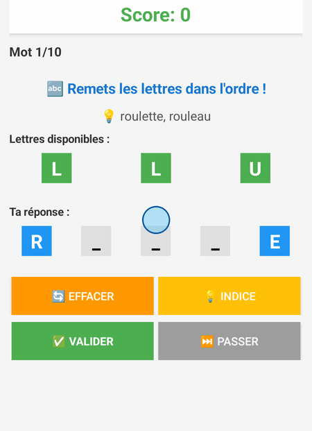
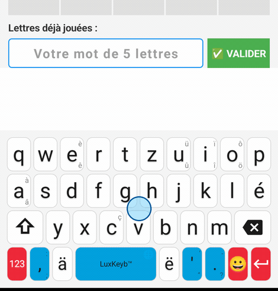
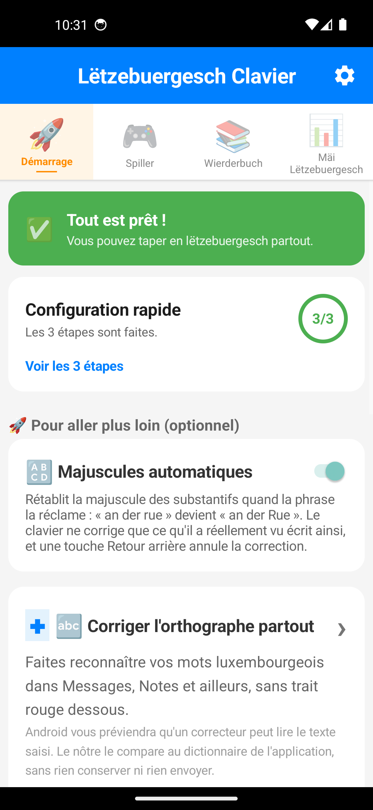

<nav class="site">
  <strong>🏠 Accueil</strong> ·
  <a href="guide.html">📘 Guide</a> ·
  <a href="privacy/privacy-policy.html">🔒 Confidentialité</a> ·
  <a href="feedbacks_form.html">💬 Retours</a> ·
  <a href="https://github.com/famibelle/LuxKeyb/releases/latest">📲 Télécharger</a> ·
  <a href="https://github.com/famibelle/LuxKeyb">💻 GitHub</a> ·
  <button type="button" class="theme-toggle" aria-label="Changer de thème">🌙</button>
</nav>

# Lëtzebuergesch Clavier, le clavier luxembourgeois pour Android

**Écrire en lëtzebuergesch sur son téléphone, sans se battre contre le clavier.**
Lëtzebuergesch Clavier est un clavier Android **gratuit, open source, sans
publicité et entièrement hors ligne**, qui propose des suggestions de mots en
luxembourgeois pendant la frappe.

Plus besoin de chercher un `ë` dans un menu d'accents : les trois diacritiques
qui portent la langue — **é**, **ä** et **ë** — ont chacune leur touche.

  <a href="https://github.com/famibelle/LuxKeyb/releases/latest/download/LetzebuergeschClavier-latest.apk"
     style="display:inline-block;padding:14px 28px;background:#ED2939;color:#fff;
            border-radius:8px;font-weight:bold;text-decoration:none;font-size:1.1em;">
    📲 Télécharger l'APK (version 10.9.5)
  </a>
  <figure style="margin:0;text-align:center;">
    
    <figcaption style="margin-top:8px;font-size:0.9em;opacity:0.8;">
      Scannez : le téléchargement démarre
    </figcaption>
  </figure>

<em>Android 5.0 ou plus récent · environ 3 Mo · aucune permission réseau</em>

## Le clavier en action

  <figure style="margin:0;max-width:420px;text-align:center;">
    
    <figcaption style="margin-top:8px;font-size:0.9em;opacity:0.8;">
      « Moien wéi geet et » : suggestions pendant la frappe, accents par appui
      long, puis prédiction du mot suivant
    </figcaption>
  </figure>

  <figure style="margin:0;flex:1 1 220px;max-width:300px;text-align:center;">
    
    <figcaption style="margin-top:6px;font-size:0.9em;opacity:0.8;">Suggestions bilingues</figcaption>
  </figure>
  <figure style="margin:0;flex:1 1 220px;max-width:300px;text-align:center;">
    
    <figcaption style="margin-top:6px;font-size:0.9em;opacity:0.8;">Accents par appui long</figcaption>
  </figure>
  <figure style="margin:0;flex:1 1 220px;max-width:300px;text-align:center;">
    
    <figcaption style="margin-top:6px;font-size:0.9em;opacity:0.8;">Chiffres et symboles</figcaption>
  </figure>

Le clavier reprend les trois couleurs du drapeau : le blanc pour les lettres, le
rouge pour ce qui agit — Entrée, changement de mode — et le bleu ciel pour la
barre d'espace et la ponctuation.

## Ce qu'il sait faire

### Il vous souffle les mots

Le dictionnaire compte **8 792 mots** et **23 169 contextes** de prédiction.
Après un espace, le clavier propose la suite probable de votre phrase d'après
les deux mots que vous venez d'écrire, pas seulement le dernier.

Les suggestions luxembourgeoises passent en premier ; le français prend le
relais à partir de trois lettres si aucun mot luxembourgeois ne correspond.

### Il pardonne les fautes de frappe

Une lettre oubliée, une lettre en trop, une touche voisine : les suggestions
arrivent quand même. Et vous pouvez écrire sans diacritiques — tapez
« letzebuergesch », le clavier vous propose « lëtzebuergesch ».

La casse est respectée, et les mots que vous employez souvent remontent d'eux-mêmes.

### Il corrige partout, pas seulement dans le clavier

Un correcteur orthographique système est fourni : une fois activé, vos mots
luxembourgeois cessent d'être soulignés en rouge dans Messages, Notes ou votre
messagerie.

### Il vous fait progresser

Chaque mot que vous employez fait avancer votre niveau, d'**Ufänker** à
**Sproochenmeeschter**, selon la part du dictionnaire que vous avez déjà
utilisée. Trois jeux de vocabulaire complètent le parcours : **Wuertsich**
(mots mêlés), **Wuertmix** (mots mélangés) et **Wuertriet**, où il faut deviner
un mot de cinq lettres en six essais.

  <figure style="margin:0;flex:1 1 160px;max-width:220px;text-align:center;">
    
    <figcaption style="margin-top:6px;font-size:0.9em;opacity:0.8;">Progression et mot du jour</figcaption>
  </figure>
  <figure style="margin:0;flex:1 1 160px;max-width:220px;text-align:center;">
    
    <figcaption style="margin-top:6px;font-size:0.9em;opacity:0.8;">Wuertsich · mots mêlés</figcaption>
  </figure>
  <figure style="margin:0;flex:1 1 160px;max-width:220px;text-align:center;">
    
    <figcaption style="margin-top:6px;font-size:0.9em;opacity:0.8;">Wuertmix · mots mélangés</figcaption>
  </figure>
  <figure style="margin:0;flex:1 1 160px;max-width:220px;text-align:center;">
    
    <figcaption style="margin-top:6px;font-size:0.9em;opacity:0.8;">Wuertriet · mot en six essais</figcaption>
  </figure>

### Il ne sait rien de vous

Le clavier **n'a aucun accès à Internet**. Rien de ce que vous tapez ne quitte
votre téléphone.

Seuls les mots déjà présents dans le dictionnaire sont comptés pour la
progression : un mot de passe, un nom propre ou un numéro n'y figurent pas et ne
sont donc jamais enregistrés. Le clavier se désactive de lui-même dans les
champs de mot de passe. Voir la [politique de confidentialité](privacy/privacy-policy.html).

## Face aux autres claviers

Le luxembourgeois n'est absent d'aucun grand clavier : Gboard comme SwiftKey le
proposent. Mais aucun n'est **construit** pour lui, et les claviers libres qui
acceptent un dictionnaire luxembourgeois s'appuient sur une liste de mots figée
depuis 2013, sans prédiction du mot suivant.

| | **Lëtzebuergesch Clavier** | Gboard | SwiftKey | HeliBoard | AnySoftKeyboard |
|---|---|---|---|---|---|
| Conçu pour le luxembourgeois | **Oui**, c'est sa seule raison d'être | Une langue parmi 100+ | Une langue parmi 700+ | Dictionnaire à ajouter | Pack séparé à installer |
| Dictionnaire luxembourgeois | **8 792 mots**, corpus 2026 | Non communiqué | Non communiqué | 71 255 mots, figés en 2013 | Non communiqué |
| Prédiction du mot suivant | **Oui**, 23 169 contextes | Oui | Oui | Non, en luxembourgeois | Basique |
| Pardonne les fautes de frappe | **Oui** | Oui | Oui | Oui | Oui |
| Écriture sans diacritiques | **Oui** | — | — | — | — |
| Correcteur système (lb) | **Oui** | Oui | — | Non | Non |
| Aucun accès à Internet | **Oui** | Non | Non | Oui | Oui |
| Code ouvert | **Oui**, MIT | Non | Non | Oui | Oui |
| Jeux et progression | **Oui**, 3 jeux, 8 niveaux | Non | Non | Non | Non |
| Saisie glissée | Non | Oui | Oui | Bibliothèque à ajouter | Gestes |
| Dictée vocale | Non | Oui | Oui | Non | Non |
| Thème sombre | Non | Oui | Oui | Oui | Oui |

« — » : non vérifié. Chiffres relevés en
août 2026 ; le dictionnaire luxembourgeois des claviers libres provient du
<a href="https://codeberg.org/Helium314/aosp-dictionaries">dépôt de dictionnaires AOSP</a>.

**Ce qu'il ne fait pas encore.** Pas de saisie glissée, pas de dictée, pas de
thème sombre, et pas de dictionnaire allemand à côté du français. Ces manques
sont réels et connus ; ils sont en tête de la liste des choses à faire.

## D'où viennent les suggestions

Le dictionnaire et les n-grammes sont générés à partir d'un corpus de
luxembourgeois contemporain, publié en jeu de données ouvert :
[POTOMITAN/luxembourgish-corpus](https://huggingface.co/datasets/POTOMITAN/luxembourgish-corpus).

Le pipeline est relancé à chaque publication, ce qui fait évoluer les
suggestions avec l'usage réel de la langue plutôt qu'avec une liste figée.

## Installer

1. [Téléchargez l'APK](https://github.com/famibelle/LuxKeyb/releases/latest/download/LetzebuergeschClavier-latest.apk),
   ou scannez le QR code en haut de page depuis votre téléphone : dans les deux
   cas le téléchargement démarre directement. Toutes les versions restent
   listées sur la [page des releases](https://github.com/famibelle/LuxKeyb/releases).
2. Autorisez l'installation depuis cette source, si Android le demande.
3. Ouvrez l'application : elle vous guide en trois étapes pour activer le
   clavier, le sélectionner, puis l'essayer.

  <figure style="margin:0;max-width:220px;text-align:center;">
    
    <figcaption style="margin-top:6px;font-size:0.9em;opacity:0.8;">Les trois étapes guidées, dans l'application</figcaption>
  </figure>

Android affiche au passage un avertissement générique, montré pour **tout**
clavier tiers, sur la capture éventuelle de ce que vous tapez. Il est normal, et
l'onglet Guide de l'application explique pourquoi ce clavier-ci ne peut rien
envoyer nulle part.

## Contribuer

Le code est sur [GitHub](https://github.com/famibelle/LuxKeyb) sous licence MIT.

Un mot manque, une suggestion tombe à côté, une touche vous gêne ? Ouvrez une
[issue](https://github.com/famibelle/LuxKeyb/issues) ou passez par le
[formulaire de retours](feedbacks_form.html). Le dictionnaire progresse surtout
grâce à ces signalements.

---

<em>Fait au Luxembourg avec ❤️ — « Mir wëlle bleiwe wat mir sinn »</em>

