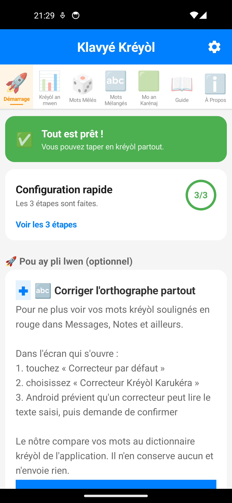
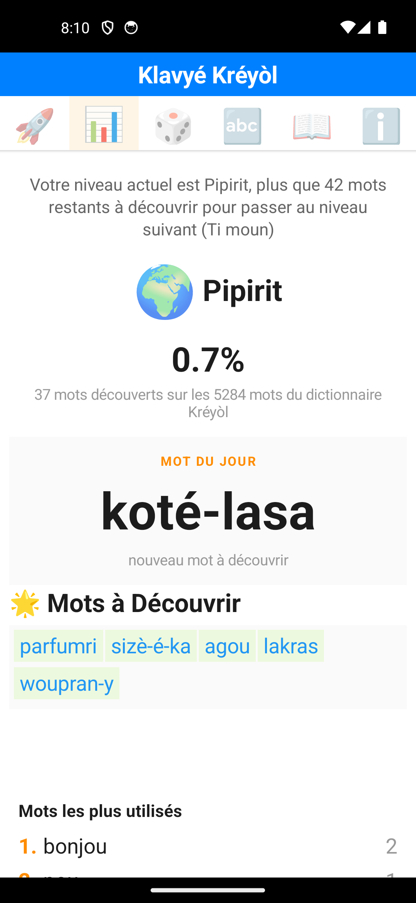
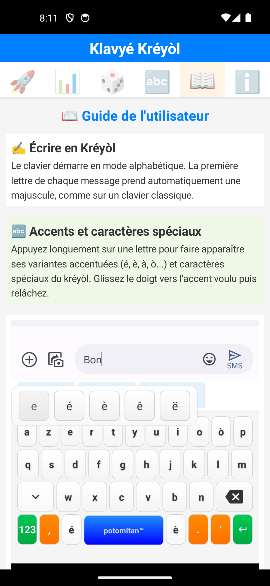
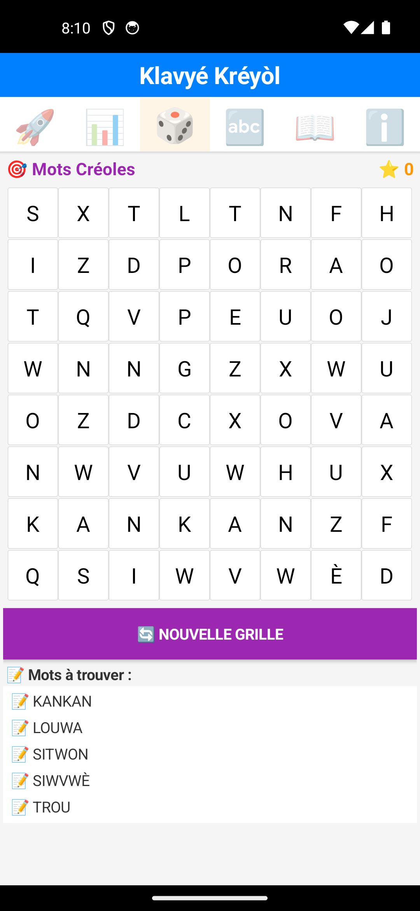
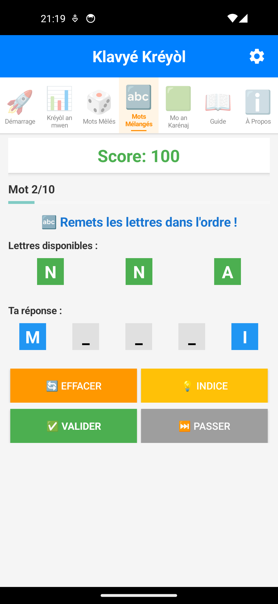
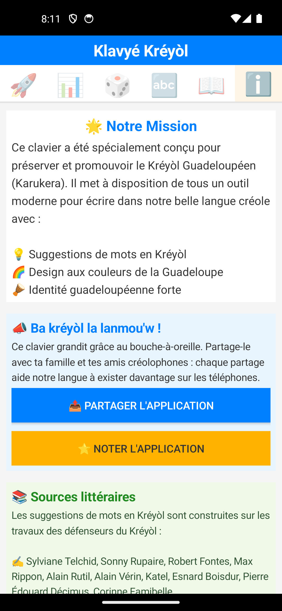
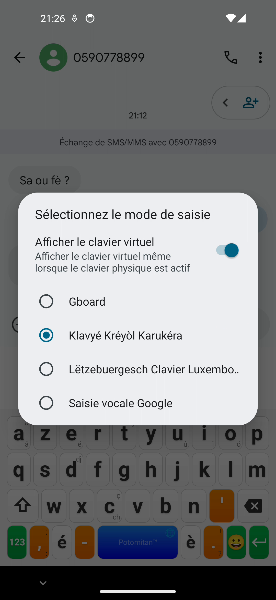
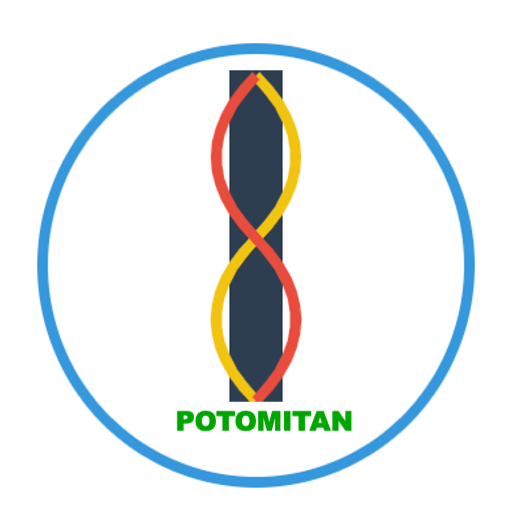

<nav class="site">
  <a href="index.html">🏠 Accueil</a> ·
  <a href="guide.html">📘 Guide</a> ·
  <a href="ambassade.html">📣 Vin Anbasadè</a> ·
  <a href="triptyque.html">📖 Triptyque</a> ·
  <strong>📰 Presse</strong> ·
  <a href="https://play.google.com/store/apps/details?id=com.potomitan.kreyolkeyboard&referrer=utm_source%3Dpresse%26utm_campaign%3Dlaunch10k">📲 Installer Klavyé Kréyòl</a> ·
  <a href="https://github.com/famibelle/KreyolKeyb">💻 GitHub</a> ·
  <button type="button" class="theme-toggle" aria-label="Changer de thème">🌙</button>
</nav>

# Dossier de presse : Klavyé Kréyòl Karukera

*Dernière mise à jour : 31 juillet 2026*

## En une phrase

**Klavyé Kréyòl Karukera est le premier clavier Android intelligent dédié au
créole guadeloupéen** : il suggère les mots en kréyòl pendant la frappe, à
partir d'un corpus littéraire créole authentique. Gratuit, open source, et
sans aucune collecte de données.

## Ils en parlent déjà

Fin juillet 2026, deux chaînes de télévision guadeloupéennes ont consacré un
sujet au clavier :

  

    <video controls preload="metadata" poster="Medias/TV_Canal10_poster.jpg" style="width: 100%; border-radius: 8px;">
      <source src="Medias/TV_Canal10.mp4" type="video/mp4">
      Votre navigateur ne supporte pas la lecture vidéo intégrée.
      <a href="Medias/TV_Canal10.mp4">Télécharger l'extrait Canal 10</a>.
    </video>
    
<strong>Canal 10</strong> — sujet Tech « Une application intuitive
    pour écrire en créole » : présentation et démonstration du clavier à
    l'antenne.

  

  

    <video controls preload="metadata" poster="Medias/TV_Guadeloupe1ère_poster.jpg" style="width: 100%; border-radius: 8px;">
      <source src="Medias/TV_Guadeloupe1ère.mp4" type="video/mp4">
      Votre navigateur ne supporte pas la lecture vidéo intégrée.
      <a href="Medias/TV_Guadeloupe1ère.mp4">Télécharger l'extrait Guadeloupe la 1ère</a>.
    </video>
    
<strong>Guadeloupe la 1ère</strong> (France Télévisions) — journal
    <em>Guadeloupe Soir 19h30</em> du mardi 28 juillet 2026, sujet « Karukéra
    : on jan pou maké kréyòl-la », avec le témoignage d'un utilisateur du
    clavier.
    <a href="https://la1ere.franceinfo.fr/guadeloupe/programme-video/la1ere_guadeloupe_guadeloupe-soir-19h30/diffusion/8682591-emission-du-mardi-28-juillet-2026.html">Replay complet sur la1ere.franceinfo.fr</a>.

  

## Le contexte d'actualité : une langue fragilisée par l'institution

Le créole avait pourtant été inscrit au programme 2026 de l'**agrégation des
langues de France le 13 juin 2025**, avant d'en être écarté début octobre,
alors que le breton, le corse et l'occitan y restent. Le ministère justifie
ce retrait par une programmation pluriannuelle limitant à trois le nombre de
concours de langues régionales ouverts par session. Le CAPES créole, lui,
reste ouvert en 2026.

La décision a provoqué une mobilisation forte : lettre ouverte du SPEG
(Syndicat des Personnels de l'Éducation en Guadeloupe), dénonciation du
député guadeloupéen Olivier Serva et du SE-Unsa Martinique, qui y voit « un
recul grave pour la reconnaissance institutionnelle du créole gagnée de
haute lutte », deux questions déposées à l'Assemblée nationale, et une
[motion du CESECEM (Conseil Économique, Social, Environnemental et de la
Culture de Martinique)](https://www.youtube.com/watch?v=mNfkT2xpxR4) votée
en réaction à la suspension. Le créole est pourtant parlé par **1,6 million
de locuteurs en France**.

Le paradoxe est saisissant dans les chiffres de l'Éducation nationale
elle-même : les effectifs en créole **au primaire ont bondi de 92 % entre
2021 et 2023** (4 643 à 8 896 écoliers), portés par la demande des familles,
pendant que ceux du lycée chutaient de 43,7 %, la faute à la réforme du bac
plus qu'à un désamour de la langue.

**Klavyé Kréyòl Karukera est la réponse de la société civile** : pendant que
la place institutionnelle du créole recule, un projet citoyen, gratuit et
open source équipe la langue pour le numérique, là où elle se joue
désormais chaque jour, dans les SMS et les réseaux sociaux de centaines de
milliers de créolophones.

## Le problème

Les claviers standards (Gboard, Samsung...) ne connaissent pas le créole
guadeloupéen : ils soulignent chaque mot en rouge, « corrigent » le kréyòl
vers le français et découragent celles et ceux qui veulent écrire dans leur
langue. Résultat : le créole recule dans les usages numériques quotidiens :
SMS, WhatsApp, réseaux sociaux.

## La réponse

Un clavier qui **travaille pour le kréyòl au lieu de le combattre** :

- **Suggestions intelligentes** à partir d'un dictionnaire de plus de
  **5 200 mots** kréyòl et d'un modèle de prédiction contextuelle (n-grams,
  4 600 mots-pivots) construit sur des textes littéraires créoles
  authentiques
- **Accents du kréyòl** (é, è, à, ò...) par simple appui long
- **Bilingue** : le français prend le relais quand aucun mot créole ne correspond
- **Jeux de vocabulaire** intégrés (Mots Mêlés, Mots Mélangés) et
  **progression gamifiée** en 7 niveaux culturels, de « Pipirit » à « Potomitan »
- **100 % local, zéro collecte de données**, code source public (licence MIT)

## Le corpus : un hommage aux défenseurs du kréyòl

Les suggestions s'appuient sur les œuvres de :

- ✍️ **Écrivains et poètes** : Sylviane Telchid, Sonny Rupaire, Max Rippon, Gisèle Pineau, Katel
- 📚 **Linguistes et chercheurs** : Robert Fontes, Alain Rutil, Alain Vérin, Benjamin Moïse
- 🎤 **Artistes et conteurs** : Esnard Boisdur, Jomimi, Pierre Édouard Décimus

## Faits clés

| | |
|---|---|
| Plateforme | Android 5.0+ (iOS en préparation) |
| Prix | Gratuit, sans pub, sans achat intégré |
| Données personnelles | Aucune collecte, fonctionnement 100 % hors ligne |
| Licence | Open source (MIT), code sur [GitHub](https://github.com/famibelle/KreyolKeyb) |
| Éditeur | [Potomitan™](https://potomitan.io) |
| Écosystème | Développe aussi [POTOMITAN](https://potomitan.io), traducteur d'urgence français ↔ créole |
| Téléchargement | [Google Play](https://play.google.com/store/apps/details?id=com.potomitan.kreyolkeyboard&referrer=utm_source%3Dpresse%26utm_campaign%3Dlaunch10k) |
| Couverture presse | Canal 10 et Guadeloupe la 1ère (TV, juillet 2026) |
| Dictionnaire | 5 284 mots kréyòl + 662 mots français (fallback bilingue) |
| Modèle de prédiction | 4 601 mots-pivots (n-grams contextuels) |

## Angles possibles

- **L'affaire de l'agrégation** : pendant que le créole est retiré des
  concours, la société civile construit gratuitement les outils numériques
  qui le font vivre : le contre-exemple positif de la polémique
- **Patrimoine × tech** : quand l'intelligence des claviers se met au service
  d'une langue régionale
- **Jounen Entènasyonal Kréyòl (28 octobre)** : un outil concret pour écrire
  en créole toute l'année
- **Éducation** : un support moderne pour les professeurs de créole (LVR,
  CAPES créole) et leurs élèves
- **Open source citoyen** : un projet indépendant, auditable, sans modèle
  publicitaire
- **Les racines du kréyòl** : en février 2026, des chercheurs créolistes
  (dont Tony Mango sur Radyo Tanbou) annoncent explorer les origines
  africaines réelles de la langue mère du côté des langues congolaises, un
  écho direct au corpus littéraire créole sur lequel s'appuie le clavier
- **Un écosystème, pas un produit isolé** : Klavyé Kréyòl s'inscrit dans
  l'écosystème Potomitan™, qui développe aussi
  [POTOMITAN](https://potomitan.io), un traducteur d'urgence
  français ↔ créole soutenu par la Préfecture de Guadeloupe (Lab'An Nou) et
  présenté par Orange Antilles-Guyane, déjà couvert par France-Antilles
  (« POTOMITAN, l'IA qui parle créole »). Écrire le kréyòl (le clavier) et
  le traduire (POTOMITAN) : deux réponses complémentaires au même vide
  numérique

## Visuels

Captures d'écran de chaque section de l'application (juillet 2026) :

  

    
    
<small>Suggestions en conditions réelles</small>

  

  

    
    
<small>Accueil / configuration</small>

  

  

    
    
<small>Progression gamifiée</small>

  

  

    
    
<small>Guide + popup accents</small>

  

  

    
    
<small>Jeu Mots Mêlés</small>

  

  

    
    
<small>Jeu Mots Mélangés</small>

  

  

    
    
<small>À propos / mission</small>

  

  

    
    
<small>Sélecteur de clavier système</small>

  

  

    
    
<small>Logo Potomitan™</small>

  

- [Animation du clavier en action](Screenshots/KlavyéAnAktion.gif)
- [Toutes les captures d'écran](https://github.com/famibelle/KreyolKeyb/tree/main/docs/Screenshots) (suggestions, accents, jeux, gamification)
- [Reportage Canal 10](Medias/TV_Canal10.mp4) et [reportage Guadeloupe la 1ère](Medias/TV_Guadeloupe1ère.mp4) (extraits vidéo, voir aussi ci-dessus)
- [Motion du CESECEM sur la suspension de l'agrégation de créole](https://www.youtube.com/watch?v=mNfkT2xpxR4) (vidéo)
- [Logo Potomitan™ en haute résolution](assets/potomitan-logo.png)

## Sources

- [Suspension de l'agrégation de créole en 2026](https://www.cafepedagogique.net/2025/11/04/suspension-de-lagregation-de-creole-en-2026/) · Café pédagogique
- [Le créole retiré du concours de l'agrégation des langues de France : le SPEG monte au créneau](https://la1ere.franceinfo.fr/guadeloupe/le-creole-retire-du-concours-de-l-agregation-des-langues-de-france-le-speg-monte-au-creneau-1632566.html) · la1ère Guadeloupe
- [Concours de l'agrégation 2026 : Le SPEG et le député Serva dénoncent l'absence du créole, contrairement au breton, au corse et à l'occitan](https://la1ere.franceinfo.fr/guadeloupe/concours-de-l-agregation-le-speg-et-le-depute-serva-denoncent-l-absence-du-creole-contrairement-au-breton-au-corse-et-a-l-occitan-1632029.html) · la1ère Guadeloupe
- [Suspension de l'agrégation de créole : une « décision inadmissible »](https://www.franceguyane.fr/actualite/education-sante-environnement/suspension-de-lagregation-de-creole-une-decision-inadmissible-1054425.php) · France-Guyane
- [Créole à l'école : l'élan brisé](https://lecourrierdeguadeloupe.com/creole-a-lecole-lelan-brise/) · Le Courrier de Guadeloupe
- [A la découverte des langues régionales : le créole (Guadeloupe et Martinique)](https://www.vousnousils.fr/2026/02/19/a-la-decouverte-des-langues-regionales-le-creole-guadeloupe-et-martinique-700875) · VousNousIls, février 2026
- [Guadeloupe. Lang Kréyol : vers un changement de paradigme ?](https://caraibcreolenews.com/guadeloupe-lang-kreyol-vers-un-changement-de-paradigme/) · Caraib Creole News

## Contact

**Médhi Famibelle**, Potomitan™
[GitHub du projet](https://github.com/famibelle/KreyolKeyb) ·
[Page du projet](index.html) ·
[Devenir ambassadeur](ambassade.html)

Une question, une proposition, un partenariat ? Écrivez à
**[contact@potomitan.io](mailto:contact@potomitan.io)**.
