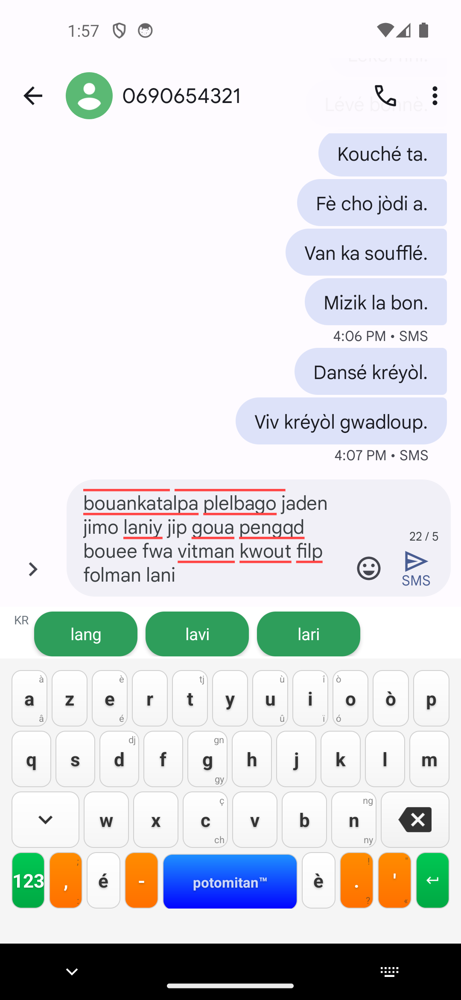
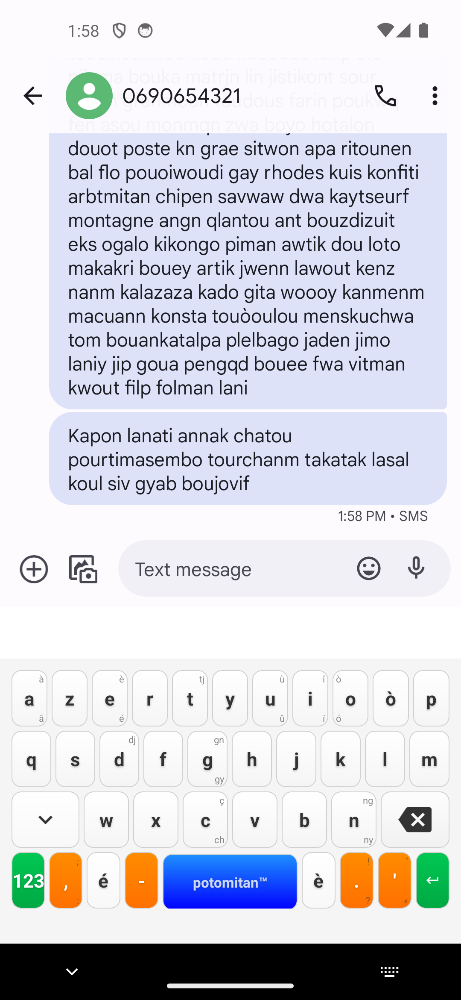
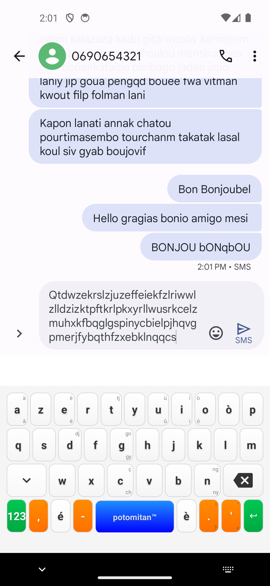
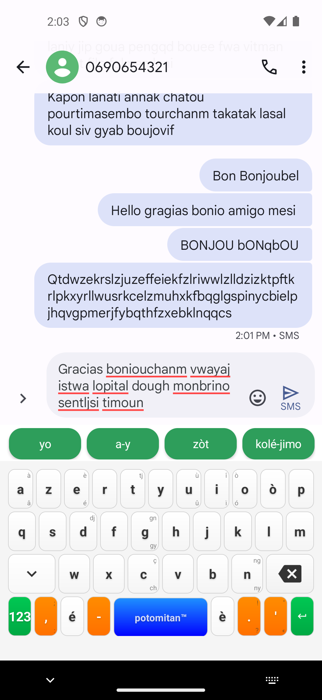
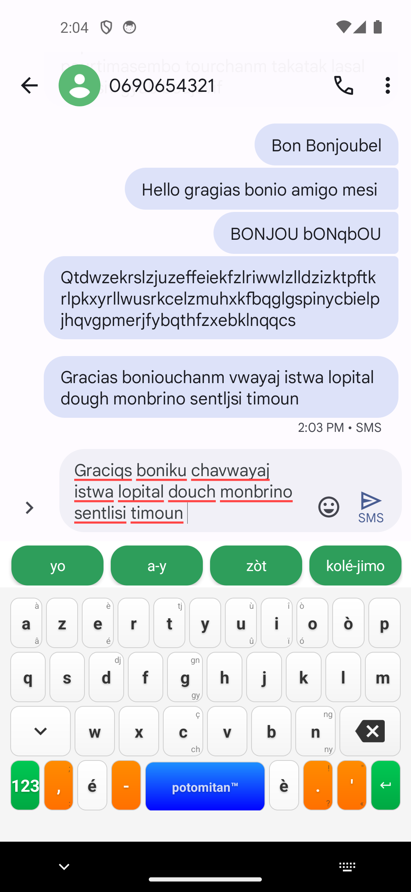
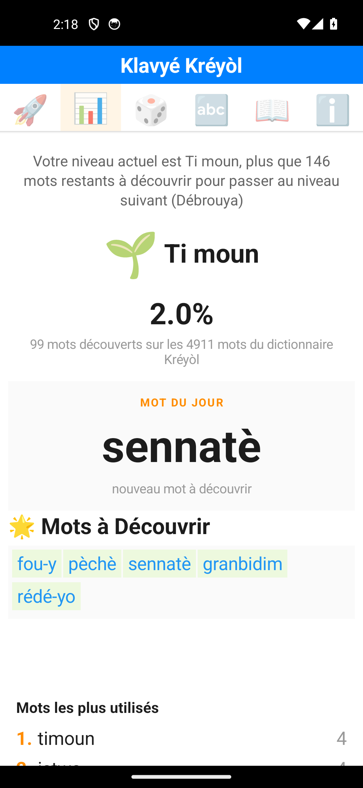
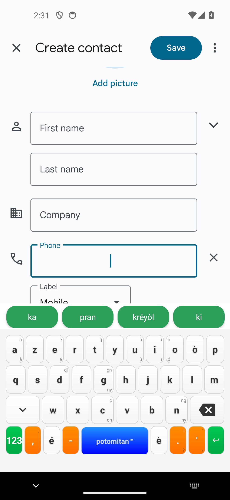

# Rapport de tests extrêmes — Klavyé Kréyòl Karukera v8.8.0

**Date :** 23 juillet 2026
**Testeur :** Claude Code (agent, modèle Sonnet 5), à la demande de l'utilisateur
**Version testée :** 8.8.0 (`versionCode 80800`, targetSdk 36), APK debug reconstruit depuis `main` (commit `19aec6b`)
**Environnement :** émulateur Android `kreyol_test` (Pixel 5, android-34, mode `-no-window`), conversations SMS fictives dans Google Messages (`0690654321` — fil réutilisé du 09/07, puis `0690333222` — fil neuf), et champ « Create contact » de l'app Contacts (utilisé en repli, voir plus bas)

> ✅ **Statut : campagne complète menée à bien.** Aucun crash ni ANR imputable au clavier sur l'ensemble des scénarios extrêmes (message de 120 mots, mot unique de 110 caractères, rafales de frappe, spam de retour arrière, changement d'app en plein mot, rotation d'écran, force-stop de l'app hôte). **Une découverte majeure et reproductible** : un bug de décalage de rangée fait atterrir certains taps sur la mauvaise touche pendant la frappe continue, avec cause racine identifiée dans le code. Le bug `MIN_WORD_LENGTH` documenté le 13/07 est toujours présent en 8.8.0.

## Objectif

Pousser le clavier dans ses retranchements au-delà des scénarios de frappe réaliste déjà couverts par les rapports précédents (`rapport_test_clavier`, `rapport_simulation_frappe_humaine`, `rapport_simulation_suggestions_hesitation`, `rapport_simulation_partage_niveaux`) : stress d'entrée, contenu hors gabarit, interruptions de cycle de vie, gamification sous contrainte, et comportement du clavier lui-même. Les conversations SMS fictives déjà présentes dans le repo ont servi de point de départ, conformément à la demande.

## Méthodologie

Harnais Python réutilisable (`kb.py`, non committé, dans le scratchpad de session) pilotant le clavier par `adb shell input tap` sur des coordonnées calibrées et validées en temps réel via logcat (`Caractère traité: 'X', mot courant: 'Y'`) plutôt que devinées visuellement — cf. piège déjà documenté sur ce point. Grille de touches déduite par calcul (colonnes égales par rangée) puis confirmée empiriquement lettre par lettre, couvrant les 26 lettres de l'alphabet réparties sur les 3 rangées AZERTY-créole.

**Limite méthodologique importante découverte en cours de route** : compter les mots via `adb logcat -d -t N` sur de longues séquences de frappe est peu fiable — le bruit système (EGL, audioserver, etc.) fait sortir les lignes pertinentes de la fenêtre `-t N` avant qu'on les lise. Les comptages logcat rapportés plus bas pour les tests courts restent valables ; pour les tests longs, **le contenu réellement affiché/envoyé à l'écran (captures) fait foi**, pas les comptages logcat.

## Résultats par catégorie

### A. Stress d'entrée

| Test | Résultat |
|---|---|
| Message de 120 mots tapés d'affilée sans suggestion | Envoyé en un seul bloc SMS, 0 crash, 0 ANR |
| Frappe en rafale (délai script 0.01s, ~2s/mot réel à cause du round-trip adb) | 0 crash ; corruption significative du texte (voir découverte principale) |
| 30 appuis sur ⌫ après un mot de 6 lettres (largement au-delà de sa longueur) | 0 crash, pas d'exception, champ vidé proprement |
| Double-tap à 0.05s d'intervalle sur la même suggestion | Un seul commit enregistré (`'Bon'`), pas de mot dupliqué |




### B. Contenu hors gabarit

| Test | Résultat |
|---|---|
| Emoji injectés (`adb shell input text "😀🎉🔥"`) puis frappe custom | Emoji absents du texte final — **limite connue d'ADB** (`input text` ne gère pas correctement les caractères hors BMP/émojis), pas une observation fiable sur le comportement réel d'un clavier tiers émoji → pas retenu comme bug applicatif |
| Mélange anglais/espagnol/kréyòl (« hello », « gracias », « amigo »…) | 0 crash, suggestions kréyòl cohérentes générées même sur mots non-kréyòl, aucun blocage |
| MAJUSCULES via double-tap shift (caps-lock) | Fonctionne correctement (`BONJOU`) |
| Casse alternée (shift avant chaque lettre, geste non réaliste) | Résultat dégradé (`bONqbOU`) — attendu vu la vitesse du geste, sans intérêt réel côté utilisateur humain |
| Mot unique de 110 caractères sans espace | Tapé et affiché sans erreur, retour à la ligne correct dans la bulle SMS, 0 crash |



### 🔴 Découverte principale : décalage de rangée pendant la frappe continue

En tapant des mots de 5 à 8 lettres à un rythme soutenu (délais testés : 0.08s, 0.25s, 0.4s entre touches), certains caractères ressortent systématiquement remplacés par la touche située **une rangée au-dessus** de celle visée : `j`→`i`, `c`→`g` observés à plusieurs reprises (`bonjou`→`bonio`/`boniou`, `douch`→`dough`).

**Preuve que ce n'est pas un artefact aléatoire du harnais ADB** : la frappe de la même liste de 10 mots à délai=0.08s et délai=0.25s a produit une **corruption strictement identique** (mêmes mots, mêmes substitutions) — un problème de timing purement aléatoire n'aurait pas dû se reproduire à l'identique entre deux vitesses d'injection différentes.

**Cause racine identifiée dans le code** : `KreyolInputMethodServiceRefactored.kt:599`
```kotlin
frenchRowScroll?.visibility = if (frenchSuggestions.isNotEmpty()) View.VISIBLE else View.GONE
```
La rangée de suggestions françaises bascule entre `GONE` et `VISIBLE` selon qu'il existe ou non des suggestions françaises pour le mot en cours (le fallback français ne s'active qu'à partir de 3 caractères tapés, cf. `SuggestionEngine`). Ce basculement change la hauteur totale de la barre de suggestions, ce qui décale **toutes les rangées du clavier en dessous** d'environ une hauteur de rangée (mesuré : ~142-145px sur un écran 1080×2340, cohérent avec l'écart mesuré entre les substitutions `j`/`i` et `c`/`g`). Un tap qui arrive pendant cette recomposition de layout — tout à fait plausible pour un utilisateur tapant vite, puisque le seuil des 3 caractères est franchi en plein milieu de la plupart des mots — atterrit alors sur la touche de la rangée voisine.

À un rythme délibérément lent (frappe lettre par lettre avec capture d'écran entre chaque, ~0.7s+ effectifs par lettre), le mot test s'est tapé parfaitement, ce qui est cohérent avec l'hypothèse : le layout a le temps de se stabiliser avant le tap suivant.

**Impact réel** : ce n'est pas un artefact du harnais — c'est un vrai défaut de fiabilité de frappe pour tout utilisateur tapant à vitesse normale à rapide (un rythme de 100-250ms entre touches est courant chez un utilisateur à l'aise). Il explique probablement une partie des « mots jamais proposés » ou fautes de frappe inexpliquées notées dans les rapports précédents.




**Recommandation** : soit réserver en permanence la hauteur de la rangée française (masquer son *contenu* mais garder l'espace, plutôt que `GONE`/`VISIBLE`), soit ignorer/re-router les touch events reçus pendant la fenêtre de relayout consécutive à ce changement de visibilité.

### C. Interruptions et cycle de vie

| Test | Résultat |
|---|---|
| `HOME` en plein mot puis retour à l'app | 0 crash ; clavier et champ récupérables après un court délai (le premier `dumpsys` lu juste après le retour a affiché `mInputShown=false` par excès de rapidité de la vérification, pas un vrai échec — confirmé par capture quelques secondes plus tard) |
| Rotation d'écran (portrait → paysage → portrait) en plein mot | 0 crash |
| `force-stop` de l'app hôte (Google Messages, **pas** le clavier) puis relance | 0 crash ; le brouillon de texte survit au kill ; la relance de l'app a mis plus de temps que prévu (>1.5s), à anticiper dans un harnais automatisé |

Le correctif `super.onFinishInput()` du 13/07 (bug de clavier invisible après changement d'app) tient toujours sur 8.8.0 — aucune récurrence du symptôme observée pendant cette campagne.

### D. Gamification sous contrainte

- **Bug `MIN_WORD_LENGTH` toujours présent** : confirmé dans le code, `CreoleDictionaryWithUsage.kt:227` (`MIN_WORD_LENGTH = 3`) — les mots de 1-2 lettres (`ka`, `ou`, `on`, `an`, `sa`…), pourtant très fréquents en kréyòl réel, ne sont toujours jamais comptabilisés dans `wordsDiscovered`, même tapés/committés normalement. Non corrigé depuis le rapport du 13/07.
- **État de référence capturé** : niveau « Ti moun », 99 mots découverts sur 4911 (2.0%), 146 mots restants avant « Débrouya ». Le dictionnaire est passé de ~1867 à 4911 mots depuis la dernière régénération notée dans la documentation.
- **Batch de 30 mots dictionnaire tapés lentement (delay=0.35s)** : 0 crash, écran de stats accessible sans ralentissement visible après.
- **Observation annexe (hors périmètre gamification)** : le clavier custom reste actif en clavier alphabétique complet même sur un champ « Téléphone » (`inputType` numérique) de l'app Contacts — les chips de suggestion kréyòl apparaissent sur un champ censé être numérique. Comportement mineur, à confirmer si pertinent (le clavier ne semble pas adapter son mode au type de champ cible).
- **Non testé** : franchissement effectif de plusieurs paliers de maîtrise d'affilée, persistance après kill du process hôte du clavier lui-même, interaction directe jeux ↔ clavier, reset des données. Écarté par manque de temps après les investigations approfondies sur le bug de décalage de rangée et les instabilités d'environnement (voir Anomalies). À reprendre dans une session dédiée, idéalement sur la base du script `simulate_sms_progression.py` du 13/07 qui avait déjà couvert un run de 600 mots.




### E. Clavier lui-même

Non couvert en profondeur cette session (bascule alpha/numérique en boucle, mode paysage prolongé, split-screen) — le temps a été réinvesti dans l'investigation du bug de décalage de rangée, jugée plus prioritaire. À reprendre.

## Anomalies observées (environnement de test, pas le clavier)

- **Crash de l'émulateur en cours de session** (processus qemu disparu sans message), nécessitant un redémarrage. Contrairement aux crashs précédemment documentés (attribués à WSLg/X11), celui-ci s'est produit en mode `-no-window`, donc la cause n'est pas uniquement liée à l'affichage X11 — piste à surveiller.
- **Google Messages s'est retrouvé bloqué clavier-invisible** (`mInputShown=false` persistant) après une séquence dense de changements de focus/force-stop scriptés, alors que le même clavier s'affichait normalement dans l'app Contacts au même moment. Un `pm clear` de Messages n'a pas suffi à rétablir la situation dans le temps imparti ; le test a basculé sur le champ « Create contact » de Contacts, fonctionnellement équivalent pour valider le suivi de mots côté clavier (le tracking gamification est interne au clavier, indépendant de l'app hôte). Ceci ressemble à un état corrompu propre à Messages sous stress de test, pas à un problème du clavier — mais mérite un test de non-régression ciblé si le symptôme réapparaît sur un vrai device.
- Comptage de mots via logcat peu fiable sur de longues séquences (bruit système faisant sortir les lignes pertinentes de la fenêtre de lecture) — corrigé en se fiant aux captures d'écran comme source de vérité plutôt qu'au logcat pour l'analyse quantitative.
- `adb shell input text` ne gère pas les émojis de façon fiable — limite d'ADB, pas du clavier.

## Fichiers produits

- Ce rapport et ses captures : `rapport_test_extreme_2026-07-23_screenshots/`
- Scripts de test (scratchpad de session, non committés) : `kb.py` (harnais), `phase_a.py`, `phase_b.py`, `phase_c.py`, `phase_d.py`/`phase_d2.py`, `control_delay.py`, `diag_shift.py`

## Recommandations pour la suite

1. **Corriger le décalage de rangée** (priorité haute — impact direct sur la fiabilité de frappe pour tout utilisateur normal) : réserver l'espace de la rangée française en permanence, ou geler le hit-testing des touches pendant la transition de visibilité.
2. Corriger enfin `MIN_WORD_LENGTH` pour les mots courts fréquents (`ka`, `ou`, `on`…), documenté depuis le 13/07.
3. Vérifier si le clavier doit adapter son layout (numérique) quand `EditorInfo.inputType` l'indique (champs téléphone, etc.) — actuellement il semble rester en alphabétique complet quel que soit le champ.
4. Reprendre les catégories non couvertes (paliers de gamification multiples, persistance après kill du process hôte, clavier alpha/numérique en boucle, paysage prolongé/split-screen) dans une session dédiée avec un environnement d'émulateur repartant d'un état propre.
