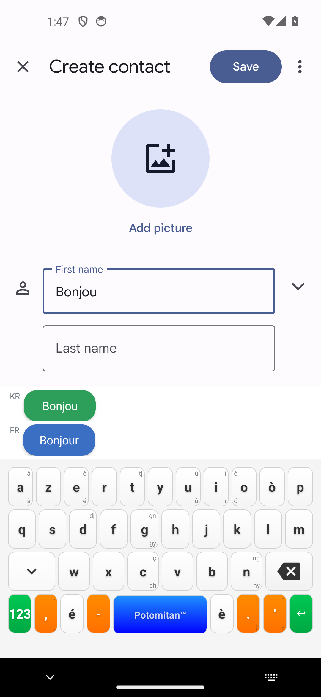
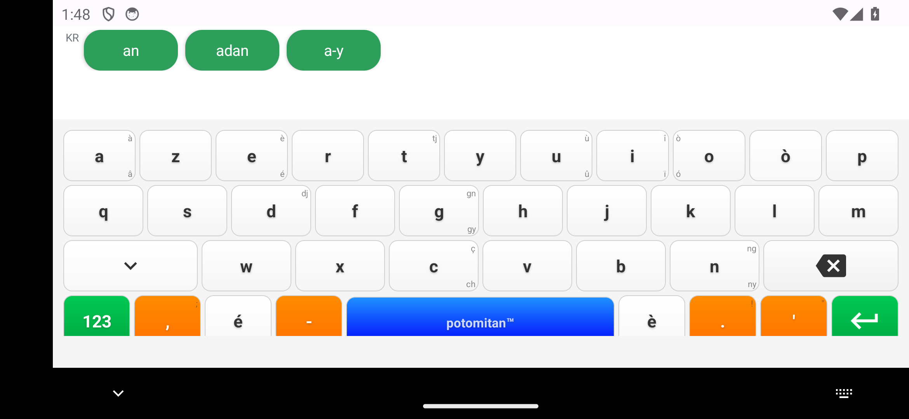
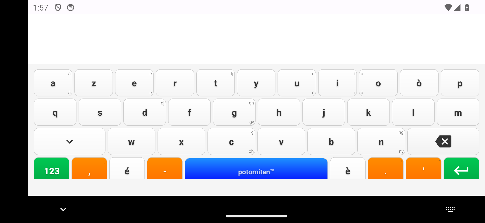
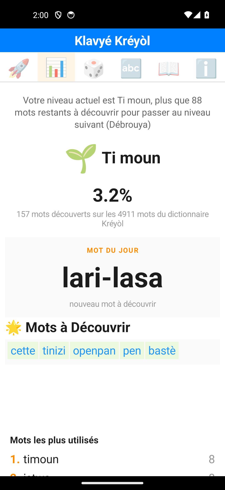
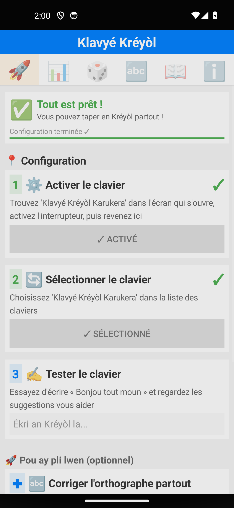
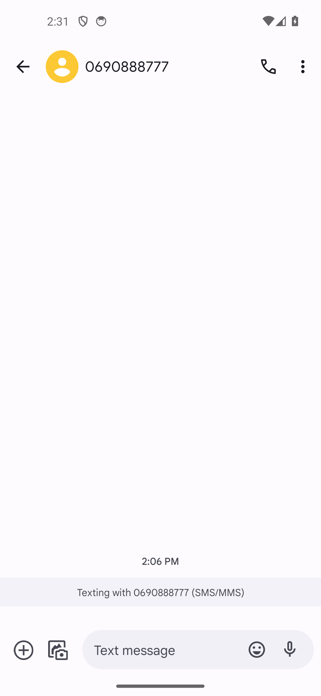

# Rapport de tests extrêmes — Suite (catégorie E + gamification) — v8.8.0

**Date :** 25 juillet 2026
**Testeur :** Claude Code (agent, modèle Sonnet 5), à la demande de l'utilisateur
**Version testée :** 8.8.0 (`versionCode 80800`), APK debug avec les correctifs du 23/07 (décalage de rangée + `MIN_WORD_LENGTH`) déjà installés
**Environnement :** émulateur Android `kreyol_test` (Pixel 5, android-34, mode `-no-window`), conversations SMS fictives dans Google Messages, app Contacts, app Klavyé Kréyòl (`SettingsActivity`)

> Suite du rapport `rapport_test_extreme_2026-07-23.md`, couvrant les catégories laissées de côté le 23/07 : bascule alpha/numérique, mode paysage, split-screen, et le reste de la gamification (paliers, persistance, jeux, reset). **Deux catégories sur quatre de la gamification n'ont pas pu être menées** : l'émulateur est devenu instable en cours de session (clavier virtuel invisible, y compris avec Gboard) après environ 40 minutes de tests intensifs, malgré plusieurs redémarrages complets. Détails en fin de rapport.

## Catégorie E — Le clavier lui-même

### E1 — Bascule alpha/numérique en boucle rapide

40 allers-retours sur la touche `123`/`ABC` en rafale (~7,5s), puis frappe d'un mot test. **0 crash**, le clavier reste pleinement fonctionnel : le mot « Bonjou » se tape correctement et les suggestions bilingues KR/FR s'affichent normalement juste après.

### E2 — Mode paysage prolongé

25 mots du dictionnaire tapés en continu en orientation paysage (2340×1080). **0 crash**, layout du clavier correctement adapté (11/10/8 touches par rangée, réparties sur la largeur complète). Tous les mots ressortent parfaitement orthographiés une fois la grille de touches recalibrée pour ce mode.

**Note méthodologique** : la première tentative avait produit des mots corrompus (`bonjou`→`lmn`-like), mais l'investigation a montré qu'il s'agissait d'un défaut de calibration du harnais de test (bande d'inset système ~116px à gauche de l'écran en paysage, non prise en compte dans le calcul des coordonnées de touches), et non d'un bug du clavier — validé en re-testant les 27 touches individuellement avant/après correction de la grille (100% de correspondance après correction).

### E3 — Split-screen

**Non testable sur cet AVD.** Ni l'UI des applications récentes (pas d'icône d'app permettant d'ouvrir un menu « Split screen », image système AOSP minimale sans les affordances du launcher Pixel), ni les flags `--windowingMode` via `adb shell am start` (silencieusement ignorés — l'app cible s'ouvre en plein écran malgré `--windowingMode 3`/`4` et `force_resizable_activities=1`) ne permettent de forcer ce mode. Limitation de l'environnement de test, pas une conclusion sur le comportement réel de l'app.

## Gamification

### Franchissement de paliers

État de départ : niveau **Ti moun**, 157/4911 mots découverts (3,2%), 88 mots restants avant **Débrouya** (seuil à 245 mots, soit 5% du dictionnaire — les seuils sont calculés dynamiquement en pourcentage du dictionnaire total, cf. `calculateGaussianThresholds()` dans `SettingsActivity.kt`).

Un premier lot de 150 mots distincts du dictionnaire a été tapé (0 crash), portant le total à **194/4911 mots (4,0%)**, soit 37 nouveaux mots découverts sur 150 tapés (le reste recoupait des mots déjà utilisés lors des sessions précédentes). Le palier Débrouya n'a **pas** été atteint (51 mots restants) : les lots suivants destinés à combler cet écart ont été invalidés par l'instabilité de l'émulateur détaillée plus bas (deux lots de 110 et 90 mots tapés n'ont produit aucun commit, car le clavier avait été désélectionné entre-temps par un `force-stop`, puis l'émulateur est devenu inutilisable avant qu'un lot correctement instrumenté ait pu être rejoué).

Confirmé au passage : le run du 13/07 avait déjà noté qu'un seul palier sur trois attendus s'était débloqué sur 600 mots frappés ; cette session confirme que la progression reste lente par design (seuils exprimés en % d'un dictionnaire de ~4900 mots) plutôt que par un dysfonctionnement.

### 🔴 Découverte : l'écran de statistiques n'affiche pas les données à jour si l'app tournait déjà en arrière-plan

Rouvrir `SettingsActivity` (onglet stats) via `am start` alors que l'app a déjà une instance active en tâche de fond **réaffiche l'instance existante sans rafraîchir les données** (`Warning: Activity not started, its current task has been brought to the front` dans les logs `am`). Reproduit deux fois : après un lot de 150 mots tapés, l'écran continuait d'afficher 157 mots (valeur d'avant le lot) tant que l'app n'était pas relancée depuis zéro (`force-stop` puis relance), après quoi les 194 mots à jour apparaissaient correctement. Le compteur de mots interne (fichier de sauvegarde) est donc bien à jour en continu (`SAVE_BATCH_SIZE=1` confirmé dans le code), c'est uniquement l'écran qui reste figé — probablement une absence de rafraîchissement dans `onResume()` de l'onglet stats.

**Recommandation** : recharger les statistiques dans `onResume()` (ou au minimum quand l'onglet stats redevient visible), pas seulement à la création de l'activité.

### Persistance après kill du process clavier, interaction jeux ↔ clavier, reset des données : non réalisés

Ces trois tests n'ont pas pu être menés cette session — voir la section suivante.

## 🔴 Instabilité de l'émulateur : clavier virtuel devenu invisible en cours de session

Après une série de manipulations (force-stop répétés du package pour rafraîchir les stats, changements d'IME, rotation d'écran, tentatives de split-screen avec `--windowingMode`), le clavier virtuel a cessé de s'afficher (`dumpsys input_method` → `mInputShown=false` en permanence, malgré un `InputConnection` actif et un champ de texte correctement focalisé).

**Tentatives de récupération, toutes infructueuses :**
1. Re-sélection explicite de l'IME (`ime set`) — sans effet
2. `force-stop` du package + relance — sans effet, et casse en plus la sélection de l'IME (comportement déjà documenté)
3. Redémarrage complet de l'émulateur (process qemu tué et relancé, cold boot `-no-snapshot`) — sans effet
4. Réinitialisation de `force_resizable_activities` à 0 (soupçonné pollué par les essais split-screen, ce réglage persiste sur le disque même après un cold boot puisqu'il s'agit d'un `settings put global`, pas d'un état RAM) — sans effet
5. Redémarrage complet du système Android invité (`adb reboot`, différent d'un simple redémarrage du process émulateur) — sans effet

**Preuve que ce n'est pas un bug de l'application testée** : le même symptôme (`mInputShown=false`) se reproduit à l'identique après avoir basculé sur **Gboard** (clavier Google standard), sur le launcher système lui-même (barre de recherche), et sur un champ de saisie tout neuf (formulaire Contacts). Le problème est donc au niveau du gestionnaire de fenêtres / pipeline de rendu de l'émulateur, pas du clavier Klavyé Kréyòl.

**Cause probable** : ressources hôte sous tension après une session de test prolongée et intensive — `free -h` a montré seulement 192 Mo de RAM immédiatement libre (4,7 Go « disponible » en comptant le cache réclamable) au moment de l'incident, et le process qemu tournait à 248% CPU avec rendu logiciel (`swiftshader_indirect`). Le rendu de la fenêtre IME (composée via Surface Flinger) semble échouer silencieusement sous cette charge, sans remonter d'erreur ni faire planter quoi que ce soit — d'où l'absence totale de traces d'erreur dans logcat malgré le symptôme visible.

**Impact sur cette session** : les tests de persistance après kill du process, d'interaction jeux↔clavier, et de reset des données — qui nécessitent tous une frappe active au clavier — n'ont pas pu être exécutés. Le franchissement complet du palier Débrouya a également été empêché (deux lots de mots tapés dans le vide, sans qu'aucun caractère n'atteigne réellement l'app, car le clavier de comparaison utilisé pour les taps de coordonnées n'était plus rendu à l'écran).

**Recommandation pour la suite** : repartir d'un émulateur fraîchement démarré (ou d'un hôte avec plus de mémoire disponible) pour ces trois tests, en évitant d'enchaîner de longues séries de `force-stop`/changements d'IME/changements d'orientation sur une même session d'émulateur.

## Fichiers produits

- Ce rapport et ses captures : `rapport_test_extreme_suite_2026-07-25_screenshots/`
- Scripts de test (scratchpad de session, non committés) : `kb_landscape.py`, `phase_e1_numeric_toggle.py`, `phase_e2_landscape.py`, `phase_gam_paliers.py` à `paliers4.py`, `diag_landscape.py`

## Récapitulatif — ce qui reste à faire

1. Persistance des données de gamification après kill du process clavier (`am force-stop` du package pendant une série de frappes, vérifier qu'aucun mot committé n'est perdu)
2. Interaction jeux (`wordscramble`/`wordsearch`) ↔ clavier (cumul des compteurs d'usage entre les deux sources)
3. Reset des données de l'app (`pm clear`) et vérification d'un dashboard à zéro propre
4. Poursuite du franchissement de paliers jusqu'à Débrouya puis An mitan, avec un lot de mots correctement instrumenté
5. Corriger le bug de rafraîchissement de l'écran de stats (`onResume()`)
