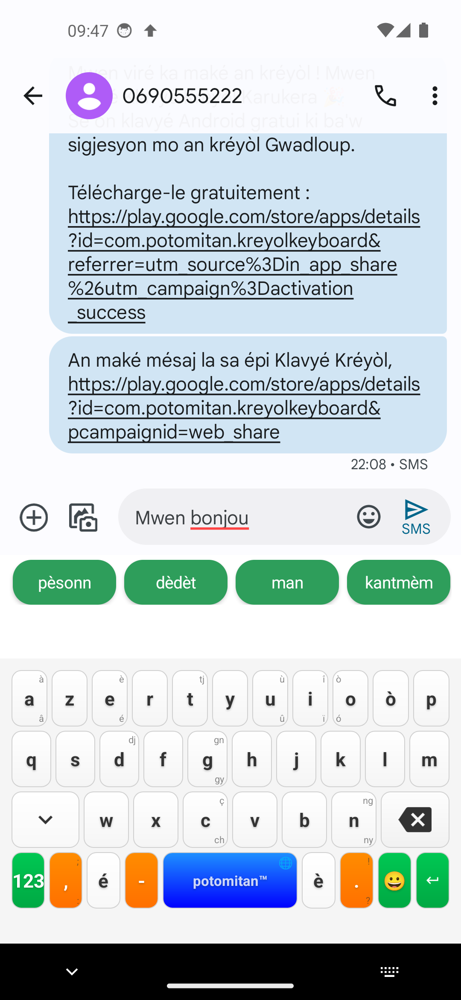
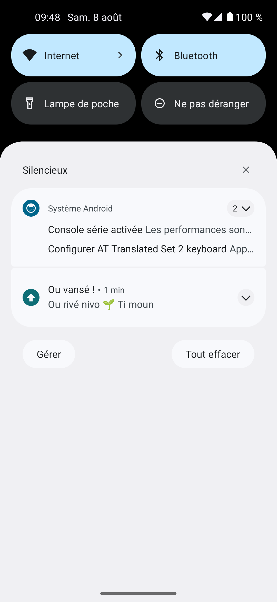
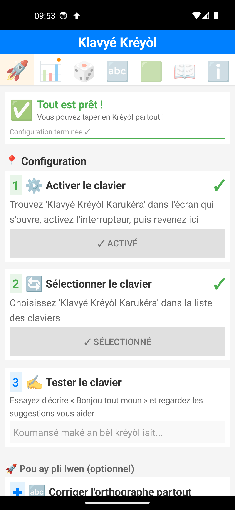
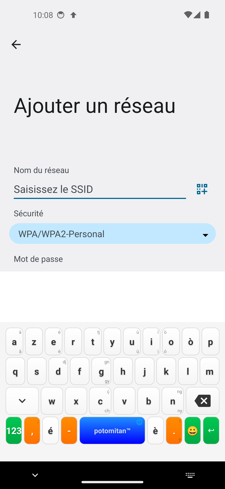
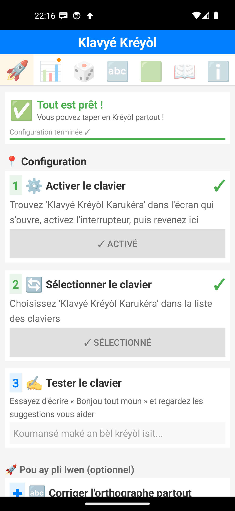

# Rapport de test : passage de niveau sur émulateur

**Date** : 8 août 2026
**Version testée** : 10.9.0 (`versionCode` 100900), APK debug
**Banc** : AVD `kreyol_test` (Pixel 5, Android 14 / API 34, `google_apis` x86_64), émulateur fenêtré
**Application partenaire** : Google Messages (`com.google.android.apps.messaging`), champ de composition d'une conversation existante
**Frappe** : taps `adb` sur les touches réelles du clavier Klavyé Kréyòl, jamais `input text` ni `KEYCODE_DEL`, pour que chaque mot passe bien par `InputProcessor` et déclenche `onWordCommitted`

## Résumé

Quatorze scénarios exécutés, quatorze conformes au comportement attendu. La chaîne complète (frappe dans Messages → découverte d'un mot → franchissement de palier → pastille → notification → carte partageable) fonctionne de bout en bout, sans jamais interrompre l'écriture.

Trois défauts sont ressortis en marge des scénarios, dont un qui pesait sur la fluidité de frappe de **tous** les utilisateurs, pas seulement de ceux qui franchissent un niveau. **Les trois ont été corrigés et la campagne rejouée** : voir « Correctifs et seconde campagne » plus bas. Le blocage du thread de frappe passe de 116-500 ms à 0-16 ms par mot validé.

## Méthode

Les paliers sont des pourcentages du dictionnaire (`CreoleLevels.PERCENTAGES`) appliqués aux 5296 mots de `creole_dict.json` :

| Niveau | Seuil | Mots |
|---|---|---|
| 🌍 Pipirit | 0 % | 0 |
| 🌱 Ti moun | 1,5 % | 79 |
| 🔥 Débrouya | 5 % | 264 |
| 💎 An mitan | 12 % | 635 |

Attendre 635 mots réellement tapés n'étant pas praticable, le fichier de comptage `files/creole_dict_with_usage.json` a été pré-alimenté avant chaque scénario pour placer le compteur **une découverte en dessous** du seuil visé, puis le mot déclencheur a été tapé à la main sur le clavier. Le franchissement lui-même n'est donc jamais simulé : seule la position de départ l'est.

Vérifications à chaque étape : `logcat` (tags `KreyolIME-Potomitan™`, `LevelUpNotifier`), `dumpsys notification --noredact`, `shared_prefs/kreyol_gamification_prefs.xml` lu par `run-as`, et capture d'écran.

## Scénarios

### T1 — Amorçage silencieux à la première installation ✅

Données effacées, permission de notification accordée, premier mot kréyòl tapé dans Messages.

`last_notified_level_index` passe de absent à `0`, aucune notification n'est publiée. Un utilisateur qui installe cette version en ayant déjà des centaines de mots à son actif n'est pas notifié rétroactivement : c'est l'intention documentée, elle tient.

### T2 — Franchissement du niveau 🌱 Ti moun ✅

Compteur placé à 78, mot `bonjou` tapé dans le champ de composition.

```
🎯 Résultat tracking 'bonjou': true
LevelUpNotifier: Pastille de niveau publiée : 🌱 Ti moun
```

`last_notified_level_index` → `1`, `level_badge_pending` → `true`.

### T3 — Rien ne surgit pendant que l'utilisateur écrit ✅



Capture prise dans la seconde qui suit la publication. Aucun bandeau, aucun son, aucune vibration ; la conversation et le clavier restent intacts. `dumpsys` confirme la mécanique :

```
importance=2  vibrate=null  sound=null  groupKey=silent  headsUpContentView=null
```

Le seul changement visible est la petite flèche monochrome apparue dans la barre d'état.

### T4 — Pas de rappel au même niveau ✅

Trois mots nouveaux supplémentaires (`travay`, `krab`, `dlo`), tous découverts pour la première fois. Aucune ligne `LevelUpNotifier`, et l'horodatage `when=` de la notification existante ne bouge pas. Le garde `currentIndex <= lastNotified` fait son travail.

### T5 — Présentation dans le volet ✅



Rangée dans la section **Silencieux**, comme voulu :

> **Ou vansé !**
> Ou rivé nivo 🌱 Ti moun

Silhouette blanche sur pastille teal `#0E6E76` : le `ic_notification_level.xml` monochrome évite bien le carré blanc qu'aurait donné l'icône couleur.

### T6 — Pastille sur l'icône du lanceur ✅


La pastille se pose sur l'icône, en haut à droite. Sa couleur relevée au pixel est `#CAC1EA`, un mauve pâle : elle vient du thème système dérivé du fond d'écran, **pas** du `setColor(#0E6E76)` de la notification. Cela confirme au pixel près ce qui avait été établi en juillet, et il n'y a rien à changer côté application, cette couleur ne lui appartient pas.

### T7 — Le tap ouvre la bonne page ✅

Tap sur la notification → `SettingsActivity` reprise **directement sur l'onglet statistiques**, et la notification s'efface (`setAutoCancel`). Le correctif ViewPager2 de la 10.8.0 tient : `onPageSelected()` ne réécrit plus l'onglet demandé.

### T8 à T10 — Deuxième franchissement, chaîne complète ✅

Compteur replacé à 263, mot `moun` tapé dans Messages → `🔥 Débrouya`.

L'application est cette fois ouverte **depuis le lanceur**, pas depuis la notification, pour vérifier le repli :



La pastille orange est bien là sur l'onglet statistiques alors que l'utilisateur arrive sur Démarrage. Un tap dessus déclenche la célébration avec la carte :


`level_badge_pending` retombe à `false`, `last_celebrated_level_index` à `2`.

### T11 — Le correctif de la 10.9.0 ✅

Après avoir répondu **Plus tard** à la célébration, le bouton permanent « 📤 Partager ma carte de niveau » reconstruit la carte et ouvre le sélecteur de partage :


L'image et le texte d'accompagnement sont bien présents. L'impasse corrigée en 10.9.0 est refermée : « Plus tard » ne fait plus perdre la carte.

### T12 — Un mot de passe n'est jamais compté ✅



Champ mot de passe du dialogue « Ajouter un réseau » Wi-Fi, mot `krab` (présent au dictionnaire, non encore découvert) tapé sur le clavier :

```
🔍 onWordCommitted appelé avec: 'krab'
🔒 Champ sensible: mot ignoré
```

Aucun comptage, aucune progression de niveau. À noter pour qui rejouerait le test : le même mot tapé dans le champ **SSID** juste au-dessus est compté, et c'est correct, un SSID n'est pas une donnée sensible.

### T13 — Permission de notification refusée ✅

Permission révoquée, compteur placé à 634, mot `tini` tapé dans Messages :

```
🎯 Résultat tracking 'Tini': true
LevelUpNotifier: Permission de notification absente : rien n'est publié
```

Aucune notification, aucune pastille sur l'icône du lanceur, aucun plantage. `level_badge_pending` passe quand même à `true` et `last_notified_level_index` à `3` : le repli est armé comme prévu.

### T14 — La célébration survit à la permission refusée ✅


L'application ouverte, la carte 💎 An mitan (635 mots) s'affiche normalement. Quelqu'un qui refuse les notifications ne perd donc que le signal, pas le contenu.

## Défauts relevés

### D1 — La pastille d'onglet n'apparaît pas si l'application est déjà en mémoire

**Constat** : `level_badge_pending` valant `true`, l'application rouverte depuis le lanceur **sans avoir été tuée** n'affiche aucune pastille sur l'onglet statistiques. Après un `force-stop` puis relance, la pastille est là.

**Cause** : `hasPendingLevelBadge()` n'est lu que dans `createTab()` (`SettingsActivity.kt:772`), appelé à la construction de la barre d'onglets. Aucun `onResume()` de l'activité ne rappelle `updateTabBar()`.

**Portée** : le cas est fréquent, une application récemment consultée reste dans la pile. Il devient sérieux quand la permission de notification a été refusée : la pastille d'onglet est alors le **seul** signal existant, et il ne s'affiche pas. Le franchissement passe totalement inaperçu jusqu'au prochain démarrage à froid.

**Piste** : appeler `updateTabBar()` depuis `onResume()` de `SettingsActivity`, la fonction existe déjà et est appelée après consommation de la pastille.

### D2 — La notification et la pastille d'icône survivent à la consultation

**Constat** : après avoir ouvert l'application depuis le lanceur, vu la célébration et répondu « Plus tard », la notification est toujours dans le volet et la pastille toujours sur l'icône. Relevé au pixel après coup : `#CAC1EA`, inchangée.

**Cause** : `setAutoCancel(true)` n'agit qu'au tap sur la notification. Le chemin « j'ouvre l'app par le lanceur » éteint bien `level_badge_pending`, mais n'annule jamais la notification.

**Effet** : l'utilisateur qui a déjà tout vu garde une pastille sur son écran d'accueil jusqu'à ce qu'il pense à balayer la notification. Le signal devient du bruit.

**Piste** : appeler `NotificationManagerCompat.cancel(4201)` au même endroit que l'extinction de `level_badge_pending`, dans `createStatsContent()` (`SettingsActivity.kt:2595`).

### D3 — Chaque mot validé réécrit 318 Ko sur le thread principal

C'est le point le plus lourd, et il ne concerne pas que les passages de niveau.

**Constat** : mesure de l'écart entre `🔍 onWordCommitted appelé` et `🎯 Résultat tracking` sur huit mots consécutifs, tous **déjà découverts** (donc sans le moindre calcul de niveau) :

| Mot | Durée |
|---|---|
| pou | 500 ms |
| nou | 377 ms |
| kon | 230 ms |
| adan | 176 ms |
| bon | 160 ms |
| jou | 141 ms |
| tan | 150 ms |
| gran | 116 ms |

**Cause** : `SAVE_BATCH_SIZE = 1` dans `CreoleDictionaryWithUsage.kt:38`, avec en commentaire « Sauvegarder après chaque utilisation pour tests ». Chaque mot validé déclenche donc `saveDictionary()` → `dict.toString(2)`, qui sérialise les 5296 entrées avec indentation, puis `file.writeText()`. Le fichier fait **318 Ko** sur l'appareil. Le tout est synchrone, dans un bloc `synchronized(this)`, sur le thread principal du service de saisie.

**Effets** :
- 116 à 500 ms de blocage du thread principal de l'IME à chaque espace tapé, soit largement de quoi faire sauter des images sur un appareil d'entrée de gamme ;
- le verrou `synchronized(this)` bloque pendant tout ce temps les lectures `getWordUsageCount()` que le moteur de suggestions fait depuis son thread de fond ;
- la première écriture est la plus lente (500 ms), les suivantes bénéficiant du cache du système de fichiers.

**Pistes** : remonter `SAVE_BATCH_SIZE`, sortir l'écriture sur un thread de fond, écrire sans indentation (`toString()` au lieu de `toString(2)`, le fichier n'est pas destiné à être lu à l'œil), et sauvegarder dans `onFinishInput()` pour ne rien perdre.

Le constat mérite d'être confirmé sur un appareil réel : l'émulateur x86 sous WSL2 n'a pas les mêmes performances d'écriture qu'un téléphone, dans un sens comme dans l'autre.

## Correctifs et seconde campagne

Les trois défauts ont été corrigés le jour même, puis la campagne rejouée sur l'APK reconstruit.

### D1 — `onResume()` rafraîchit la barre d'onglets

Ajout d'un champ `levelBadgeDrawn` qui mémorise si la pastille est présente **dans la barre actuellement dessinée**, et d'un `onResume()` sur `SettingsActivity` qui redessine la barre lorsque cet état diverge de la préférence. La comparaison évite de reconstruire la barre à chaque retour au premier plan.

**Vérification** : application laissée sur l'onglet Démarrage, mise en arrière-plan, palier 💎 An mitan franchi depuis Google Messages, puis retour par le lanceur. `dumpsys` confirme qu'il s'agit bien de la même instance d'activité avant et après (`ActivityRecord{9d494be}`, pas de recréation), et le journal montre la nouvelle trace `🔄 Pastille de niveau à rafraîchir au retour au premier plan`.



La pastille est là, sur exactement le scénario qui n'affichait rien avant.

Cas voisin vérifié au passage : si l'application est reprise **directement sur l'onglet statistiques**, la pastille est dessinée puis retirée dans la foulée par le contenu de l'onglet. C'est le comportement voulu, l'utilisateur regarde déjà la page annoncée.

### D2 — La notification s'efface dès que la progression est vue

Nouvelle fonction `LevelUpNotifier.clear()`, appelée dans `createStatsContent()` au même endroit que l'extinction de `level_badge_pending`. La pastille d'icône étant dérivée de la notification active, l'annuler est le seul moyen de l'éteindre.

**Vérification** : palier franchi, application ouverte **depuis le lanceur** (donc sans passer par la notification), onglet statistiques consulté. `dumpsys notification` passe de 1 à 0 enregistrement, et l'icône du lanceur ne porte plus rien.


### D3 — L'écriture du dictionnaire quitte le thread de frappe

Trois changements dans `CreoleDictionaryWithUsage` :

- `SAVE_BATCH_SIZE` disparaît au profit de `scheduleSave()`, qui confie l'écriture à un exécuteur à un seul thread. Un `AtomicBoolean` fusionne les demandes qui arrivent pendant qu'une écriture est en cours, et le drapeau est baissé à l'entrée de la tâche : un mot validé entre-temps en reprogramme une, rien n'est perdu.
- La sérialisation prend le verrou de l'objet, l'écriture disque non.
- `toString(2)` devient `toString()` : le fichier n'est pas fait pour être lu à l'œil, et l'indentation le faisait passer de 218 à 318 Ko.
- `onDestroy()` arrête l'exécuteur, attend la fin de l'écriture en cours, puis fait la sauvegarde finale, qui écrirait sinon par-dessus une écriture de fond plus récente.

**Vérification** : mêmes huit mots, même dictionnaire de 5296 entrées, même position de départ.

| Mot | Avant | Après |
|---|---|---|
| pou | 500 ms | 16 ms |
| nou | 377 ms | 1 ms |
| kon | 230 ms | 11 ms |
| adan | 176 ms | 1 ms |
| bon | 160 ms | 0 ms |
| jou | 141 ms | 1 ms |
| tan | 150 ms | 1 ms |
| gran | 116 ms | 1 ms |

L'écriture elle-même prend toujours 190 à 720 ms, mais dans le journal `💾 Dictionnaire sauvegardé en tâche de fond`, hors du chemin de frappe. Fichier relu ensuite : 5296 entrées, 263 mots découverts, compteurs correctement incrémentés à 2, y compris pour le dernier mot tapé.

**Perte de données, cas limite testé** : mot tapé puis `am force-stop` immédiat, sans laisser à l'écriture de fond le temps de finir. Le mot est bien présent au rechargement (265 découverts). La fenêtre de perte existe en théorie mais reste inférieure à la seconde.

### Non-régression

Rejoués après correctifs, sur le dictionnaire réel de 5296 entrées : franchissement du palier 🔥 Débrouya depuis Google Messages, absence de bandeau pendant la frappe, notification correcte, pastille d'onglet au démarrage à froid, célébration avec la carte, bouton de partage permanent qui ouvre le sélecteur, et champ mot de passe toujours ignoré (`🔒 Champ sensible: mot ignoré`).


Les sept tests unitaires de `CreoleLevelsTest` passent.

### Détail relevé, non corrigé

L'application et le service de saisie ne comptent pas le total de mots au même endroit : `SettingsActivity.getTotalDictionaryWords()` lit `creole_dict.json` dans les assets, tandis que le service prend `dictionary.length()` du fichier d'usage. Les deux valent 5296 en usage normal, puisque le fichier d'usage est engendré depuis les assets. La divergence n'est apparue qu'avec un fichier d'usage réduit artificiellement pour les besoins d'un test, état qu'aucun utilisateur ne peut atteindre. Laissé tel quel.

## Ce qui n'a pas été testé

- Le franchissement de **deux paliers d'un coup**, impossible avec une seule découverte par mot. Le code place `last_notified_level_index` sur l'indice courant et nomme le niveau le plus haut, mais cela reste non vérifié en conditions réelles.
- Le comportement **après réinstallation ou redémarrage** de l'appareil, où la mémoire signale déjà que le lien système de l'IME peut rester périmé.
- Les paliers au-delà de 💎 An mitan.
- Le correcteur orthographique, qui ne s'active jamais sur cet AVD (limitation connue et documentée).

## Notes de banc de test

- `adb shell am force-stop` sur l'application fait retomber le clavier système sur Gboard, y compris quand un `ime set` a été lancé juste après : il faut re-vérifier `mCurMethodId` avant chaque série de frappes, sous peine de taper sur le mauvais clavier sans s'en rendre compte.
- Le brouillon d'une conversation Messages persiste entre les redémarrages du service. Réutiliser le même champ après un `force-stop` produit des mots hybrides (`travoun` observé, issu d'un `trav` résiduel). Changer de conversation est plus fiable que d'effacer.
- Le champ mot de passe du dialogue Wi-Fi ne prend pas le focus au tap une fois le clavier ouvert ; trois `KEYCODE_TAB` depuis le champ SSID y parviennent.
