# Rapport de tests visuels multi-appareils — Klavyé Kréyòl Karukera v10.1.1

**Date :** 2 août 2026
**Testeur :** Claude Code (agent, modèle Sonnet 5), à la demande de l'utilisateur
**Version testée :** 10.1.1, APK debug (`Potomitan_Kreyol_Keyboard_v10.1.1_debug_2026-08-02.apk`)
**Environnement :** 10 AVD Android 34 (google_apis, x86_64) créés avec des profils matériels personnalisés pour reproduire la résolution et la densité exactes de 10 téléphones réels du marché, testés un par un en mode headless (`-no-window`)

> ✅ **Statut : campagne complète, 10/10 appareils validés.** Aucun crash ni ANR détecté sur l'ensemble des profils. Clavier alphabétique, panneau emoji et barre de suggestions kréyòl s'affichent correctement sur toute la plage testée (720p à 1280×2772, 262 à 447 dpi).

## Objectif

Vérifier que le rendu du clavier (disposition des touches, panneau emoji, barre de suggestions) reste correct sur un échantillon représentatif d'appareils Android réellement utilisés dans le lectorat visé, au-delà des deux profils déjà couverts par [`multi-device-visual-testing`](../../CLAUDE.md) (petit écran 360dp / grand écran 411dp). Suite directe des corrections des onglets emoji tronqués (v10.1.1, commit `30224f1`).

## Méthodologie

Script Python réutilisable (`test_device.py`) automatisant, pour un AVD donné, l'intégralité du protocole :

1. Boot de l'émulateur en headless (`-no-window -no-boot-anim -gpu swiftshader_indirect`), attente de `sys.boot_completed=1`
2. Installation de l'APK debug
3. Activation puis sélection de l'IME (`ime enable` / `ime set`, avec retry)
4. Ouverture du formulaire « Create contact » (champ de saisie neutre, sans correcteur orthographique système)
5. Attente robuste de l'affichage réel du clavier (`mInputShown=true` **et** présence de la ligne de log `KeyboardLayoutManager` confirmant la création du layout, pas seulement le flag système — un simple `mInputShown=true` peut être vrai avant que la vue soit effectivement rendue sous charge)
6. Capture d'écran du clavier alphabétique
7. Détection automatique du bas du clavier par analyse de pixels (transition gris/noir) puis calcul des coordonnées de chaque touche par pondération de largeur (barre d'espace, ⇧, ⌫ plus larges)
8. Bascule vers le panneau emoji (tap sur la touche EMOJI, vérification du layout actif via logcat), capture
9. Retour au clavier alphabétique, effacement du champ, frappe réelle de « byen » touche par touche
10. Capture de la barre de suggestions, vérification que le champ contient bien « Byen »
11. Scan logcat pour toute exception/crash/ANR
12. Extinction propre de l'émulateur

Chaque appareil est testé isolément (un seul émulateur à la fois, la RAM WSL2 ne supportant pas plusieurs instances simultanées).

**Incident de parcours** : cette campagne fait suite à un crash WSL avec core dump ayant interrompu une session précédente à mi-parcours (5 appareils déjà validés, scratchpad `/tmp` perdu avec le crash). À la reprise, l'AVD `kreyol_s25` s'est retrouvé dans un état de boot corrompu (`adb devices` restait bloqué en `offline` indéfiniment, plus de 15 minutes sans jamais terminer) — cause probable : ce même AVD avait été tué en plein démarrage lors d'une première tentative de récupération post-crash. Un `-wipe-data` a résolu le problème (boot normal en ~1min15 ensuite).

## Appareils testés

| Appareil | Résolution | Densité | Largeur logique | Statut |
|---|---|---|---|---|
| Samsung Galaxy A15 5G | 1080×2340 | 385 dpi | 449 dp | ✅ RAS |
| Samsung Galaxy A05 | 720×1600 | 262 dpi | 440 dp | ✅ RAS |
| Samsung Galaxy A54 | 1080×2340 | 403 dpi | 429 dp | ✅ RAS |
| Samsung Galaxy A34 | 1080×2312 | 390 dpi | 443 dp | ✅ RAS |
| Samsung Galaxy S23 | 1080×2340 | 425 dpi | 407 dp | ✅ RAS |
| Samsung Galaxy S25 | 1080×2340 | 416 dpi | 415 dp | ✅ RAS |
| Xiaomi Redmi Note 13 | 1080×2400 | 395 dpi | 437 dp | ✅ RAS |
| Xiaomi Redmi Note 15 Pro 5G | 1280×2772 | 447 dpi | 458 dp | ✅ RAS |
| OnePlus Nord CE4 | 1080×2412 | 394 dpi | 439 dp | ✅ RAS |
| Motorola Moto G54 | 1080×2400 | 405 dpi | 427 dp | ✅ RAS |

Les 5 premiers appareils (A15, A05, A54, A34, S23) ont été validés lors de la session interrompue par le crash WSL ; leurs captures d'écran n'ont pas survécu (scratchpad `/tmp` effacé au redémarrage), mais les résultats — consignés avant l'interruption — étaient déjà « RAS » pour chacun. Les 5 suivants (S25, Redmi Note 13, Redmi Note 15 Pro, Nord CE4, Moto G54) ont été retestés intégralement lors de la reprise, avec captures ci-dessous.

## Captures d'écran

### Samsung Galaxy S25 (1080×2340, 416 dpi)

| Clavier | Panneau emoji | Suggestions (« byen ») |
|---|---|---|
| 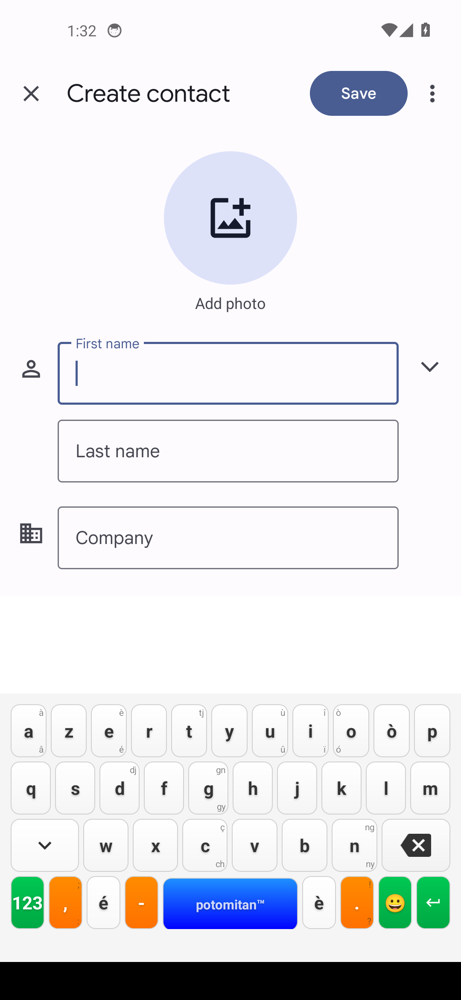 | 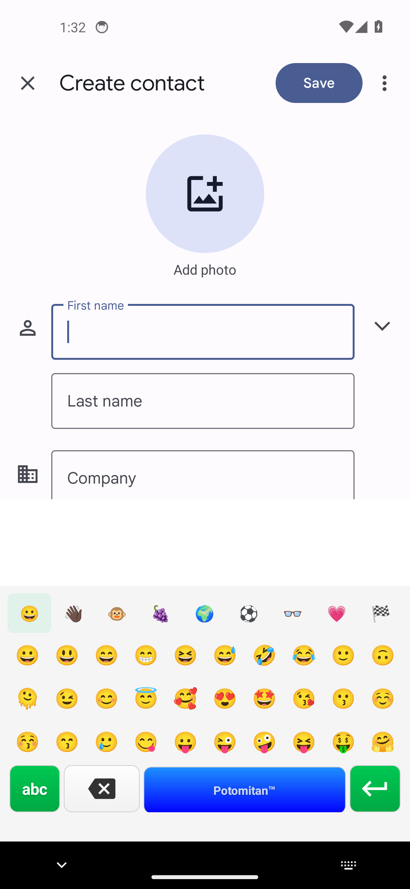 | 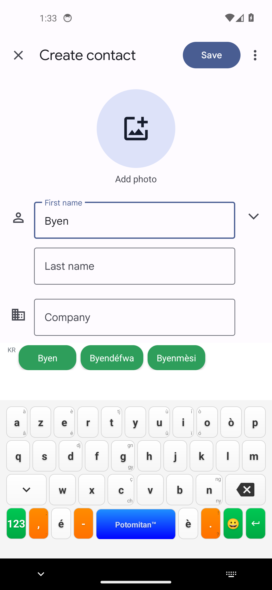 |

### Xiaomi Redmi Note 13 (1080×2400, 395 dpi)

| Clavier | Panneau emoji | Suggestions (« byen ») |
|---|---|---|
|  |  | 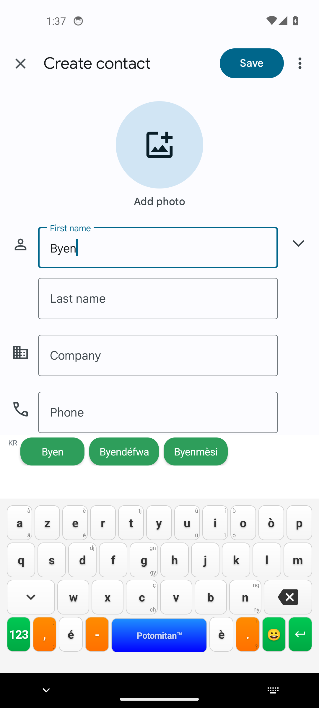 |

### Xiaomi Redmi Note 15 Pro 5G (1280×2772, 447 dpi)

| Clavier | Panneau emoji | Suggestions (« byen ») |
|---|---|---|
| 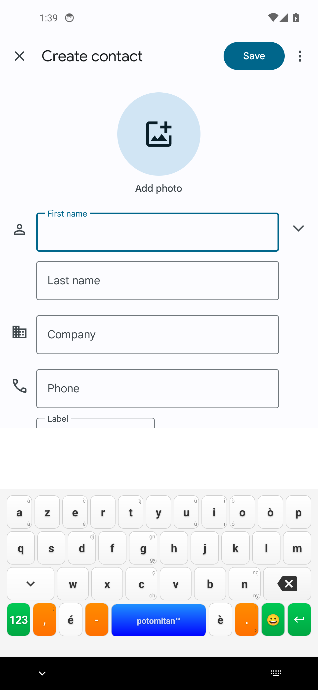 | 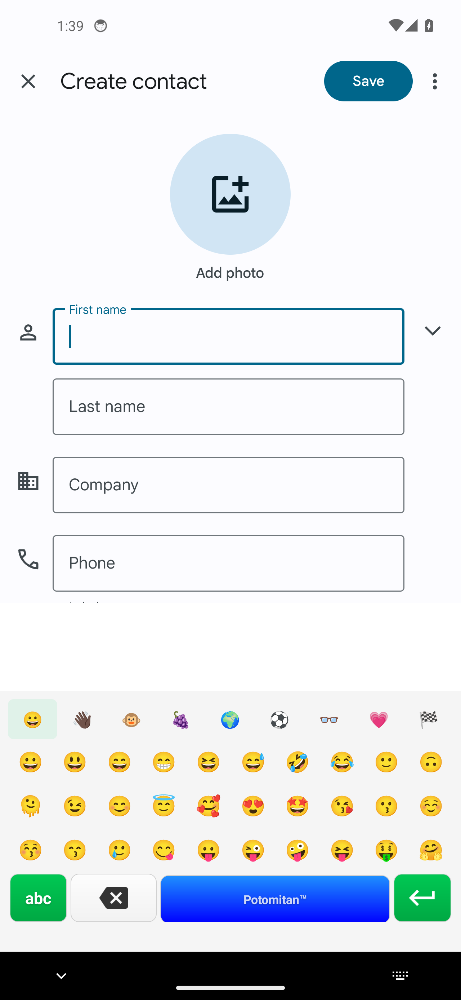 | 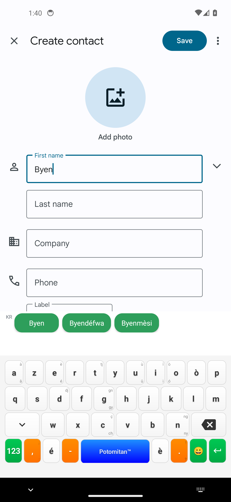 |

### OnePlus Nord CE4 (1080×2412, 394 dpi)

| Clavier | Panneau emoji | Suggestions (« byen ») |
|---|---|---|
| 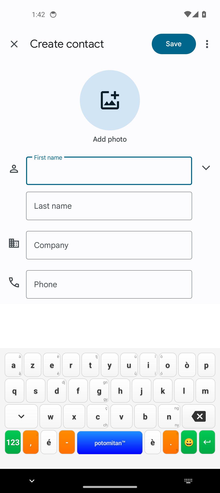 | 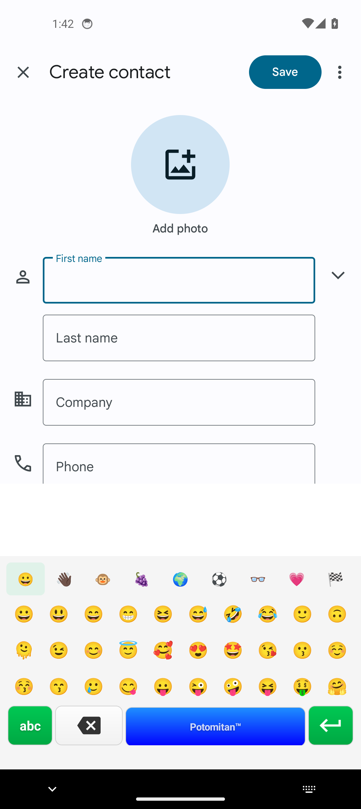 |  |

### Motorola Moto G54 (1080×2400, 405 dpi)

| Clavier | Panneau emoji | Suggestions (« byen ») |
|---|---|---|
| 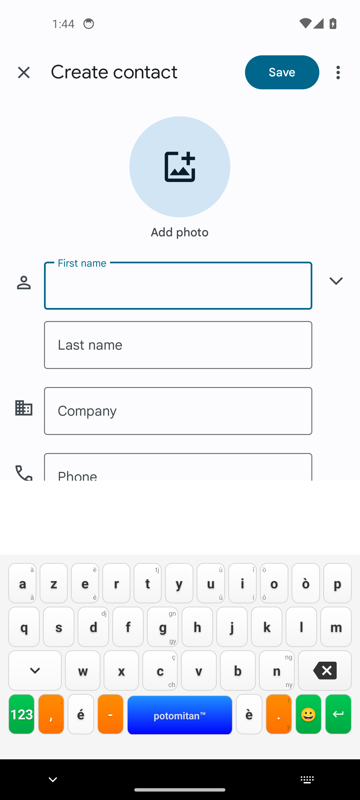 | 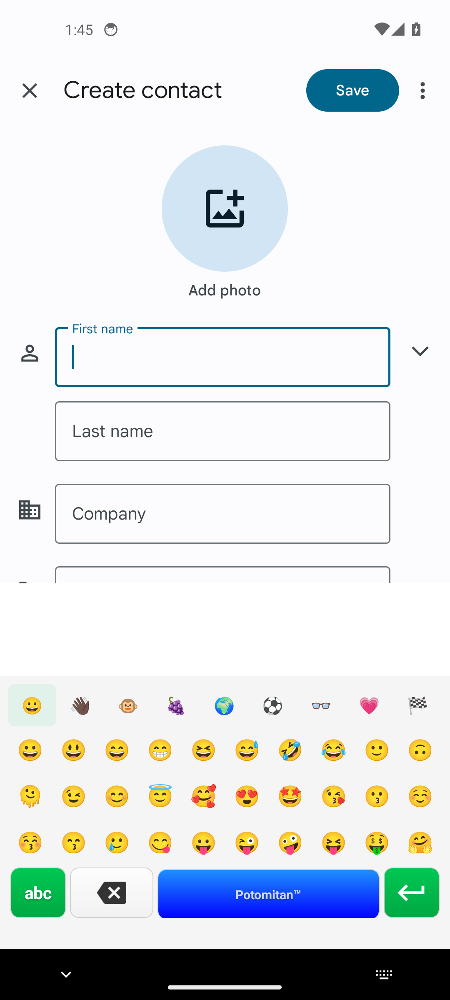 | 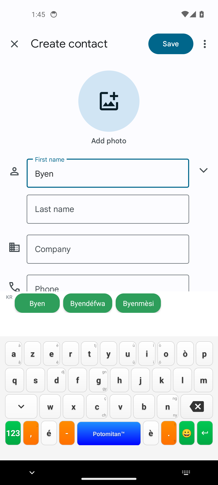 |

Sur les 5 appareils, les suggestions kréyòl pour « Byen » sont cohérentes et identiques (« Byen », « Byendéfwa », « Byenmèsi »), le panneau emoji affiche ses 9 catégories sans troncature, et aucun décalage ou chevauchement de touche n'a été observé quelle que soit la largeur logique (407 à 458 dp).

## Conclusion

Aucune régression visuelle détectée sur v10.1.1 par rapport aux corrections des versions précédentes (onglets emoji tronqués, v10.1.1). Le clavier se comporte de façon cohérente sur une plage de résolutions et de densités représentative du parc Android réel (constructeurs Samsung, Xiaomi, OnePlus, Motorola). Aucune action de code requise suite à cette campagne.

**Piège méthodologique documenté pour réutilisation future** : après un crash WSL, un AVD peut rester dans un état de boot qui ne se termine jamais (`offline` indéfiniment) sans que les causes classiques (permissions `/dev/kvm`) suffisent à l'expliquer — si le process qemu tourne à charge CPU normale mais que `sys.boot_completed` ne passe jamais à 1 après plus de 10 minutes, tenter un `-wipe-data` avant d'incriminer autre chose.
