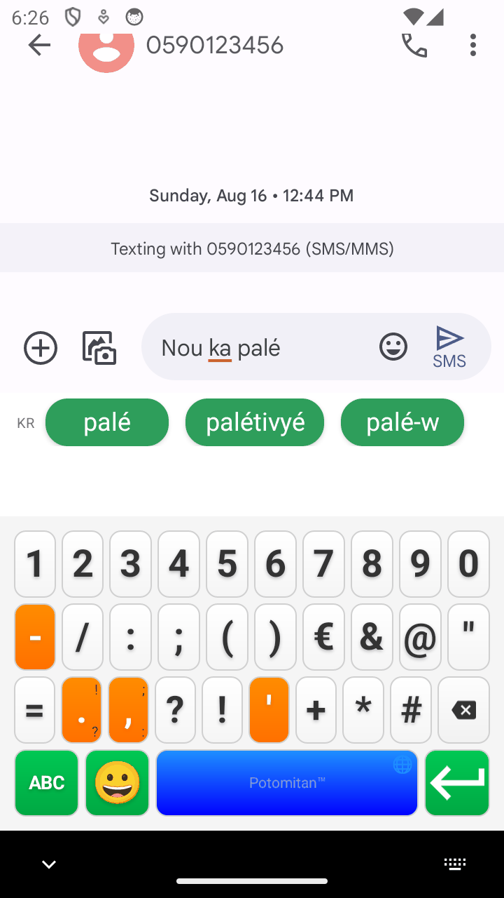
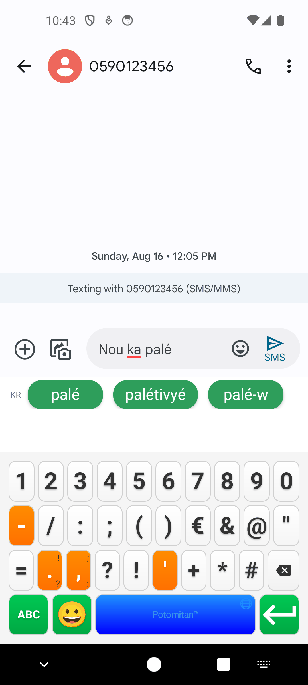
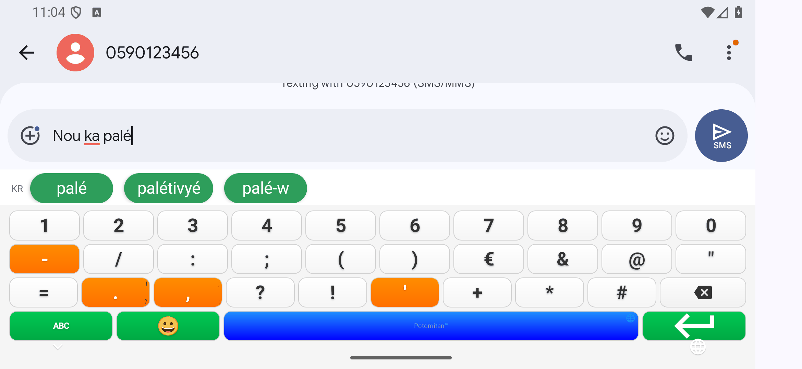

# Rapport de tests de la page de symboles sur 5 appareils, v10.12.15

**Date :** 23 août 2026
**Testeur :** Claude Code (agent, modèle Opus 5), à la demande de l'utilisateur
**Version testée :** 10.12.15, APK debug `Potomitan_Kreyol_Keyboard_v10.12.15_debug_2026-08-23.apk` (commit `299e62fd`)
**Environnement :** 5 AVD lancés un par un en headless sous WSL2, images `google_apis`, API 34 et 36

> **Statut : 5 appareils sur 5 validés, portrait et paysage.** Dans les 10 relevés, la page de symboles affiche ses quatre rangées complètes (10 / 10 / 10 / 4) et la touche « # » insère son caractère dans le champ de rédaction. La rangée 3 rejoint la largeur des deux du dessus à 2,4 % près, et sa touche la plus étroite, 27,7 dp dans le pire cas, reste plus large que le minimum déjà pratiqué ailleurs sur le clavier (24,0 dp). Aucun crash, aucun ANR. Trois saisies de contrôle sur dix sont non conformes, toutes par perte de taps du pilotage `adb` : voir « Anomalies ».

## Objectif

La 10.12.15 ajoute « # » en rangée 3 du mode 123, portant cette rangée de 9 à 10 touches (`KeyboardLayoutManager.kt:282`). L'argument de l'ajout est qu'il ne coûte presque rien : la rangée en portait une de moins que les deux du dessus, donc des touches plus larges qu'elles, et la dixième la ramène à leur niveau. Cette campagne vérifie cet argument là où il peut se démentir, c'est-à-dire aux extrêmes de densité et de géométrie, et contrôle que la touche insère bien son caractère.

Suite des campagnes du [2 août](../rapport_test_multi_appareils_2026-08-02.md) et du [16 août](../rapport_test_multi_appareils_2026-08-16/README.md), dont elle reprend le banc.

## Sélection des appareils

Cinq AVD choisis pour encadrer la gamme plutôt que pour la couvrir, la largeur de touche étant la grandeur en jeu :

| AVD | Appareil | Pourquoi celui-là |
|---|---|---|
| `kreyol_smallphone` | Petit écran 720×1280, 320 dpi | La géométrie la plus contrainte du parc, 360 dp de large |
| `kreyol_magic5lite` | Honor Magic5 Lite, 480 dpi | Densité la plus forte à 1080 px, donc les touches les plus étroites en dp |
| `kreyol_a05` | Samsung Galaxy A05, 262 dpi | L'extrême inverse, touches les plus larges |
| `kreyol_pixel7pro` | Google Pixel 7 Pro, 560 dpi | Densité maximale du parc |
| `honor_x9c_test` | Honor X9c, API 36 | Seul appareil en Android 16, où le calcul d'insets diffère |

## Méthodologie

Le banc du 16 août (`scripts/`) est repris tel quel pour le boot, l'installation, la sélection de l'IME, l'ouverture du champ de rédaction SMS et la détection de la géométrie du clavier par analyse d'image. Quatre adaptations ont été nécessaires.

**1. La disposition de référence avait vieilli.** `kbdetect.py` attendait 11 / 10 / 8 / 9 touches, l'état de la 10.11.1. Depuis, « ò » a quitté la rangée 1 (10.11.3, `5a788156`, il reste en appui long sur « o ») et l'apostrophe est redevenue une touche visible en rangée 3 (10.11.4). La référence est donc passée à **10 / 10 / 9 / 9**. Sans cette mise à jour, les cinq appareils auraient été déclarés non conformes sans que rien ne soit cassé.

**2. La phrase de test a perdu son dernier mot.** « nou ka palé kréyòl » n'est plus saisissable touche par touche, « ò » demandant maintenant un appui long que ce banc ne simule pas. La phrase retenue est **« nou ka palé »** : les trois mots sont attestés dans `creole_dict.json`, l'enchaînement « nou ka » → « palé » figure dans `creole_ngrams.json`, et elle exerce toujours la touche « é » de la rangée 4, la barre d'espace et le moteur de n-grammes.

**3. L'index de la touche ⌫ a changé.** Le nettoyage du champ tapait sur la rangée 3, index 7, dernière touche quand elle en comptait 8. Avec l'apostrophe revenue, l'index 7 tape sur « ' ». Il est désormais calculé depuis la longueur de la rangée.

**4. Un test de la page de symboles a été ajouté** (`test_symboles()` dans `run_device.py`), joué après la saisie, dans chaque orientation :

1. tap sur « 123 », capture de la page de symboles
2. détection des quatre rangées, attendues à **10 / 10 / 10 / 4**
3. mesure de la largeur des touches des rangées 1, 2 et 3, converties en dp (la moyenne enregistrée par le banc s'est révélée sans portée, voir l'encadré du chapitre suivant)
4. position de « # » comparée à celle de « @ » de la rangée du dessus, sous lequel il est censé tomber
5. lecture du champ, tap sur « # », relecture : la touche est validée si le champ vaut exactement son contenu précédent suivi de « # »
6. retour à l'alphabétique par « ABC »

Le point 5 compare le champ à lui-même, avant et après. Ce choix rend le verdict indépendant de l'état du champ, donc des trois saisies de contrôle non conformes décrites plus bas.

## Résultats par appareil

Classés par densité croissante. « P » pour portrait, « Y » pour paysage.

| Appareil | Géométrie | dpi | API | P. page 123 | P. « # » | Y. page 123 | Y. « # » |
|---|---|---|---|---|---|---|---|
| Samsung Galaxy A05 | 720×1600 | 262 | 34 | 10/10/10/4 | inséré | 10/10/10/4 | inséré |
| Petit écran | 720×1280 | 320 | 34 | 10/10/10/4 | inséré | 10/10/10/4 | inséré |
| Honor X9c | 1080×2340 | 440 | **36** | 10/10/10/4 | inséré | 10/10/10/4 | inséré |
| Honor Magic5 Lite | 1080×2400 | 480 | 34 | 10/10/10/4 | inséré | 10/10/10/4 | inséré |
| Google Pixel 7 Pro | 1440×3120 | 560 | 34 | 10/10/10/4 | inséré | 10/10/10/4 | inséré |

## La mesure qui valide l'ajout

Largeur des touches de la page 123, mesurée touche par touche sur les captures et convertie en dp. La rangée 3 est donnée hors ⌫, qui pèse 1,25 (`getKeyWeight`) et fausserait la comparaison.

| Appareil | Orientation | Rangées 1 et 2 | Rangée 3, touches ordinaires | La plus étroite | ⌫ |
|---|---|---|---|---|---|
| Honor Magic5 Lite (480 dpi) | portrait | 28,7 dp | **28,0 dp** | 27,7 dp | 35,7 dp |
| Petit écran (320 dpi) | portrait | 28,9 dp | 28,1 dp | 28,0 dp | 36,0 dp |
| Honor X9c (440 dpi) | portrait | 32,9 dp | 32,1 dp | 32,0 dp | 40,7 dp |
| Google Pixel 7 Pro (560 dpi) | portrait | 34,1 dp | 33,2 dp | 33,1 dp | 42,3 dp |
| Samsung Galaxy A05 (262 dpi) | portrait | 38,1 dp | 37,1 dp | 36,6 dp | 47,0 dp |
| Petit écran (320 dpi) | paysage | 56,9 dp | 55,4 dp | 55,0 dp | 70,0 dp |
| Honor Magic5 Lite (480 dpi) | paysage | 68,2 dp | 66,4 dp | 66,3 dp | 84,0 dp |
| Honor X9c (440 dpi) | paysage | 73,8 dp | 72,0 dp | 71,6 dp | 90,5 dp |
| Google Pixel 7 Pro (560 dpi) | paysage | 78,0 dp | 76,0 dp | 76,0 dp | 95,7 dp |
| Samsung Galaxy A05 (262 dpi) | paysage | 83,5 dp | 81,4 dp | 81,2 dp | 102,6 dp |

**La rangée 3 s'aligne sur les deux du dessus à 2,4 % près, pas exactement.** L'écart est constant sur les dix relevés et s'explique par le poids de ⌫ : la rangée totalise 9 × 1 + 1,25 = 10,25 parts pour la même largeur que les 10 parts des rangées 1 et 2, d'où des touches ordinaires à 97,6 % de leurs voisines. Avant la 10.12.15 la rangée comptait 9,25 parts et ses touches faisaient 108 % de celles des rangées 1 et 2 : elles perdent donc environ 9,7 % de largeur, et la page de symboles a maintenant sa touche la plus étroite en rangée 3 plutôt qu'en rangées 1 et 2.

**Cette touche la plus étroite reste plus large que ce que l'application affichait déjà.** Sur le Magic5 Lite, le cas le plus serré, elle mesure 27,7 dp, contre 24,0 dp pour la plus étroite du clavier alphabétique du même appareil, en rangée 4. Aucune touche ne descend donc sous un minimum déjà pratiqué, ce qui était l'enjeu.

> **Correction d'une mesure intermédiaire.** Le banc calcule la largeur moyenne des dix touches d'une rangée : ce nombre vaut mécaniquement la largeur de l'écran divisée par dix pour toute rangée de dix touches, quelles que soient leurs largeurs individuelles. Il affichait donc un écart nul entre rangées, ce qui ne démontrait rien. Le tableau ci-dessus repart des largeurs touche par touche relues sur les captures. Le verdict ne change pas, sa justification si.

La hauteur de touche est inchangée : 46,3 à 47,0 dp en portrait, 30,3 à 31,1 dp en paysage, les mêmes valeurs qu'au 16 août.

Position de « # » par rapport au « @ » de la rangée du dessus, en pixels de décalage entre centres : de 13 à 27 px en portrait, 25 à 59 px en paysage. Le décalage vient de ce que la rangée 3 se termine par ⌫, plus large que les touches ordinaires, ce qui déplace légèrement la colonne. « # » reste visuellement sous « @ » sur toutes les captures.

## Captures

Page de symboles, portrait, aux deux extrêmes de densité :

| Petit écran 720×1280 | Honor Magic5 Lite 480 dpi |
|---|---|
|  |  |

Page de symboles en paysage, Honor X9c (API 36) :



Les 30 captures sont dans `captures/` (originaux, qui font foi) et `apercus/` (mêmes images en 256 couleurs pour l'affichage). Pour chaque appareil et chaque orientation : le clavier alphabétique, la page de symboles, et le champ après le tap sur « # ».

## Anomalies

### Trois saisies de contrôle non conformes sur dix

| Appareil | Orientation | Obtenu | Attendu |
|---|---|---|---|
| Honor X9c | portrait | `Nou a paé` | `nou ka palé` |
| Google Pixel 7 Pro | paysage | `Ou ka paléou ka palé` | `nou ka palé` |
| Samsung Galaxy A05 | paysage | `Ou ka paléou ka palé` | `nou ka palé` |

Des caractères manquent à des endroits quelconques : « k » et « l » en milieu de phrase sur le X9c, le « n » initial sur les deux autres. Quand le banc détecte l'écart il rejoue la phrase une fois, et son nettoyage au ⌫ n'ayant rien effacé, la seconde tentative s'écrit derrière la première, d'où les phrases doublées.

**Ce ne sont pas des défauts du clavier**, sur la base de trois constats :

1. Aucune trace dans logcat : ni `FATAL`, ni `ANR in`, ni `E/AndroidRuntime` sur aucun des cinq appareils.
2. La répartition ne suit ni l'orientation ni l'API. Le X9c échoue en portrait et réussit en paysage, le Pixel 7 Pro fait l'inverse. Un défaut de mise en page ou de calcul d'insets se comporterait de façon reproductible.
3. Les mêmes appareils, avec le même APK, saisissent la phrase intégralement dans l'autre orientation.

Il s'agit de taps perdus par le pilotage `adb input tap`, le piège déjà documenté dans le banc du 16 août (des taps rapprochés se font avaler par le gestionnaire d'appui long). La campagne du 16 août avait relevé le même type d'artefact, sur un test sur 36.

**Ce que cela n'exclut pas.** Que des appuis rapprochés soient absorbés par la gestion de l'appui long est un comportement du clavier, pas seulement du pilotage : un utilisateur qui tape vite pourrait le rencontrer. Cette campagne ne permet pas de trancher, faute d'avoir mesuré le seuil. C'est le point à instruire ensuite, indépendamment de la 10.12.15.

### Deux défauts du banc, corrigés

**L'invite du champ prise pour du contenu.** `clear_field()` lit le champ par `uiautomator dump`, qui rend le texte d'invite dans l'attribut `text` exactement comme un contenu réel : aucun attribut ne les distingue. Sur un champ vide affichant « Text message », la fonction croyait donc voir un brouillon et tapait 112 fois sur ⌫ dans le vide avant de sortir par son plafond de passes. Les 112 appuis se retrouvent à l'identique sur les appareils qui passent, en portrait comme en paysage. Le banc relève désormais l'invite une fois, après un `pm clear` où le champ est vide par construction, et s'arrête dessus.

**L'attente d'extinction ne servait à rien en headless.** Le banc attendait la fin de l'émulateur par `pgrep -x qemu-system-x86_64`, or le binaire headless s'appelle `qemu-system-x86_64-headless` : le motif ancré ne l'a jamais vu et la boucle sortait immédiatement. Le défaut existait déjà lors de la campagne du 16 août, avec le risque de lancer un AVD pendant que le précédent s'éteignait. Le motif est passé en `pgrep -f` ancré sur `-avd`.

### Un brouillon hérité de la campagne précédente

Le premier passage de l'A05 a trouvé dans le champ le brouillon « Nou ka palé kréyòl » laissé par la campagne du 16 août, que Messages restaure d'un run à l'autre, et n'a pas réussi à l'effacer. L'appareil a été rejoué avec `--clear-messages`, qui réinitialise Messages avant le test. Le portrait est alors conforme du premier essai. Le paysage reste non conforme, avec le même motif de tap perdu que le Pixel 7 Pro, ce qui confirme que le brouillon n'était pas la cause. Les données du premier passage sont conservées dans `donnees/kreyol_a05_essai1.json`.

## Ce que cette campagne ne couvre pas

- **Aucun appareil réel.** Uniquement des AVD. Les défauts de rendu liés au pilote GPU du SoC, comme celui traité en 10.3.2, ne se reproduisent pas sur émulateur.
- **Cinq appareils sur les dix-huit du parc.** Les extrêmes sont couverts, pas les cas intermédiaires.
- **La page de symboles seule.** Le panneau emoji et les appuis longs ne sont pas testés ici.
- **Un seul niveau d'API 36**, le Honor X9c. Android 16 n'est pas couvert au-delà.
- **Les durées de bout en bout du premier appareil ne veulent rien dire** : la machine hôte a été suspendue pendant son passage. Les temps de boot par appareil, eux, sont mesurés à l'intérieur du run et restent valides : 31 à 63 s.

## Reproduire

```bash
cd android_keyboard
./gradlew assembleDebug                    # voir CLAUDE.md pour Java 17 et gradlew
cd ../reports/tests/rapport_test_symboles_2026-08-23/scripts
./run_all.sh                               # les 5 AVD, un par un
python3 analyse.py                         # tableau comparatif + resume.json
python3 alleger_captures.py                # aperçus du rapport
```

Un seul appareil : `python3 -u run_device.py <avd> "<libellé>" [--clear-messages] [--windowed]`.
Vérifier une capture isolée : `python3 kbdetect.py <capture.png> [--num]`, `--num` pour la page de symboles.
